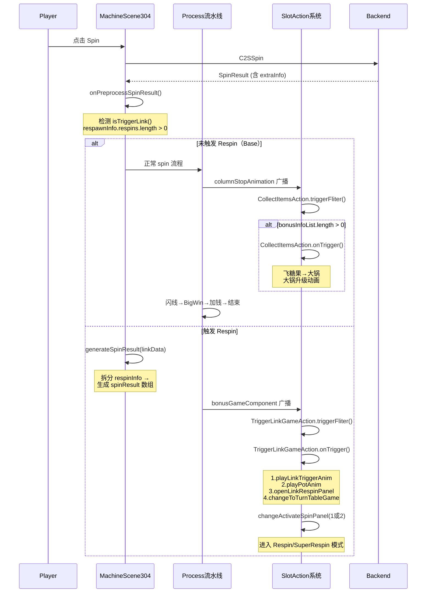
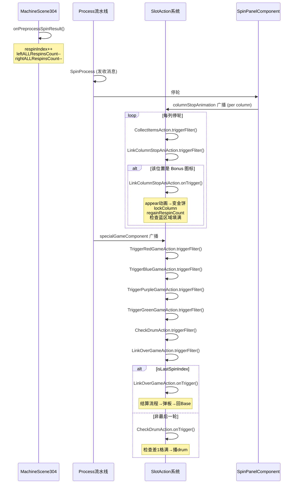
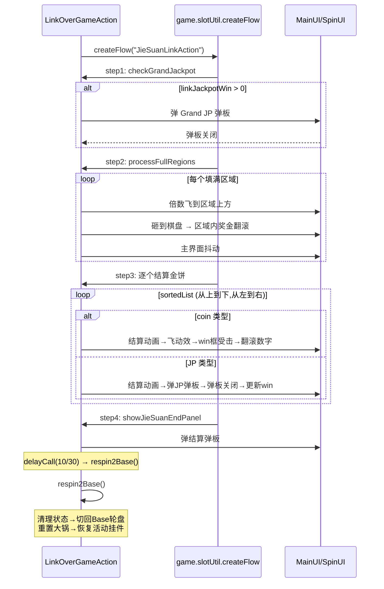
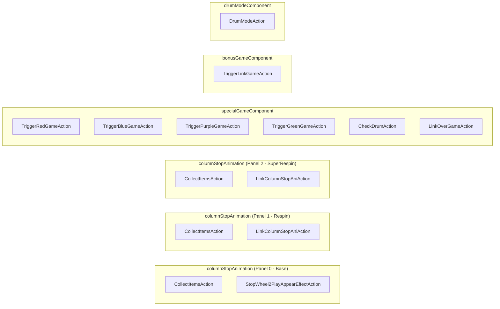
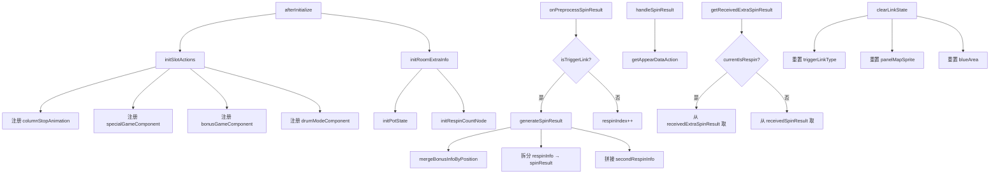
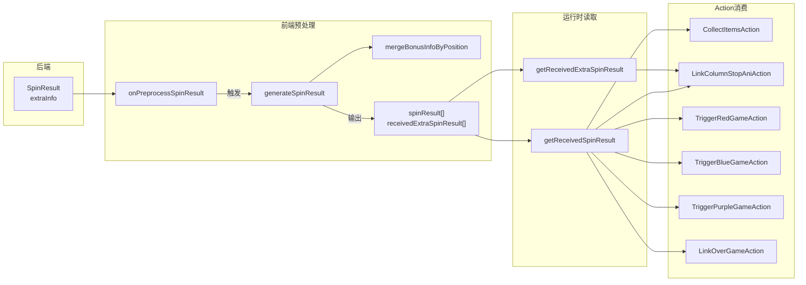

# 304 Sweet Gala 关卡可视化手册

**制定时间**：2026-07-24
**适用范围**：`src/newdesign_slot/scene/304_sweet_gala/` 全量逆向 + 新关卡生成模板
**关联文档**：[AI关卡研发流程](/关卡/AI关卡研发流程)、[SlotAction-使用规范](/关卡/SlotAction-使用规范)、[多轮盘spin相关注意事项](/关卡/多轮盘spin相关注意事项)、[注意事项](/关卡/注意事项)

---

## 一、玩法概述

Sweet Gala（304）是一个 **收集 + 多色 Respin** 玩法关卡：

- **Base 玩法**：普通 5×3 轮盘，转轴过程中收集彩色糖果飞入 4 个大锅（紫/绿/红/蓝），大锅升级 5 级后触发 Respin
- **Respin 玩法**：5×3 棋盘，Bonus 图标落定后锁定，消耗 respin 次数（默认 3 次，绿色触发后 4 次）
- **Super Respin**：收集次数达到第 7 次时触发，左右双 5×3 棋盘同时 respin
- **四色玩法**（Respin 中再触发）：
  - 紫色（index 0）：给已有金饼加钱
  - 绿色（index 1）：respin 次数 3→4
  - 红色（index 2）：单金饼变双金饼
  - 蓝色（index 3）：棋盘出现倍数区域，填满后倍数加成

---

## 二、整体架构图

### 2.1 文件结构

```text
src/newdesign_slot/scene/304_sweet_gala/
├── 304_action/              # SlotAction 文件（10 个）
│   ├── SweetGala_CollectItemsAction.js         # Base 收集糖果→大锅升级
│   ├── SweetGala_LinkColumnStopAniAction.js    # Respin 停轮→金饼 appear
│   ├── SweetGala_TriggerLinkGameAction.js      # Respin 入场（弹板+转场+初始化）
│   ├── SweetGala_TriggerRedGameAction.js        # 红色：单饼→双饼
│   ├── SweetGala_TriggerBlueGameAction.js       # 蓝色：倍数区域
│   ├── SweetGala_TriggerPurpleGameAction.js    # 紫色：加钱
│   ├── SweetGala_TriggerGreenGameAction.js      # 绿色：次数+1
│   ├── SweetGala_CheckDrumAction.js             # Drum 检测（差1格满）
│   ├── SweetGala_LinkOverGameAction.js          # Respin 结算
│   ├── SweetGala_DrumModeAction.js              # Base Drum 逻辑
│   └── SweetGala_SlowDrumModeAction.js          # Base 慢 Drum（10x/50x）
├── 304_components/          # 自定义组件（4 个）
│   ├── SweetGala_CellSpinPanelComponent.js      # 停轮步数+cell 坐标
│   ├── SweetGala_LinkSymbolLayerComponent.js    # 图标创建+缩放+颜色过滤
│   ├── Link_ClassicSymbolTransformComponent.js  # 斜切（Respin 关闭）
│   └── SweetGala_EnterRoomBonusCheckingComponent.js # 断线重连弹板
├── 304_controller/          # 控制器（1 个）
│   └── Link_SymbolController.js                  # 金饼数据显示+翻滚动画
├── 304_process/             # 流程（1 个）
│   └── SweetGala_PanelWinUpdateProcess.js       # 加钱流程（respin 即时更新）
├── SweetGalaMachineConfig304.js                 # 关卡配置（439 行）
└── SweetGalaMachineScene304.js                  # 场景主文件（1074 行）
```

### 2.2 类继承关系

```mermaid
classDiagram
    SlotActionEasy <|-- SlotAction
    SlotAction <|-- SlotActionSequence
    SlotAction <|-- SlowDrumModeAction
    SlotAction <|-- SweetGala_TriggerLinkGameAction
    SlotAction <|-- SweetGala_LinkOverGameAction
    SlotAction <|-- SweetGala_TriggerRedGameAction
    SlotAction <|-- SweetGala_TriggerBlueGameAction
    SlotAction <|-- SweetGala_TriggerPurpleGameAction
    SlotAction <|-- SweetGala_TriggerGreenGameAction
    SlotAction <|-- SweetGala_CheckDrumAction
    SlotAction <|-- SweetGala_CollectItemsAction
    SlotAction <|-- SweetGala_LinkColumnStopAniAction
    SlotAction <|-- SweetGala_DrumModeAction
    SlowDrumModeAction <|-- SweetGala_SlowDrumModeAction

    SlotMachineScene <|-- SlotMachineScene2022
    SlotMachineScene2022 <|-- SweetGalaMachineScene304

    CellSpinPanelComponent <|-- SweetGala_CellSpinPanelComponent
    CellSymbolLayerComponent <|-- SweetGala_LinkSymbolLayerComponent
    ClassicSymbolTransformComponent <|-- Link_ClassicSymbolTransformComponent
    EnterRoomBonusCheckingComponent <|-- SweetGala_EnterRoomBonusCheckingComponent
    NewSlot_PanelWinUpdateProcess <|-- SweetGala_PanelWinUpdateProcess

    class SlotAction {
        +context
        +triggerFliter(fliterData) bool
        +onTrigger(callback, fliterData)
        +onStartSpin(eventData)
    }
    class SlotActionSequence {
        +slotActions~SlotAction~
        +triggerFliter(fliterData) bool
        +onTrigger(callback, triggerData)
        +triggerOne(callNext, seqId, triggerData)
    }
    class SweetGalaMachineScene304 {
        +initSlotActions()
        +onPreprocessSpinResult()
        +generateSpinResult(allLinkData)
        +mergeBonusInfoByPosition(infoList)
        +getReceivedExtraSpinResult(panelId, col, row)
    }
```



### 2.3 组件关系图

```mermaid
graph TB
    subgraph MachineScene["SweetGalaMachineScene304"]
        SC["Scene 主控"]
        SPC0["SPIN_PANEL_ZERO<br/>ClassicSpinPanelComponent<br/>(Base 轮盘)"]
        SPC1["SPIN_PANEL_ONE<br/>SweetGala_CellSpinPanelComponent<br/>(Respin 轮盘)"]
        SPC2["SPIN_PANEL_TWO<br/>SweetGala_CellSpinPanelComponent<br/>(Super Respin 双盘)"]
        SLC["SymbolLayerComponent<br/>(Base: Classic / Respin: Link)"]
        STC["ClassicSymbolTransformComponent<br/>(斜切)"]
        ERB["EnterRoomBonusCheckingComponent<br/>(断线重连)"]
        PWU["PanelWinUpdateProcess<br/>(加钱)"]
    end

    subgraph Actions["SlotAction 注册"]
        COL["CollectItemsAction"]
        LCSA["LinkColumnStopAniAction"]
        TLA["TriggerLinkGameAction"]
        TRA["TriggerRedGameAction"]
        TBA["TriggerBlueGameAction"]
        TPA["TriggerPurpleGameAction"]
        TGA["TriggerGreenGameAction"]
        CDA["CheckDrumAction"]
        LOGA["LinkOverGameAction"]
        DMA["DrumModeAction"]
        SDMA["SlowDrumModeAction"]
    end

    SC --> SPC0
    SC --> SPC1
    SC --> SPC2
    SPC0 -->|columnStopAnimation| COL
    SPC1 -->|columnStopAnimation| LCSA
    SPC2 -->|columnStopAnimation| LCSA
    SC -->|specialGameComponent| TRA
    SC -->|specialGameComponent| TBA
    SC -->|specialGameComponent| TPA
    SC -->|specialGameComponent| TGA
    SC -->|specialGameComponent| CDA
    SC -->|specialGameComponent| LOGA
    SC -->|bonusGameComponent| TLA
    SC -->|drumModeComponent| DMA
    SC --> SDMA
```



---

## 三、主流程时序图

### 3.1 Base Spin → 触发 Respin 完整流程



### 3.2 Respin 单次 Spin 流程



### 3.3 LinkOverGame 结算时序



---

## 四、Action 注册与执行顺序

### 4.1 initSlotActions 注册表



**specialGameComponent 执行顺序**（SlotActionSequence 内串行）：

| 序号 | Action | 触发条件 | 说明 |
|---|---|---|---|
| 1 | TriggerRedGameAction | `reTriggerColors` 含 2 | 单饼→双饼，先于其他色 |
| 2 | TriggerBlueGameAction | `reTriggerBlueArea` 非空 | 倍数区域出现 |
| 3 | TriggerPurpleGameAction | `purpleAddInfoList` 非空或首次触发 | 给金饼加钱 |
| 4 | TriggerGreenGameAction | `reTriggerColors` 含 1 | 次数 3→4 |
| 5 | CheckDrumAction | respin 中且非最后一轮 | 差 1 格满播 drum |
| 6 | LinkOverGameAction | respin 中且最后一轮 | 结算→回 Base |

---

## 五、协议契约表（从 304 代码逆向提取）

### 5.1 后端 SpinResult.extraInfo 字段

| 字段 | 类型 | 来源 | 说明 |
|---|---|---|---|
| `triggeredColorFlags` | `[int,int,int,int]` | onPreprocessSpinResult | [紫,绿,红,蓝] 0/1，标记哪些颜色大锅触发 |
| `isSuperRespin` | `bool` | onPreprocessSpinResult | 是否为 Super Respin（双盘） |
| `avgTotalBet` | `number` | onPreprocessSpinResult | Super 时的平均 bet |
| `collectLevels` | `[int,int,int,int]` | onPreprocessSpinResult/initRoomExtraInfo | 4 个大锅当前等级 0-4 |
| `collectTriggerTimes` | `int` | onPreprocessSpinResult/initRoomExtraInfo | 第几次触发 respin（7 次=Super） |
| `clearCollectLevels` | `[int,int,int,int]` | LinkOverGameAction | 结束后重置的大锅等级 |
| `clearCollectTriggerTimes` | `int` | LinkOverGameAction | 结束后重置的收集次数 |
| `initBonusInfoList` | `Array` | TriggerLinkGameAction | 初始带入的金饼列表 |
| `mergeInitBonusInfoList` | `Array` | onPreprocessSpinResult（前端生成） | 合并后的初始金饼 |
| `initBlueArea` | `Object` | TriggerLinkGameAction | 初始蓝区域 |
| `secondInitBlueArea` | `Object` | TriggerLinkGameAction | Super 右盘初始蓝区域 |
| `linkJackpotWin` | `number` | onPreprocessSpinResult | Grand JP 赢钱 |
| `jackpotWin` | `number` | onPreprocessSpinResult | JP 总赢钱（触发时拆分） |

### 5.2 respinInfo 结构

| 字段 | 类型 | 说明 |
|---|---|---|
| `respinInfo.respins[]` | `Array` | 每次 respin 的结果 |
| `respinInfo.finalBonusInfoList` | `Array` | 结算时的最终金饼列表 |
| `respinInfo.blueArea` | `Object` | 结算时的蓝区域 `{"x2":{"0":true,...}}` |
| `secondRespinInfo.respins[]` | `Array` | Super 右盘 respin 结果 |
| `secondRespinInfo.finalBonusInfoList` | `Array` | Super 右盘结算列表 |
| `secondRespinInfo.blueArea` | `Object` | Super 右盘蓝区域 |

### 5.3 单次 respin 的 spinInfo 结构

| 字段 | 类型 | 说明 |
|---|---|---|
| `newBonusInfoList[]` | `Array` | 本次落定的金饼列表 |
| `purpleAddInfoList[]` | `Array` | 紫色加钱数据 |
| `reTriggerColors` | `[int]` | 本次触发的颜色 index 列表 |
| `reTriggerRedBonusInfoList` | `Array` | 红色触发的双饼数据 |
| `reTriggerBlueArea` | `Object` | 蓝色触发的新倍数区域 |

### 5.4 bonusInfo 数据结构

```yaml
bonusInfo:
  pos: { col: int, row: int }    # 位置（后端坐标，row 0=底部）
  color: int                      # 0紫 1绿 2红 3蓝 4彩虹
  type: [int]                     # [1=coin, 2=jp] 每个槽一个
  param: [number]                 # 倍率值
  finalParam: [number]            # 最终倍率值（结算用）
  index: [int]                    # [0=左下, 1=右上] 槽位
  symbolId: int                   # 前端生成：1501=金饼
```

### 5.5 purpleAddInfo 数据结构

```yaml
purpleAddInfo:
  toPos: { col: int, row: int }  # 要加钱的位置
  toIndex: int                    # 加到哪个槽 0/1
  param: number                   # 加多少倍率
```

### 5.6 blueArea 数据结构

```yaml
blueArea:
  "x2":                          # 倍数 key（x2 = 2倍区域）
    "0": true                     # cellId: 是否已落定
    "1": false
    ...
  "x3": { ... }
  "x4": { ... }
  "x5": { ... }
# cellId = col * 3 + row（后端坐标）
```

### 5.7 subjectRoomExtraInfo（进房时）

| 字段 | 类型 | 说明 |
|---|---|---|
| `collectLevels` | `[int,int,int,int]` | 进房时大锅等级 |
| `collectTriggerTimes` | `int` | 进房时收集次数 |

---

## 六、美术资产清单（从 304 代码逆向提取）

### 6.1 CCB 路径

| 用途 | CCB 路径 | 引用位置 |
|---|---|---|
| 主界面（普通） | `sweet_gala/reels/bg/sweet_gala_main.ccbi` | MachineConfig (resRootDir 拼接) |
| 主界面（Pad） | `sweet_gala/reels/bg/sweet_gala_main_pad.ccbi` | MachineConfig |
| Respin 触发弹板 | `sweet_gala/reels/bg/sweet_gala_dialog_respin_start.ccbi` | TriggerLinkGameAction |
| Super Respin 触发弹板 | `sweet_gala/reels/bg/sweet_gala_dialog_sp_respin_start.ccbi` | TriggerLinkGameAction |
| Respin 结算弹板 | `sweet_gala/reels/bg/sweet_gala_dialog_respin_collect.ccbi` | LinkOverGameAction |
| Super Respin 结算弹板 | `sweet_gala/reels/bg/sweet_gala_dialog_sp_respin_collect.ccbi` | LinkOverGameAction |
| JP 弹板 | `sweet_gala/reels/bg/sweet_gala_dialog_jackpot.ccbi` | LinkOverGameAction |
| 断线重连弹板 | `sweet_gala/reels/bg/sweet_gala_dialog_duanxian.ccbi` | MachineConfig |
| Super 断线重连弹板 | `sweet_gala/reels/bg/sweet_gala_dialog_duanxian_sp.ccbi` | EnterRoomBonusCheckingComponent |
| 金饼飞行 | `sweet_gala/reels/symbol/sweet_gala_symbol_batch_link_fly.ccbi` | LinkOverGameAction |
| 倍数飞行 | `sweet_gala/reels/bg/sweet_gala_whee_beishu_add.ccbi` | LinkOverGameAction |
| 糖果飞行 | `sweet_gala/reels/symbol/sweet_gala_symbol_batch_tang_fly.ccbi` | CollectItemsAction |
| Drum 特效 | `sweet_gala/reels/bg/sweet_gala_wheel_effect_drum.ccbi` | CheckDrumAction |
| Paytable | `sweet_gala/reels/bg/sweet_gala_faq.ccbi` | MachineConfig |

### 6.2 MainUI 节点命名

| 节点名 | 用途 | 引用位置 |
|---|---|---|
| `_guo0` ~ `_guo3` | 4 个大锅（紫/绿/红/蓝） | getPotNodeList |
| `_multiTL` `_multiBL` `_multiTR` `_multiBR` | 倍数节点（4 角） | getMultiplierNodeList |
| `_bonusTitle` | Respin 标题节点 | getRespinTitleNode |
| `_bonus0` ~ `_bonus6` | 7 个进度节点 | getRespinCountListNode |
| `_baserespinCount` | Base Respin 计数器 | initRespinCountCCB |
| `_winEffect` | Win 框受击动画 | LinkOverGameAction |
| `_superTipCCB` | Super 提示气泡 | switchTipQiPao |
| `_drum` | Drum 背景特效 | DrumModeAction |
| `panel_2` | Super Respin 面板容器 | afterInitialize |
| `_leftPanel` `_rightPanel` | Super 左右子盘 | CellSpinPanelComponent |
| `_leftSpinCount` `_rightSpinCount` | Super 左右计数器 | initRespinCountCCB |
| `respinJackpotEffectNode` | Super JP 特效 | clearJackpotEffect |

### 6.3 Super Panel 节点命名

| 节点名 | 用途 |
|---|---|
| `_cell_0` ~ `_cell_14` | 15 个格子（5×3） |
| `_color0` ~ `_color3` | 4 色背景 |
| `_line_t_0` ~ `_line_t_4` | 顶部外边框线 |
| `_line_b_0` ~ `_line_b_4` | 底部外边框线 |
| `_line_l_0` `_line_r_4` | 左/右外边框线 |
| `_line_N_M` | 内部线段（N→M） |

### 6.4 动画名

| 类别 | 动画名 | 用途 |
|---|---|---|
| 大锅 | `1` `2` `3` `4` `5` | 等级状态 |
| 大锅升级 | `1_to_2` `2_to_3` `3_to_4` `4_to_5` | 升级动画 |
| 大锅加料 | `1_add` `2_add` ... `5_add` | 收集动画 |
| 大锅触发 | `trigger` | Respin 触发 |
| 金饼 | `appear` `appear_2` | 落定（单饼/双饼） |
| 金饼 | `base` `base_2` | 基础状态（单/双） |
| 金饼 | `change1` `change2` | 糖→饼转换（单/双） |
| 金饼 | `jiesuan` `jiesuan_2_left` `jiesuan_2_right` | 结算动画 |
| 金饼 | `add` `add_2` `add_2_left` `add_2_right` | 紫色加钱 |
| 金饼 | `to_2` | 单饼→双饼 |
| Drum | `drum` | Drum 动画 |
| 区域 | `to_glow` `glow` | 区域填满高亮 |
| 区域 | `appear` `loop` `base` | 区域线段 |
| MainUI | `base` `respin` `super` | 玩法切换 |
| MainUI | `respin_shake` `super_shake` | 棋盘抖动 |
| 计数器 | `appear` `disappear` `loop` `base` | 计数动画 |
| 计数器 | `to_4` `3` `4` | 3→4 升级 |
| 转场 | `trigger` | Respin 入场 |
| 标题 | `appear` | 进度节点出现 |

### 6.5 音效名

| 音效名 | 用途 |
|---|---|
| `304_qianyao` | 前摇音效 |
| `304_bonus_appear` | Bonus 图标出现 |
| `304_wild_appear` | Wild 图标出现 |
| `304_coin_appear` | 金饼出现 |
| `304_bonus_fly` | 糖果飞行 |
| `304_pot_trigger` | 大锅触发 |
| `304_pot_retrigger` | 大锅再触发 |
| `304_pot_upgrade` | 大锅升级 |
| `304_double_2doublecoins` | 单饼→双饼 |
| `304_zone_appear` | 倍数区域出现 |
| `304_zone_fly` | 倍数飞行 |
| `304_coin_fly` | 金币飞行 |
| `304_coin_jp` | JP 金饼结算 |
| `304_jp_menu` | JP 弹板（普通） |
| `304_jp_multy` | JP 弹板（倍数） |
| `304_boost_add` | 紫色加钱 |
| `304_respin_candy2coin` | 糖→饼转换 |
| `304_respin_reelstop` | Respin 停轮 |
| `304_respin_start` | Respin 开始弹板 |
| `304_super_start` | Super Respin 开始弹板 |
| `304_respin_end` | Respin 结束弹板 |
| `304_super_end` | Super Respin 结束弹板 |
| `304_super_add` | Super 进度增加 |
| `304_super_trigger` | Super 触发 |
| `304_extra_3to4` | 次数 3→4 升级 |
| `304_zhuanchang` | 转场音效 |
| `bonus_game_bg_music` | Respin 背景音乐 |
| `bonusgame_bgm` | Super Respin 背景音乐 |
| `fx-reel-stop-drum-roll` | DrumMode 通用音效 |
| `HitFreespin` | Scatter 打铃音效 |

### 6.6 图标 ID

| 图标 ID | 含义 |
|---|---|
| `1` | Wild |
| `1101` `1102` | 普通图标 |
| `1103` `1104` | 10x / 50x 倍数图标 |
| `1200` | 紫色 Bonus |
| `1201` | 绿色 Bonus |
| `1202` | 红色 Bonus |
| `1203` | 蓝色 Bonus |
| `1204` | 彩虹 Bonus（随机色） |
| `1501` | 金饼（Link 图标） |
| `1502` | 空位占位 |
| `3` | 空图标 |

---

## 七、时序常数清单（从 304 代码逆向提取）

> 所有时间以"帧"为单位，除以 30 转为秒（30fps）。`delayCall(N/30, ...)` = 延迟 N 帧。

### 7.1 Action 内时序

| Action | 步骤 | 帧数 | 秒 | 说明 |
|---|---|---|---|---|
| TriggerRedGameAction | convertAllSingleToDouble 后等待 | 50 | 1.67 | 双饼变化动画时长 |
| TriggerBlueGameAction | 全部完成后等待 | 50 | 1.67 | 倍数出现15帧+cell变色10帧+锅trigger |
| TriggerPurpleGameAction | 首次触发等待 | 55 | 1.83 | 含锅 trigger 动画 |
| TriggerPurpleGameAction | 非首次触发等待 | 30 | 1.0 | 无锅 trigger |
| TriggerPurpleGameAction | 加钱后 setSymbolData 延迟 | 7 | 0.23 | 加钱动画时长 |
| TriggerGreenGameAction | 全部完成后等待 | 50 | 1.67 | 锅 trigger 动画时长 |

### 7.2 TriggerLinkGameAction 时序

| 步骤 | 帧数/秒 | 说明 |
|---|---|---|
| playLinkTriggerAnim → callNext | 2s | Super 时播完 title trigger |
| playPotAnim 内清理图标 | 2.5s delay | 延迟清理 bonus 图标 |
| playPotAnim → callNext | 2s delay | 大锅 trigger 动画 |
| openLinkRespinPanel → changeToTurnTableGame | 2s delay | 弹板显示后转场 |
| 转场后音乐切换 | 0.4s delay | 等待转场完成 |

### 7.3 LinkColumnStopAniAction 时序

| 步骤 | 帧数 | 秒 | 说明 |
|---|---|---|---|
| 非金饼图标延迟 | 20 | 0.67 | 糖→饼转换动画 |
| 总等待 | 21 + delayTime | 0.7~1.37 | 21帧基础 + 20帧(非1501) |
| CollectItemsAction 升级延迟 | 15 | 0.5 | 飞行后升级 |

### 7.4 LinkOverGameAction 时序

| 步骤 | 帧数/秒 | 说明 |
|---|---|---|
| 倍数飞行 | 15/30 | flyItem 飞行时长 |
| 倍数砸棋盘后翻滚 | 30/30 | 翻滚动画 |
| 区域处理完成后等待 | 45/30 | 等待所有区域处理完 |
| 金饼结算飞动效 | 15/30 | flyCCBItemWithRecycle |
| 金饼结算受击延迟 | 15/30 | 飞到 win 框延迟 |
| 金饼结算回调延迟 | 10/30 | 受击后回调 |
| JP 结算弹板延迟 | 15/30 | 结算动画后弹板 |
| win框翻滚停止等待 | 25/30 | 等翻滚结束 |
| 结算弹板→转场 | 10/30 | 弹板关闭后转场 |
| JP弹板自动关闭 | 4s | setAutoCloseDelay(4) |
| JP弹板倍数翻滚开始 | 78/30 | 倍数翻滚延迟 |
| JP弹板翻滚时长 | 32/30 | NumberAnimation tickDuration |

### 7.5 SlowDrumModeAction 时序

| 步骤 | 帧数 | 秒 | 说明 |
|---|---|---|---|
| forceShowDrumAnimation 延迟 | 20.5 | 0.68 | 慢 drum 延迟 |
| NumberAnimation 翻滚 | 14 | 0.47 | 金饼数字翻滚 |

### 7.6 MachineConfig 时序

| 配置项 | 值 | 说明 |
|---|---|---|
| `columnStopAnimationDelayTime` | 20/30 | 停轮后 appear 等待 |
| `winLineBlinkDuration` | 2s | 赢钱线闪烁 |
| `scatterBlinkDuration` | 2s | Scatter 闪烁 |
| `bonusBlinkDuration` | 2s | Bonus 闪烁 |
| `delayAfterBlinkAllWinLine` | 0.5s | 闪线后进入下一流程 |
| `delayTimeMultiUpWinChips` | 1+11/30 | 加倍后更新展示 |
| `multiUpAnimTime` | 3s | 加倍动画总时长 |
| `reconnectAutoCloseDelayTime` | 4s | 断线重连弹板 |
| `popupPanelAutoCloseProgressDelay` | 1s | 弹板倒计延迟 |

---

## 八、玩法点矩阵（AI 生成 Action 的直接输入）

| 玩法点 | 触发条件（triggerFliter） | 执行流程（onTrigger） | Action | 注册位置 |
|---|---|---|---|---|
| Base 收集糖果 | `bonusInfoList.length > 0` | 飞糖果→大锅→升级动画 | CollectItemsAction | columnStop (panel 0) |
| Respin 金饼落定 | respin 中且该位置是 bonus 图标 | appear→变金饼→lockColumn→regainRespinCount→检查蓝区域 | LinkColumnStopAniAction | columnStop (panel 1/2) |
| Respin 触发入场 | `respinTriggered && respinIndex === 0` | trigger动画→大锅→弹板→转场→初始化图标/倍数/线段 | TriggerLinkGameAction | bonusGameComponent |
| 红色：单→双饼 | respin 中且 `reTriggerColors` 含 2 | 锅 trigger→逐个合并双饼数据→to_2 动画 | TriggerRedGameAction | specialGameComponent |
| 蓝色：倍数区域 | respin 中且 `reTriggerBlueArea` 非空 | 锅 trigger→随机颜色→设置倍数节点→设置背景色→设置线段→检查填满 | TriggerBlueGameAction | specialGameComponent |
| 紫色：加钱 | respin 中且 `purpleAddInfoList` 非空或首次触发 | 锅 trigger→按位置合并→累加 param→翻滚动画 | TriggerPurpleGameAction | specialGameComponent |
| 绿色：次数+1 | respin 中且 `reTriggerColors` 含 1 | 锅 trigger→triggerLinkType[1]=1→regainRespinCount(4) | TriggerGreenGameAction | specialGameComponent |
| Drum 检测 | respin 中且非最后一轮 | 检查差1格满→在空位播 drum | CheckDrumAction | specialGameComponent |
| Respin 结算 | respin 中且最后一轮 | 检查Grand→倍数砸棋盘→逐个结算→弹板→回Base | LinkOverGameAction | specialGameComponent |
| Base Drum | Base 中且非前摇且非 FreeSpin | 检查10x/50x→播放drum→压暗→停轮清理 | DrumModeAction | drumModeComponent |
| Base 慢 Drum | Base 中且 col0/col1 有 10x/50x | R3 延迟播慢 drum | SlowDrumModeAction | (场景缓存) |

---

## 九、Scene 关键方法调用关系



---

## 十、数据流转图



---

## 十一、Scene 重载方法清单

### 11.1 框架重载方法

| 方法 | 来源 | 用途 | 304 实现 |
|---|---|---|---|
| `appendExtraConfig` | SlotMachineScene2022 | 注册 MachineConfig + 自定义 Controller | 注册 SweetGalaMachineConfig304 + Link_SymbolController |
| `getSceneComponentConfig` | SlotMachineScene2022 | 配置 Scene 级组件 | ENTER_ROOM + 3 个 SpinPanel |
| `getSpinPanelComponentsConfig` | SlotMachineScene2022 | 配置轮盘级组件 | WinLine + SymbolTransform + SymbolLayer |
| `getPanelSpinProcesses` | SlotMachineScene2022 | 多轮盘 Process 注册 | 3 个 PanelSpinProcess |
| `getProcessesNewVersion2025` | SlotMachineScene2022 | 主流程流水线 | 替换 PanelWinUpdateProcess |
| `afterInitialize` | SlotMachineScene2022 | 初始化后 | initSlotActions + changeActivateSpinPanel(0) |
| `initRoomExtraInfo` | SlotMachineScene2022 | 进房信息 | 大锅等级 + 收集次数 + 计数器 |
| `onPreprocessSpinResult` | SlotMachineScene2022 | spin 结果预处理 | 检测触发 + generateSpinResult |
| `handleSpinResult` | SlotMachineScene2022 | spin 结果处理 | getAppearDataAction |
| `getReceivedExtraSpinResult` | SlotMachineScene2022 | 获取附加数据 | respin 中从 receivedExtraSpinResult 取 |
| `getSpinExtraData` | SlotMachineScene2022 | 滚动图标数据 | 1501 生成随机金饼数据 |
| `usingFeatureDependentSpinBet` | SlotMachineScene2022 | bet 逻辑 | 返回 `_useAverageBet` |
| `getFeatureDependentSpinBet` | SlotMachineScene2022 | bet 获取 | 返回 `respinAvgTotalBet` |
| `enableFeatureSpinBet` | SlotMachineScene2022 | 启用平均 bet | 手动设置 FreeSpinBet |
| `disableFeatureSpinBet` | SlotMachineScene2022 | 禁用平均 bet | 恢复默认 |
| `onSubRoundStart` | SlotMachineScene2022 | 子轮开始 | updateRespinsCount |
| `clearJackpotEffect` | SlotMachineScene2022 | 清理 JP 效果 | 重置 JP 特效节点 |

### 11.2 304 自定义方法

| 方法 | 用途 |
|---|---|
| `initSlotActions` | 注册所有 Action |
| `isTriggerLink` | 检测是否触发 Respin |
| `isTriggerRed` | 检测是否触发红色玩法 |
| `isTriggerGreen` | 检测是否触发绿色玩法 |
| `generateSpinResult` | 拆分后端数据为多轮 spinResult |
| `mergeBonusInfoByPosition` | 同位置 bonusInfo 合并 |
| `getDefaultSymbolId` | 生成默认空盘面 |
| `getDefaultExtraPanel` | 生成默认附加盘面 |
| `clearLinkState` | 重置 Respin 状态 |
| `getPotNodeList` | 获取 4 个大锅节点 |
| `initPotState` | 初始化大锅等级 |
| `getRespinTitleNode` | 获取 Respin 标题 |
| `getRespinCountListNode` | 获取 7 个进度节点 |
| `initRespinCountNode` | 初始化进度节点状态 |
| `initRespinCountCCB` | 初始化计数器 CCB |
| `regainRespinCount` | 恢复已消耗计数 |
| `updateRespinsCount` | 消耗计数 |
| `getMultiplierNodeList` | 获取倍数节点 |
| `getSuperMultiplierNodeList` | 获取 Super 倍数节点 |
| `applyMultiplierNodes` | 设置倍数节点 |
| `resetMultiplierNodes` | 重置倍数节点 |
| `getRandomColor` | 随机颜色排列 |
| `flipCellRow` | 后端坐标→前端坐标（行翻转） |
| `flipMultiData` | 批量翻转倍数数据 |
| `initAllLinesVisible` | 初始化所有线段可见 |
| `setAllLinesVisible` | 设置线段可见 |
| `applyLineVisibility` | 按区域设置线段 |
| `getRegionBorderNodes` | 获取区域边界节点 |
| `playRegionWinAnimation` | 区域填满动画 |
| `isRegionFull` | 检查区域是否填满 |
| `checkAndPlayTriggerAnimation` | 检查并播放填满动画 |
| `resetAllCellBg` | 重置背景色 |
| `applyCellBgColors` | 设置区域背景色 |

---

## 十二、MachineConfig 关键配置项

### 12.1 玩法开关

| 配置项 | 值 | 说明 |
|---|---|---|
| `needOnWinLine` | false | 不需要在线上才触发 |
| `isCCBSymbol` | true | 启用 CCB 图标 |
| `simulateRandomSymbol` | true | 模拟卷轴 |
| `useDrumModeComponent` | true | 启用 DrumMode |
| `useColumnStopAnimationComponent` | true | 启用停轮动画组件 |
| `useBigWinProcess2025` | true | 2025 BigWin 流程 |
| `needFreeSpinAction` | false | 无 FreeSpin |
| `supportEarlyStopInRespin` | true | Respin 允许 EarlyStop |
| `tapAnyWhereSpin` | true | 点击轮盘 Spin |
| `supportFastSpin` | true | FastSpin |
| `needFastSpinSettlement` | true | FastSpin 结算 |
| `HookAppearData` | true | 启用 appear 数据钩子 |

### 12.2 图标配置

| 配置项 | 值 | 说明 |
|---|---|---|
| `hasSymbolListAppear` | `[1200,1201,1202,1203,1204,1501]` | 有就 appear |
| `inLineSymbolListAppear` | `[[[1,1101,1102,1103,1104],[],[]],[[],[...],[]]]` | 在线上 appear |
| `winLineHasSymbolListAppear` | `[1,1101,1102,1103,1104]` | 赢钱线上 appear |
| `inLineSymbolFilterID` | `[3]` | 过滤空图标 |
| `appearAudioNameList` | `{1:"304_wild_appear",1200:"304_bonus_appear",...}` | appear 音效 |
| `drumSymbolGroupList` | `[[1,1101,1102],[2]]` | Drum 图标组 |
| `supportSymbolDrumMode` | false | 关闭图标 DrumMode |

### 12.3 斜切配置

| 配置项 | 值 | 说明 |
|---|---|---|
| `supportSymbolTransform` | `[true,true,true,false]` | 4 个轮盘开关 |
| `xRotateFactors` | `[[5,0,5],[5,0,5]]` | X 旋转因子 |
| `xOffsetFactors` | `[[5,0,5],[5,0,5]]` | X 偏移因子 |
| `scaleFactors` | `[[0.95,1,0.95],[0.95,1,0.95]]` | 缩放因子 |

### 12.4 弹板 CCB 配置

| 配置项 | 值 |
|---|---|
| `reconnectPanelCCB` | `sweet_gala/reels/bg/sweet_gala_dialog_duanxian.ccbi` |
| `newPaytablePath` | `sweet_gala/reels/bg/sweet_gala_faq.ccbi` |
| 其他弹板 | `null`（关卡自定义处理） |

### 12.5 多轮盘配置

| 配置项 | 值 | 说明 |
|---|---|---|
| `useSinglePanelBet` | false | 不使用单轮盘 bet |
| `supportMultiPanelCloverClash` | true | 四叶草支持多轮盘 |
| `supportMultiPanelHRJP` | true | HR JP 支持多轮盘 |
| `useMultiPanelRespin` | false | 不使用多轮盘 respin 协议 |
| `stopAllReelsWhenTriggerQianyao` | `[true,false]` | 前摇时全停 |

---

## 十三、新关卡提取模板

### 13.1 协议契约表模板（新关卡用）

```yaml
# ===== 新关卡 extraInfo 字段结构 =====
# 后端在策划案定稿后填写此表

extraInfo:
  # --- 触发标记 ---
  triggeredFlags: [type]           # 触发了哪些玩法
  isSpecialMode: bool             # 是否为特殊模式

  # --- 收集系统（如有）---
  collectLevels: [type]           # 收集等级
  collectTriggerTimes: int        # 收集次数

  # --- 特殊玩法数据 ---
  specialInfo:
    items:                        # 每次 spin 的落定项
      - pos: {col, row}
        type: int
        param: [number]
        finalParam: [number]
        index: [int]
    addInfoList:                  # 加值数据（如有）
      - toPos: {col, row}
        toIndex: int
        param: number
    reTriggerFlags: [int]         # 再触发标记
    reTriggerData: [...]          # 再触发附加数据

  # --- 结算数据 ---
  finalItems: [...]               # 结算时的最终列表
  areaData:                       # 区域数据（如有）
    "x2": {"0": true, ...}

  # --- 清理数据 ---
  clearCollectLevels: [type]
  clearCollectTriggerTimes: int
```

### 13.2 美术资产清单模板（新关卡用）

```yaml
# ===== 新关卡美术资产 =====
# 美术在策划案定稿后填写此表

# CCB 路径（相对于 resRootDir）
mainUI: "{{resRootDir}}/reels/bg/{{resRootDir}}_main.ccbi"
mainUIPad: "{{resRootDir}}/reels/bg/{{resRootDir}}_main_pad.ccbi"
startPanel: "{{resRootDir}}/reels/bg/{{resRootDir}}_dialog_start.ccbi"
collectPanel: "{{resRootDir}}/reels/bg/{{resRootDir}}_dialog_collect.ccbi"
jackpotPanel: "{{resRootDir}}/reels/bg/{{resRootDir}}_dialog_jackpot.ccbi"
reconnectPanel: "{{resRootDir}}/reels/bg/{{resRootDir}}_dialog_duanxian.ccbi"
flyItem: "{{resRootDir}}/reels/symbol/{{resRootDir}}_symbol_fly.ccbi"
# ... 按需添加

# 节点命名
collectNodes: ["_node0", "_node1", ...]  # 收集节点
multiplierNodes: ["_multiTL", ...]        # 倍数节点
counterNodes: ["_count0", ...]            # 计数节点
# ... 按需添加

# 动画名
collectAnims: ["1", "2", ..., "trigger"]
symbolAnims: ["appear", "base", "jiesuan", ...]
# ... 按需添加

# 音效名
sounds: ["{{id}}_appear", "{{id}}_trigger", ...]
# ... 按需添加

# 图标 ID
symbolIds:
  wild: 1
  bonus: [1200, 1201, ...]
  link: 1501
  empty: 3
```

### 13.3 时序常数模板（新关卡用）

```yaml
# ===== 新关卡时序常数 =====
# AI 生成时用占位符，人工调优时填入实际值

timing:
  # Action 内时序
  trigger_wait: __FRAMES__      # 触发后等待动画时长
  appear_delay: __FRAMES__      # appear 动画时长
  fly_duration: __FRAMES__       # 飞行动效时长
  settle_delay: __FRAMES__      # 结算动画时长

  # 弹板时序
  panel_auto_close: __SECONDS__  # 弹板自动关闭延迟
  panel_progress_delay: __SECONDS__

  # 流程时序
  blink_duration: __SECONDS__    # 闪烁时长
  bigwin_delay: __SECONDS__      # BigWin 延迟
```

---

## 十四、SymbolController 节点清单

`Link_SymbolController` 管理金饼图标的显示，CCB 节点命名如下：

| 节点名 | 用途 | 显示条件 |
|---|---|---|
| `_chips0` `_chips1` | 金币数字（槽 0/1） | type=1 |
| `_jp00` ~ `_jp03` | JP 图标（槽 0, param 0-3） | type=2, param=0-3 |
| `_jp10` ~ `_jp13` | JP 图标（槽 1, param 0-3） | type=2, param=0-3 |
| `_jp00_add` ~ `_jp03_add` | JP 倍数图标（槽 0） | type=2 且有 AddMulti |
| `_jp10_add` ~ `_jp13_add` | JP 倍数图标（槽 1） | type=2 且有 AddMulti |
| `_norJp0` `_norJp1` | 普通 JP 容器 | 无 AddMulti 时显示 |
| `_addMulti0` `_addMulti1` | 倍数 JP 容器 | 有 AddMulti 时显示 |
| `_jpMulti0` `_jpMulti1` | 倍数文字 | AddMulti > 0 时显示 |
| `_jpGold0` `_jpGold1` | JP 金色底 | type=2 时显示 |
| `_color0` ~ `_color4` | 颜色标记 | 对应 5 种颜色 |
| `_addChips0` `_addChips1` | 加钱文字 | 紫色加钱时显示 |

---

**最后更新**：2026-07-24
**维护者**：赵恒
