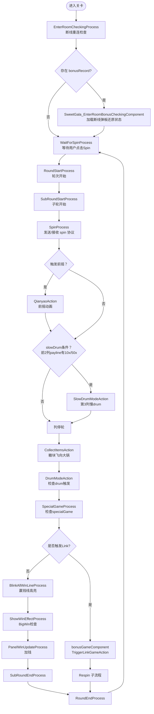
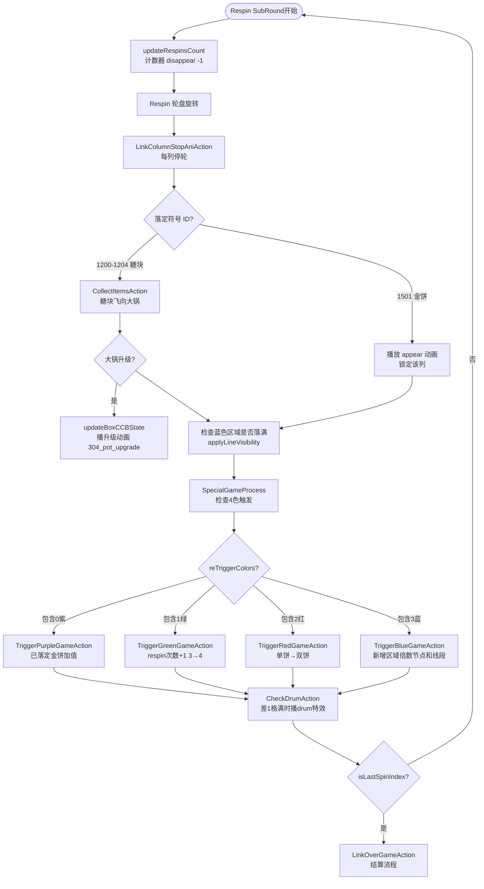
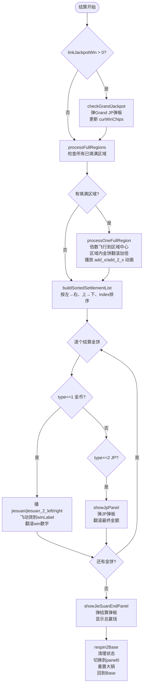
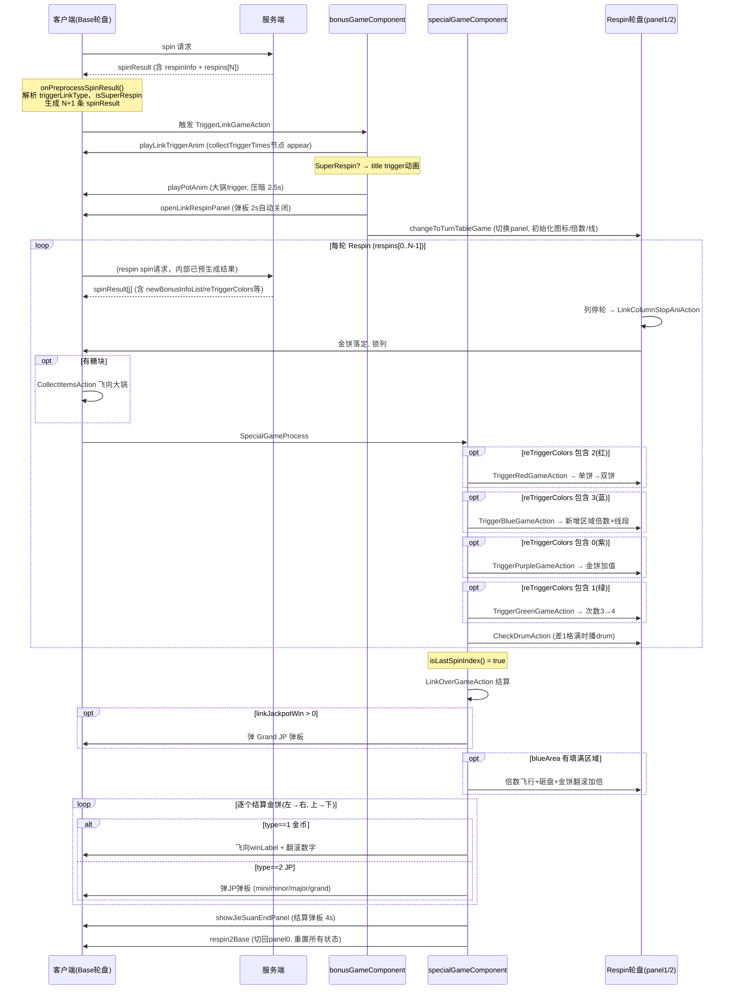
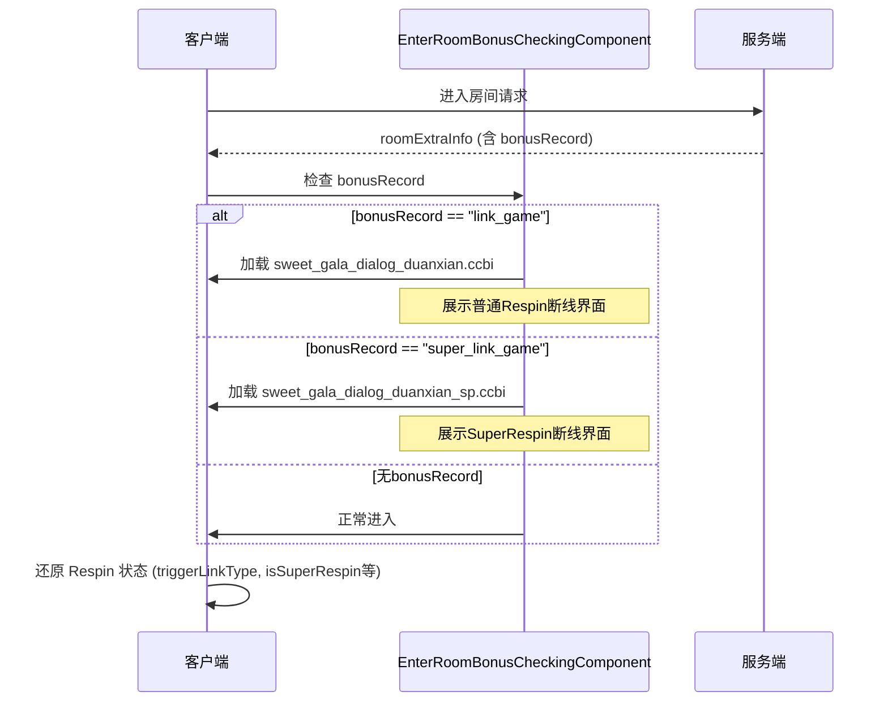

# 关卡 304：Sweet Gala 研发手册

> **场景类**: `SweetGalaMachineScene304`  
> **Scene Type ID**: `1304`  
> **资源目录**: `res_doublehit/sweet_gala/`  
> **最后更新**: 2026-07-24

---

## 一、策划案拆解

### 1.1 玩法总览

| 维度 | 内容 |
|---|---|
| **轮盘布局** | 5列 × 3行（Base），Respin 5×3，Super Respin 10×3（左右各5列） |
| **轮盘数量** | 3个 Panel（panel0=Base，panel1=普通Respin，panel2=Super Respin） |
| **核心机制** | 糖块收集 → 触发 Link Respin，4色大锅各有独立玩法 |
| **JP系统** | Mini(0) / Minor(1) / Major(2) / Grand(3)，共4级 |
| **Drum Mode** | Base中payline上出现 10x(1103)/50x(1104) 时触发 |
| **Super Respin** | 收集触发次数满7次后，下次触发进入 Super Respin（双轮盘） |

---

### 1.2 符号系统表

| 符号 ID | 名称 | 类型 | 说明 |
|---|---|---|---|
| `1` | Wild | 万能符号 | 替换所有普通符号 |
| `1101` | Wild 2x | 万能符号 | 带2倍乘数Wild |
| `1102` | Wild 3x | 万能符号 | 带3倍乘数Wild |
| `1103` | Wild 10x | 万能符号 | 带10倍，触发 Drum Mode |
| `1104` | Wild 50x | 万能符号 | 带50倍，触发 Drum Mode |
| `1200` | 糖块（紫） | 收集符号 | 飞向紫色大锅，Bonus Appear |
| `1201` | 糖块（绿） | 收集符号 | 飞向绿色大锅，Bonus Appear |
| `1202` | 糖块（红） | 收集符号 | 飞向红色大锅，Bonus Appear |
| `1203` | 糖块（蓝） | 收集符号 | 飞向蓝色大锅，Bonus Appear |
| `1204` | 糖块（混合） | 收集符号 | 飞向所有大锅 |
| `1501` | 金饼（Link符号） | Respin落定符号 | 携带金币数值或JP等级 |
| `1502` | 空格 | Respin占位符 | Respin轮盘的空白格 |

**Appear 触发规则**：

| 规则 | 符号列表 |
|---|---|
| `hasSymbolListAppear`（有就播） | 1200, 1201, 1202, 1203, 1204, 1501 |
| `inLineSymbolListAppear`（在线上播） | 1, 1101, 1102, 1103, 1104 |
| `winLineHasSymbolListAppear`（赢钱线上播） | 1, 1101, 1102, 1103, 1104 |

---

### 1.3 四色大锅玩法机制

| 颜色 | 大锅索引 | `triggerLinkType[i]` | Respin 中触发效果 | 触发条件 |
|---|---|---|---|---|
| **紫** | 0 | `[0]` | 给已落定金饼加值（`purpleAddInfoList`） | `reTriggerColors` 包含 0 |
| **绿** | 1 | `[1]` | Respin次数 3→4（`regainRespinCount`） | `reTriggerColors` 包含 1 |
| **红** | 2 | `[2]` | 单饼→双饼（`reTriggerRedBonusInfoList`） | `reTriggerColors` 包含 2 |
| **蓝** | 3 | `[3]` | 新增区域倍数（`reTriggerBlueArea`） | `reTriggerColors` 包含 3 |

**大锅等级**：0～4级（5个状态），动画名 `"1"` 到 `"5"`；升级动画：`"{old+1}_to_{new+1}"`；已满再飞入：`"{level+1}_add"`

---

### 1.4 蓝色区域（Blue Area）倍数系统

- **区域数据格式**：`{ "x2": {"cellId": bool, ...}, "x4": {...} }`
- **cellId 规则**：后端 `cellId = col * 3 + row`（row 0=底部），前端需行翻转（`flipCellRow`）
- **角位节点**：`bl=0, tl=2, br=12, tr=14`（5×3棋盘中4个角）
- **区域填满判断**：cellMap 内所有 bool 为 true
- **触发效果**：区域填满后，区域内金饼奖金 × 倍数

---

### 1.5 Super Respin 升级条件

```
mCollectTriggerTimes 收集次数
每次触发Link Respin → collectTriggerTimes + 1
当 collectTriggerTimes 达到 7 → 下次触发进入 Super Respin
Super Respin = 双轮盘（panel2）+ avgTotalBet计算bet
```

---

## 二、流程图（Mermaid）

### 2.1 Base 玩法完整主循环



---

### 2.2 Link 触发完整流程

```mermaid
flowchart TD
    A([bonusGameComponent触发]) --> B{respinIndex == 0?}
    B -- 否 --> Z([跳过])
    B -- 是 --> C[playLinkTriggerAnim\n播放收集次数节点 appear\n若SuperRespin播title trigger]
    C --> D[playPotAnim\n4色大锅各自播trigger动画\n压暗非bonus图标\n延迟2.5s清除糖块\n延迟2s进入下一步]
    D --> E[openLinkRespinPanel\n弹出 respin_start 弹板\n显示触发颜色数量和图标\n播放对应音效]
    E --> F[changeToTurnTableGame\n播放转场动画\n切换到 panel1/panel2\n初始化 bonus 图标\n初始化倍数节点和线\n初始化respin计数器]
    F --> G{isSuperRespin?}
    G -- 是 --> H[enableFeatureSpinBet\n显示avgTotalBet\n初始化左右双轮盘]
    G -- 否 --> I[regainRespinCount(panel1)\n恢复respin计数节点]
    H --> J([进入 Respin 子循环])
    I --> J
```

---

### 2.3 Respin 每轮循环



---

### 2.4 结算流程（LinkOverGameAction）



---

## 三、类图

```mermaid
classDiagram
    class SlotMachineScene2022 {
        +respinTriggered: bool
        +machineConfig: Object
        +spinPanelComponent: Component
        +specialGameComponent: Component
        +bonusGameComponent: Component
        +getProcessesNewVersion2025()
        +initSlotActions()
        +onPreprocessSpinResult()
    }

    class SweetGalaMachineScene304 {
        +triggerLinkType: Array~[紫绿红蓝]~
        +mCollectLevels: Array~4~
        +mCollectTriggerTimes: number
        +isSuperRespin: bool
        +respinAvgTotalBet: number
        +leftPanelMapSprite: Object
        +rightPanelMapSprite: Object
        +currentLeftBlueArea: Object
        +currentRightBlueArea: Object
        +LinkSpriteScale: 1
        +NormalSpriteScale: 0.65
        +RespinSpriteScale: 1
        +SuperRespinSpriteScale: 0.73
        +isTriggerRed()
        +isTriggerGreen()
        +clearLinkState()
        +generateSpinResult()
        +mergeBonusInfoByPosition()
        +applyMultiplierNodes()
        +applyLineVisibility()
        +flipCellRow()
        +initPotState()
        +regainRespinCount()
        +updateRespinsCount()
    }
    SlotMachineScene2022 <|-- SweetGalaMachineScene304

    class SweetGala_TriggerLinkGameAction {
        +triggerFliter()
        +onTrigger()
        +playLinkTriggerAnim()
        +playPotAnim()
        +openLinkRespinPanel()
        +changeToTurnTableGame()
        +initBonusInfoListSymbol()
        +initMultiplierNodes()
        +initLinesVisible()
    }

    class SweetGala_LinkOverGameAction {
        +curWinChips: number
        +triggerFliter()
        +onTrigger()
        +checkGrandJackpot()
        +processFullRegions()
        +buildSortedSettlementList()
        +settleSingleCoin()
        +showJpPanel()
        +showJieSuanEndPanel()
        +respin2Base()
    }

    class SweetGala_TriggerRedGameAction {
        +triggerFliter() bool
        +playPotTriggerAnim()
        +convertAllSingleToDouble()
    }

    class SweetGala_TriggerGreenGameAction {
        +triggerFliter() bool
        +playPotTriggerAnim()
        +regainRespinCount()
    }

    class SweetGala_TriggerPurpleGameAction {
        +triggerFliter() bool
        +onTrigger()
    }

    class SweetGala_TriggerBlueGameAction {
        +triggerFliter() bool
        +onTrigger()
        +applyMultiplierNodes()
        +applyLineVisibility()
    }

    class SweetGala_CollectItemsAction {
        +typeMaxCols: Object
        +triggerFliter()
        +onTrigger()
        +flyCoinToTitle()
        +updateBoxCCBState()
    }

    class SweetGala_LinkColumnStopAniAction {
        +triggerFliter()
        +onTrigger()
    }

    class SweetGala_CheckDrumAction {
        +triggerFliter()
        +onTrigger()
    }

    class SweetGala_DrumModeAction {
        +triggerFliter()
        +onTrigger()
    }

    class SweetGala_SlowDrumModeAction {
        +triggerFliter()
        +onTrigger()
    }

    class Link_SymbolController {
        +mdata: Object
        +setSymbolData(data)
        +getSymbolData()
        +upCoinNumAni(index, start, end)
        +updateTotalWinChips()
        +reset()
    }

    class SweetGala_LinkSymbolLayerComponent {
        +localCheckSymbolIDIsValid(symbolId)
        +checkSymbolIsValid()
        +createSymbol()
        +createCellContainer()
    }

    class SweetGala_CellSpinPanelComponent {
        +getStepIncreaseMultiplier()
        +getPanelCellByColRow()
    }

    class SweetGala_EnterRoomBonusCheckingComponent {
        +onEnterRoom()
    }

    SweetGalaMachineScene304 --> SweetGala_TriggerLinkGameAction : bonusGame
    SweetGalaMachineScene304 --> SweetGala_LinkOverGameAction : specialGame
    SweetGalaMachineScene304 --> SweetGala_TriggerRedGameAction : specialGame
    SweetGalaMachineScene304 --> SweetGala_TriggerGreenGameAction : specialGame
    SweetGalaMachineScene304 --> SweetGala_TriggerPurpleGameAction : specialGame
    SweetGalaMachineScene304 --> SweetGala_TriggerBlueGameAction : specialGame
    SweetGalaMachineScene304 --> SweetGala_CollectItemsAction : columnStop
    SweetGalaMachineScene304 --> SweetGala_LinkColumnStopAniAction : columnStop
    SweetGalaMachineScene304 --> SweetGala_CheckDrumAction : specialGame
    SweetGalaMachineScene304 --> SweetGala_DrumModeAction : drumMode
    SweetGalaMachineScene304 --> SweetGala_SlowDrumModeAction : slowDrum
    SweetGalaMachineScene304 --> Link_SymbolController : symbolController
    SweetGalaMachineScene304 --> SweetGala_LinkSymbolLayerComponent : panel1/2
    SweetGalaMachineScene304 --> SweetGala_CellSpinPanelComponent : panel1/2
    SweetGalaMachineScene304 --> SweetGala_EnterRoomBonusCheckingComponent : enterRoom
```



---

## 四、时序图

### 4.1 完整 Link 触发到结算时序



---

### 4.2 断线重连时序



---

## 五、后端协议字段清单

### 5.1 普通 Spin（Base 玩法）

> 位置：`spinResult.extraInfo`

| 字段 | 类型 | 说明 |
|---|---|---|
| `collectLevels` | `[number, number, number, number]` | 4个大锅当前等级 [紫,绿,红,蓝]，值0~4 |
| `collectTriggerTimes` | `number` | 本次spin后的累计收集触发次数（满7进入Super） |
| `bonusInfoList` | `Array<BonusInfo>` | 本次spin落定的糖块收集信息 |
| `respinInfo` | `RespinInfo \| null` | 触发Link时的完整respin数据 |
| `isSuperRespin` | `0 \| 1` | 是否为Super Respin |
| `avgTotalBet` | `number` | Super Respin专用bet（计算金饼价值） |
| `triggeredColorFlags` | `[0\|1, 0\|1, 0\|1, 0\|1]` | 触发的颜色标志 [紫,绿,红,蓝] |
| `initBonusInfoList` | `Array<BonusInfo>` | 进入Respin时棋盘上已有的金饼初始数据 |
| `initBlueArea` | `BlueArea \| null` | 进入Respin时的初始蓝色区域 |
| `secondRespinInfo` | `RespinInfo \| null` | Super Respin右轮盘数据（同结构） |
| `secondInitBlueArea` | `BlueArea \| null` | Super Respin右轮盘初始蓝色区域 |
| `clearCollectLevels` | `[number,number,number,number]` | Respin结束后重置的大锅等级 |
| `clearCollectTriggerTimes` | `number` | Respin结束后重置的收集次数 |

### 5.2 RespinInfo 结构

| 字段 | 类型 | 说明 |
|---|---|---|
| `respins` | `Array<SpinInfo>` | 每轮respin的数据数组 |
| `finalBonusInfoList` | `Array<BonusInfo>` | 所有轮结束后的最终金饼列表 |
| `blueArea` | `BlueArea` | 最终蓝色区域倍数映射 |

### 5.3 SpinInfo（每轮 Respin 数据）

| 字段 | 类型 | 说明 |
|---|---|---|
| `newBonusInfoList` | `Array<BonusInfo>` | 本轮新落定的金饼/糖块 |
| `purpleAddInfoList` | `Array<PurpleAdd>` | 紫色玩法：给哪些金饼加值 |
| `reTriggerColors` | `Array<number>` | 本轮触发的追加颜色索引列表 |
| `reTriggerRedBonusInfoList` | `Array<BonusInfo>` | 红色玩法：各单饼升双饼的第二槽数据 |
| `reTriggerBlueArea` | `BlueArea \| null` | 蓝色玩法：新增区域倍数映射 |

### 5.4 BonusInfo 结构

| 字段 | 类型 | 说明 |
|---|---|---|
| `pos` | `{col: number, row: number}` | 位置（后端坐标，row 0=底） |
| `color` | `number` | 颜色索引 0=紫,1=绿,2=红,3=蓝,4=混合 |
| `type` | `number` | 1=金币 2=JP |
| `param` | `number` | 金币倍数 或 JP等级(0-3) |
| `finalParam` | `number` | 最终金币倍数（含区域加成） |
| `index` | `number` | 槽位索引（0=左/单槽，1=右/双饼第二槽） |

### 5.5 BlueArea 结构

```json
{
  "x2": { "0": true, "1": false, "3": true },
  "x4": { "12": true, "13": true, "14": false }
}
```

> `cellId = col * 3 + row`（后端坐标），前端渲染时需 `flipCellRow` 翻转  
> `bool` 表示该格是否已有金饼落定

---

## 六、美术资产清单

### 6.1 CCB 弹板

| CCB 文件 | 用途 | 触发时机 |
|---|---|---|
| `sweet_gala_dialog_respin_start.ccbi` | 普通Respin开始弹板 | 触发Link时 |
| `sweet_gala_dialog_sp_respin_start.ccbi` | Super Respin开始弹板 | 触发Super时 |
| `sweet_gala_dialog_respin_collect.ccbi` | 普通Respin结算弹板 | 结算结束 |
| `sweet_gala_dialog_sp_respin_collect.ccbi` | Super Respin结算弹板 | 结算结束 |
| `sweet_gala_dialog_jackpot.ccbi` | JP弹板 | 金饼类型为JP时 |
| `sweet_gala_dialog_duanxian.ccbi` | 断线重连-普通Respin | 断线还原 |
| `sweet_gala_dialog_duanxian_sp.ccbi` | 断线重连-Super Respin | 断线还原 |
| `sweet_gala_faq.ccbi` | 赔率说明 FAQ | 点击问号 |

### 6.2 主界面 CCB

| CCB 文件 | 用途 | 适配 |
|---|---|---|
| `sweet_gala_main.ccbi` | 主界面（手机） | phone |
| `sweet_gala_main_pad.ccbi` | 主界面（平板） | pad |
| `sweet_gala_main_super.ccbi` | Super Respin 主界面 | - |
| `sweet_gala_main_qianyao.ccbi` | 前摇界面 | - |

### 6.3 轮盘/区域 CCB

| CCB 文件 | 用途 |
|---|---|
| `sweet_gala_wheel_1/2/3.ccbi` | Base 3列轮盘 |
| `sweet_gala_whee_respin.ccbi` | 普通Respin轮盘 |
| `sweet_gala_whee_respin2.ccbi` | Super Respin右轮盘 |
| `sweet_gala_wheel_kuang_x.ccbi` | 区域横线框 |
| `sweet_gala_wheel_kuang_y.ccbi` | 区域竖线框 |
| `sweet_gala_whee_beishu_add.ccbi` | 倍数飞行节点 |
| `sweet_gala_whee_beishu_big.ccbi` | 大倍数显示 |
| `sweet_gala_whee_beishu_small.ccbi` | 小倍数显示 |

### 6.4 大锅 CCB（4个颜色）

| CCB 文件 | 颜色 | 索引 |
|---|---|---|
| `sweet_gala_guo_1.ccbi` | 紫 | 0 |
| `sweet_gala_guo_2.ccbi` | 绿 | 1 |
| `sweet_gala_guo_3.ccbi` | 红 | 2 |
| `sweet_gala_guo_4.ccbi` | 蓝 | 3 |

> 每个大锅动画帧：`"1"/"2"/"3"/"4"/"5"`（5级状态），`"{N}_to_{N+1}"`（升级），`"trigger"`（触发Link），`"{N}_add"`（已满再飞入）

### 6.5 符号 CCB

| CCB 文件 | 符号 |
|---|---|
| `sweet_gala_symbol_batch_wild.ccbi` | Wild (1) |
| `sweet_gala_symbol_batch_wild_10x.ccbi` | Wild 10x (1103) |
| `sweet_gala_symbol_batch_wild_50x.ccbi` | Wild 50x (1104) |
| `sweet_gala_symbol_batch_7.ccbi` | 7 |
| `sweet_gala_symbol_batch_bar.ccbi` | BAR |
| `sweet_gala_symbol_batch_tang_1~5.ccbi` | 糖块 1200~1204 |
| `sweet_gala_symbol_batch_link_fly.ccbi` | 金饼飞行特效 |
| `sweet_gala_symbol_batch_tang_fly.ccbi` | 糖块飞行特效 |

### 6.6 大厅入口资源

| 路径 | 说明 |
|---|---|
| `slot/lobby/flagstone_big/304/` | 大厅大图块（3文件：ccbi/plist/png） |
| `slot/lobby/new_slot_banner/new_slot_banner_board_304.*` | 新关卡banner |
| `slot/lobby/flagstone/sweet_gala/` | 旧版图标 |

---

## 七、时序常数表

### 7.1 动画延时常数

> 格式：`帧数 / 30` = 秒数

| 常数 | 值（帧/秒） | 位置 | 说明 |
|---|---|---|---|
| 大锅 trigger 等待 | `2.5s` | `TriggerLinkGameAction.playPotAnim` | 糖块清除延迟 |
| 进入Respin弹板等待 | `2s` | `TriggerLinkGameAction.playPotAnim` | 进入下一步 |
| 转场到Respin弹板自动关闭 | `2s` | `TriggerLinkGameAction.openLinkRespinPanel` | changeToTurnTableGame触发 |
| 转场音效延迟 | `0.4s` | `TriggerLinkGameAction.onTrigger` | flow 延时 |
| 结算前等待 | `25/30 ≈ 0.83s` | `LinkOverGameAction.onTrigger` | win框翻滚停止 |
| 区域飞行动画 | `15/30 = 0.5s` | `processOneFullRegion` | 倍数节点飞行时长 |
| 区域砸盘延迟 | `30/30 = 1s` | `processOneFullRegion` | flyMultiItemEndAdd触发 |
| 填满区域总处理 | `45/30 = 1.5s` | `processFullRegions` | subFlow延时 |
| 金币飞行时长 | `15/30 = 0.5s` | `settleSingleCoin` | 飞向winLabel |
| 金币结算callNext | `10/30 ≈ 0.33s` | `settleSingleCoin` | 下一个金饼 |
| JP弹板触发延迟 | `15/30 = 0.5s` | `settleSingleCoin` | 结算动画后弹板 |
| JP弹板自动关闭 | `4s` | `showJpPanel` | autoCloseDelay |
| JP倍数翻滚延迟 | `78/30 = 2.6s` | `showJpPanel` | 数字开始滚动 |
| JP翻滚时长 | `32/30 ≈ 1.07s` | `showJpPanel` | tickDuration |
| 结算弹板前延迟 | `10/30 ≈ 0.33s` | `showJieSuanEndPanel` | respin2Base触发 |
| 结算弹板自动关闭 | `4s` | `showJieSuanEndPanel` | autoCloseDelay |
| 大锅飞动效 | `15/30 = 0.5s` | `CollectItemsAction.startFlyItem` | updateBoxCCBState延迟 |
| 绿色玩法等待 | `50/30 ≈ 1.67s` | `TriggerGreenGameAction` | 动画等待 |
| 红色玩法等待 | `50/30 ≈ 1.67s` | `TriggerRedGameAction` | 动画等待 |
| 金饼数字滚动时长 | `14/30 ≈ 0.47s` | `Link_SymbolController` | tickDuration |

### 7.2 缩放常数

| 常数名 | 值 | 说明 |
|---|---|---|
| `LinkSpriteScale` | `1.0` | 金饼/空格图标缩放 |
| `NormalSpriteScale` | `0.65` | 非Respin图标缩放 |
| `RespinSpriteScale` | `1.0` | 普通Respin图标缩放 |
| `SuperRespinSpriteScale` | `0.73` | Super Respin图标缩放 |

### 7.3 金饼随机参数范围

```js
// symbolId == 1501 时的随机数据
var BONUS_PARAM_RANGE = [
  [0.1, 0.2, 0.3, 0.5, 0.75, 1, 1.5, 2, 3, 5], // type=1 金币倍数范围
  [0, 0, 0, 0, 1, 1, 1, 2, 2]                    // type=2 JP等级范围 (0~3)
];
// type 概率：80%金币 (type=1)，20%JP (type=2)
var t_Type = game.util.randomNextInt(100) > 80 ? 2 : 1;
```

### 7.4 JP 等级对应关系

| `param` 值 | 等级名 | 对应比例 |
|---|---|---|
| `0` | Mini | `JackpotRatioList[0]` × bet |
| `1` | Minor | `JackpotRatioList[1]` × bet |
| `2` | Major | `JackpotRatioList[2]` × bet |
| `3` | Grand | `JackpotRatioList[3]` × bet |

---

## 八、配置常数

### 8.1 machineConfig 关键配置

| 配置项 | 值 | 说明 |
|---|---|---|
| `winLineBlinkDuration` | `2` | 赢钱线高亮时长 |
| `columnStopAnimationDelayTime` | `20/30` | 停轮后等appear动画 |
| `delayAfterBlinkAllWinLine` | `0.5` | 全线高亮后延迟 |
| `drummodeStartDelay` | `0.1` | DrumMode开始延迟 |
| `reconnectAutoCloseDelayTime` | `4` | 断线弹板自动关闭 |
| `supportEarlyStopInRespin` | `true` | Respin中允许earlyStop |
| `useBigWinProcess2025` | `true` | 先闪线再弹BigWin |
| `useMultiPanelRespin` | `false` | 不使用多轮盘respin |
| `supportMultiPanelCloverClash` | `true` | 多轮盘四叶草支持 |

---

## 九、新关卡需求模板

> 开发新 Link 类关卡时，在需求文档中预先填写以下清单，避免二次确认。

### 9.1 后端协议确认模板

```yaml
# 新关卡 XXX - 后端协议需求模板
sceneType: 1xxx           # 关卡ID
sceneName: "xxx"          # 关卡英文名

# 符号定义
symbols:
  wild: [id列表]
  collectSymbols:         # 收集符号（触发Respin的糖块类型）
    - id: 1200
      color: 0            # 颜色索引（0~3或4=混合）
      name: "颜色名"
  linkSymbol: 1501        # 落定符号（金饼）
  blankSymbol: 1502       # Respin空格

# Link 触发条件
linkTrigger:
  minCollectCount: 6      # 触发Link所需糖块数
  superTriggerCount: 7    # 触发Super Respin所需累积次数

# 颜色玩法定义（和 304 一一对应）
colorMechanics:
  purple(0): "已落定金饼加值"
  green(1):  "Respin次数+1"
  red(2):    "单饼→双饼"
  blue(3):   "新增区域倍数"

# 需后端提供的字段（参考 304 结构）
extraInfoFields:
  base:
    - collectLevels: [4个整数]
    - collectTriggerTimes: number
    - bonusInfoList: BonusInfo[]
    - respinInfo: RespinInfo | null
    - triggeredColorFlags: [4个0/1]
    - initBonusInfoList: BonusInfo[]
    - initBlueArea: BlueArea | null
    - isSuperRespin: 0|1
    - avgTotalBet: number
    - secondRespinInfo: RespinInfo | null
    - secondInitBlueArea: BlueArea | null
    - clearCollectLevels: [4个整数]
    - clearCollectTriggerTimes: number
  perRespinRound:
    - newBonusInfoList: BonusInfo[]
    - purpleAddInfoList: PurpleAdd[]
    - reTriggerColors: number[]
    - reTriggerRedBonusInfoList: BonusInfo[]
    - reTriggerBlueArea: BlueArea | null

# BlueArea 结构
blueArea:
  format: '{"x2":{"cellId":bool,...},"x4":{...}}'
  cellIdRule: "col * rows + row（后端row 0=底部）"
  frontendFlip: "需调用 flipCellRow 翻转"

# 大锅等级
potLevels:
  count: 4                # 大锅数量
  maxLevel: 4             # 最高等级（0~4，共5级）
  triggerAtLevel: 4       # 触发Link时等级

# JP配置（需后端提供比例）
jackpot:
  levels: [mini, minor, major, grand]
  ratioList: [?, ?, ?, ?]   # ← 需策划填写

# Respin 次数
respinCount:
  normal: 3
  withGreen: 4
```

### 9.2 美术资产需求模板

```yaml
# 新关卡 XXX - 美术资产需求清单

dialogs:
  - respin_start.ccbi         # Respin触发弹板
  - sp_respin_start.ccbi      # Super Respin触发弹板
  - respin_collect.ccbi       # 普通Respin结算弹板
  - sp_respin_collect.ccbi    # Super Respin结算弹板
  - jackpot.ccbi              # JP弹板（含4级节点 _level0~3）
  - duanxian.ccbi             # 断线重连弹板（普通）
  - duanxian_sp.ccbi          # 断线重连弹板（Super）
  - faq.ccbi                  # 赔率FAQ弹板

mainUI:
  - main.ccbi                 # 主界面（手机）
  - main_pad.ccbi             # 主界面（平板）
  nodes:                      # 必须存在的主界面节点
    - _guo0~3                 # 4个大锅
    - _bonusTitle             # Respin计数title
    - _bonus0~6               # 7个收集计数节点
    - _superTipCCB            # 提示气泡
    - _winEffect              # win框受击特效
    - _baserespinCount        # 普通Respin计数CCB
    - _multiTL/BL/TR/BR       # 4角倍数节点（普通Respin）
    - panel_1                 # 普通Respin轮盘节点
    - panel_2                 # Super Respin轮盘节点

wheels:
  base:
    - wheel_1/2/3.ccbi        # 3个Base轮盘CCB
  respin:
    - whee_respin.ccbi        # 普通Respin轮盘
    - whee_respin2.ccbi       # Super Respin右轮盘
  panel2_nodes:               # panel_2内必须存在
    - _leftPanel              # 左轮盘节点
    - _rightPanel             # 右轮盘节点
    - _leftSpinCount          # 左计数CCB（_count0~3）
    - _rightSpinCount         # 右计数CCB
    - _multiTL/BL/TR/BR       # 左角倍数
    - _right_multiTL/BL/TR/BR # 右角倍数
    - respinJackpotEffectNode  # JP胜利标题（_level0~3）
  area:
    - wheel_kuang_x.ccbi      # 区域横线（支持 loop/appear/to_glow/glow/base）
    - wheel_kuang_y.ccbi      # 区域竖线
    - whee_beishu_add.ccbi    # 倍数飞行节点
    - _cell_0~14              # 15个背景格（_color0~3, appear/base动画）
    - _line_x_y               # 边线节点命名规范见代码

pots:
  count: 4
  anims:                      # 每个大锅需要的动画
    states: ["1","2","3","4","5"]
    upgrade: ["1_to_2","2_to_3","3_to_4","4_to_5","1_to_5"]
    addAnim: ["1_add","2_add","3_add","4_add","5_add"]
    trigger: "trigger"

symbols:
  link_symbol:
    - 内部节点 _chips0/_chips1  # 双槽金币显示
    - 内部节点 _jp00~03/_jp10~13 # 4级JP (index 0/1)
    - 内部节点 _norJp0/1        # 普通JP显示
    - 内部节点 _addMulti0/1     # 加倍显示（_jpMulti0/1）
    - 内部节点 _jpGold0/1       # JP金色标记
    - 动画: base/base_2/appear/jiesuan/jiesuan_2_left/jiesuan_2_right
    - 动画: add_x/add_2_x
    - 动画: to_2（红色玩法：单→双）
  fly_symbols:
    - symbol_batch_tang_fly.ccbi  # 糖块飞行（_type0~4）
    - symbol_batch_link_fly.ccbi  # 金饼飞行
  respin_drum:
    - wheel_effect_drum.ccbi      # 差1格满时的drum特效

audio:
  count: 27
  naming_convention: "304_{功能名}"
  list:
    - 304_bonus_appear            # 糖块落定appear
    - 304_bonus_fly               # 糖块飞行
    - 304_boost_add               # 加分
    - 304_coin_appear             # 金饼appear
    - 304_coin_fly                # 金币结算飞行
    - 304_coin_jp                 # JP结算
    - 304_double_2doublecoins     # 双饼
    - 304_extra_3to4              # 绿色玩法 次数3→4
    - 304_jp_menu                 # JP弹板普通
    - 304_jp_multy                # JP弹板倍数
    - 304_pot_retrigger           # 大锅在Respin中再次触发
    - 304_pot_trigger             # 大锅首次触发
    - 304_pot_upgrade             # 大锅升级
    - 304_qianyao                 # 前摇
    - 304_respin_candy2coin       # 糖块变金饼
    - 304_respin_drum             # Respin drum特效
    - 304_respin_end              # 普通Respin结算结束
    - 304_respin_reelstop         # Respin停轮音效
    - 304_respin_start            # 普通Respin开始
    - 304_super_add               # Super收集计数appear
    - 304_super_end               # Super Respin结算结束
    - 304_super_start             # Super Respin开始
    - 304_super_trigger           # Super触发title动画
    - 304_wild_appear             # Wild落定appear
    - 304_zone_appear             # 区域倍数appear
    - 304_zone_fly                # 区域倍数飞行
    - 304_zhuanchang              # 转场
  bgm:
    - bg_music                    # Base背景音乐
    - bonus_game_bg_music         # 普通Respin背景音乐
    - bonusgame_bgm               # Super Respin背景音乐
```

---

## 十、关卡目录结构参考

```
src/newdesign_slot/scene/304_sweet_gala/
├── SweetGalaMachineScene304.js        # 主场景（入口）
├── SweetGalaMachineConfig304.js       # machineConfig 配置
├── 304_action/
│   ├── SweetGala_TriggerLinkGameAction.js    # Link触发
│   ├── SweetGala_LinkOverGameAction.js        # Respin结算
│   ├── SweetGala_LinkColumnStopAniAction.js   # Respin每列停轮
│   ├── SweetGala_CollectItemsAction.js        # 糖块收集飞行
│   ├── SweetGala_TriggerBlueGameAction.js     # 蓝色玩法
│   ├── SweetGala_TriggerPurpleGameAction.js   # 紫色玩法
│   ├── SweetGala_TriggerRedGameAction.js      # 红色玩法
│   ├── SweetGala_TriggerGreenGameAction.js    # 绿色玩法
│   ├── SweetGala_CheckDrumAction.js           # Respin drum检查
│   ├── SweetGala_DrumModeAction.js            # Base drum
│   └── SweetGala_SlowDrumModeAction.js        # Base 慢drum
├── 304_components/
│   ├── SweetGala_CellSpinPanelComponent.js    # Respin轮盘面板
│   ├── SweetGala_LinkSymbolLayerComponent.js  # Respin符号层
│   ├── SweetGala_EnterRoomBonusCheckingComponent.js # 断线重连
│   └── Link_ClassicSymbolTransformComponent.js # 符号斜切
├── 304_process/
│   └── SweetGala_PanelWinUpdateProcess.js     # BigWin加钱流程
└── 304_controller/
    └── Link_SymbolController.js               # 金饼符号控制器

res_doublehit/sweet_gala/
├── audio/                    # 背景音乐
├── audio_opt/                # 音效（27个）
└── reels/
    ├── bg/                   # 主界面、弹板、大锅、轮盘CCB
    │   └── effect/           # 粒子特效
    ├── symbol/               # 符号CCB
    └── font/                 # 专用字体
```

---

*本文档由代码自动提取生成，可直接用于新关卡需求文档编写及代码生成参考。*
