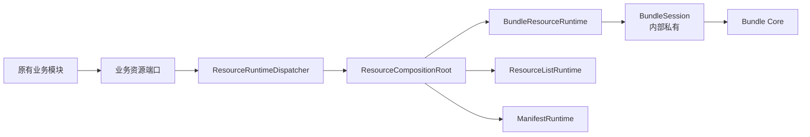

```mermaid
flowchart TB
    %% Application boundary
    Entry["游戏启动入口<br/>main.js / 应用启动器"]
    Dispatcher["统一顶层资源调度者<br/>ResourceRuntimeDispatcher<br/>或 ApplicationResourceCoordinator"]
    Business["原有业务逻辑<br/>Login / Lobby / Slot / Activity / Feature / Social"]
    BusinessAPI["稳定的业务资源端口<br/>StartupPort / LobbyPort / SlotPort / ActivityPort / FeaturePort"]

    Entry --> Dispatcher
    Business --> BusinessAPI
    Dispatcher --> BusinessAPI

    %% Composition
    Dispatcher --> Root["ResourceCompositionRoot<br/>唯一 Runtime 选择点"]
    Root --> BundleRuntime["BundleResourceRuntime"]
    Root --> ListRuntime["ResourceListRuntime"]
    Root --> ManifestRuntime["ManifestRuntime"]

    %% Bundle runtime
    subgraph Bundle["bundle/：Bundle 资源实现"]
        BundleRuntime --> BundleOrchestrator["BundleSession<br/>内部会话编排器"]
        BundleOrchestrator --> Catalog["PublishedCatalogLoader"]
        BundleOrchestrator --> Facade["BundleResourceFacade"]
        BundleOrchestrator --> Domains["领域资源编排组件"]

        Facade --> Coordinator["BundleCoordinator<br/>唯一 Bundle 状态 Owner"]
        Coordinator --> Resolver["DependencyResolver"]
        Coordinator --> Scheduler["PriorityScheduler"]
        Coordinator --> Cache["VersionedBundleCache"]
        Coordinator --> Tracker["ReferenceTracker"]
        Coordinator --> CocosPorts["CocosLoaderPorts"]

        Catalog --> Repository["CatalogRepository"]
        Catalog --> ActivityRegistry["ActivityIdentityRegistry"]
        Catalog --> StartupPlan["LobbyStartupPlan"]

        Domains --> Activity["Activity 领域适配"]
        Domains --> Feature["Feature 领域适配"]
        Domains --> Slot["Slot 领域适配"]
        Domains --> Lobby["Lobby 领域编排"]

        Activity --> ActivityAdapter["ActivityResourceAdapter"]
        Activity --> ActivityGuard["ActivityEntryGuard"]
        Activity --> ActivityPrefetch["ActivityPrefetchOrchestrator"]
        Activity --> ActivityBridge["ActivityRuntimeBridge"]

        Feature --> FeatureAdapter["FeatureResourceAdapter"]
        Feature --> FeatureGuard["FeatureEntryGuard"]

        Slot --> SlotAdapter["SlotResourceAdapter"]
        Slot --> SlotBridge["SlotRuntimeBridge"]
        Slot --> SlotRegistry["SlotIdentityRegistry"]
        Slot --> SlotEngine["SlotEnginePorts"]

        Lobby --> LobbyComposition["BrowserLobbyComposition"]
        Lobby --> PostLogin["PostLoginOrchestrator"]
        Lobby --> LobbyOwner["LobbyLifecycleOwner"]
        Lobby --> Readiness["LobbyReadinessProbe"]
    end

    %% Core
    subgraph Core["core/：跨 Runtime 公共契约"]
        Root
        CompatError["CompatResourceError"]
        CompatHandle["CompatLifecycleHandle"]
        CompatGuard["CompatResourceEntryGuard"]
        CompatRegistry["CompatRouteRegistry"]
        Residency["EngineResidencyGuard"]
    end

    %% Compat
    subgraph Compat["显式旧动态资源兼容路径"]
        CompatRegistry --> CompatAdapter["ResourceListCompatAdapter"]
        CompatAdapter --> Legacy["旧 resource_v2 / ResourceMan 能力"]
        CompatAdapter --> Residency
    end

    %% Engine physical layer
    CocosPorts --> Residency
    BundleRuntime --> Residency

    %% Infrastructure
    subgraph Other["其他 Runtime"]
        ListRuntime --> LegacyList["既有 resource-list 实现"]
        ManifestRuntime --> NativeManifest["Native manifest 实现"]
    end

    %% Test
    subgraph Testing["bundle/testing/：测试组合"]
        LocalPolicy["BrowserBundleLocalTestPolicy"]
        Pilot["DHBrowserLocalPilotFixture"]
        LocalComposition["DHBrowserLocalTestComposition"]
        VerticalSlice["VerticalSliceComposition"]
    end

    LocalComposition --> Bundle
    VerticalSlice --> Bundle
```

# 初版代码实现方案修正

> 源自飞书文档 · 最后同步：2026-09-15

你的判断是对的，而且它指出了当前设计里最关键的边界问题：

`BundleSession` 虽然位于 `resource_runtime/bundle/`，但它目前实际上已经成为业务层可以直接调用的“全局资源服务门面”。这会让 Bundle Runtime 的实现细节反向渗透到原有业务逻辑中，形成侵入式改造。

当前代码中已经能看到这种渗透：

- `src/main.js` 直接调用 `BundleSession.bootstrap()`、`retryBootstrap()`。
- `LoginLoadingController` 直接调用 `BundleSession.prepareStartupPlan()`。
- `SlotRoomLoadingController` 直接调用 `prepareSlotSubject()`、`stageSlotSceneLease()`、`activateSlotSceneLease()`。
- `SocialMan`、`PosterCenterActivity`、`LobbyBoardMan` 直接调用 `prepareCompatResource()`。
- `ActivityMan`、`ClubMan`、`ActivityLoader` 直接调用 `ActivityRuntimeBridge`。
- 多个业务模块直接判断 `BundleSession.isEnabled()`。
这说明现在的形态是：

```
原有业务逻辑
    ├── 直接依赖 BundleSession
    ├── 直接依赖 ActivityRuntimeBridge
    ├── 直接依赖 FeatureLifecycleBinding
    └── 自己判断当前是否 Bundle 模式
```

而你要求的目标形态应该是：

```
原有业务逻辑
    ↑
统一顶层调度者 / 应用编排层
    ↑
ResourceCompositionRoot
    ├── Bundle Runtime
    ├── Resource-list Runtime
    └── Manifest Runtime
```

也就是说，业务层不应该知道 `BundleSession`，更不应该知道当前选择的是 Bundle、resource-list 还是 manifest。

---

## 一、目标全景结构图

下面这张图表达的是建议的目标架构，而不是当前代码的完整真实状态。

```

```

其中最重要的变化是：

```
BundleSession 不再是业务 API
BundleSession 只属于 Bundle Runtime 内部
业务只能看见统一的业务资源端口
```

---

## 二、`resource_runtime` 的正确分层

```
src/resource_runtime/
├── core/
├── bundle/
│   ├── generated/
│   ├── testing/
│   └── domains/
│       ├── activity/
│       ├── feature/
│       ├── lobby/
│       └── slot/
├── resource_list/
├── manifest/
└── config/
```

这几个目录不是简单的代码分类，而是不同的架构所有权。

---

## 三、`core/` 下各文件作用

### `ResourceCompositionRoot.js`

这是整个资源体系的唯一 Runtime 选择点。

主要职责：

```
产品 + 平台 + 构建配置
        ↓
选择 bundle / resource-list / manifest
        ↓
创建对应 Runtime
        ↓
在当前会话内固定
```

当前代码已经实现了几个重要约束：

- 同一会话只选择一次 Runtime。
- 重复获取相同组合时复用实例。
- 尝试切换 Runtime 时抛出冲突。
- 会话结束后才允许重新组合。
- DH Browser Bundle 之外的非法组合直接拒绝。
但它现在只负责选择 Runtime，尚未完全承担“统一顶层调度者”的职责。

更合理的职责应该是：

```
ResourceCompositionRoot
    ├── 选择 Runtime
    ├── 创建统一资源调度接口
    ├── 注入各 Runtime
    └── 向业务层只暴露稳定端口
```

它不应该把 `BundleSession` 直接交给业务。

---

### `CompatResourceError.js`

创建兼容资源路径的结构化错误。

例如：

```
未知 identity
动态参数越界
资源根目录非法
资源资产与 Bundle 冲突
旧路由准备失败
```

它的价值是让兼容路径有统一错误格式，而不是到处抛普通 `Error`。

---

### `CompatLifecycleHandle.js`

旧动态资源成功后交付给调用方的生命周期句柄。

它和 Bundle 的 `leaseToken` 有意区分：

```
Bundle 路径       → Bundle Lease
resource-list 路径 → CompatLifecycleHandle
```

兼容资源不能伪造 Bundle Lease，也不能写入 Bundle 的状态机。

---

### `CompatResourceEntryGuard.js`

兼容资源入口的生命周期门禁。

负责保证：

- 资源请求期间可以取消。
- 业务对象失效后不再激活。
- 迟到回调不会重新创建 UI。
- 兼容资源成功后交付独立生命周期句柄。
- 创建 UI 失败时释放已准备资源。
- 回调只收到一次终态。
它是资源入口保护器，不是业务状态机。

---

### `CompatRouteRegistry.js`

兼容资源登记表的解析、验证和路由选择器。

它负责：

```
identity
    ↓
固定 route
    ↓
固定 resolver
    ↓
固定 allowedRoots
    ↓
校验动态资源
```

它拒绝：

- 未登记 identity。
- 任意动态目录。
- 越界资源根。
- 与 Bundle identity 冲突。
- 通过 Generic Loader 兜底。
- 通过资源缺失自动 fallback。
---

### `EngineResidencyGuard.js`

这是跨 Runtime 的物理引擎资源保护层。

它保护的是 Cocos 实际缓存中的资源：

```
纹理
图集
SpriteFrame
音频
alias
其他 Cocos cache key
```

它解决的问题不是“Bundle 是否 Ready”，而是：

```
Bundle Runtime 和旧 resource-list Runtime
可能同时持有同一份 Cocos 资源。
任意一方退出，都不能提前物理释放另一方仍在使用的资源。
```

它只负责：

- 预留引擎资源键。
- 校验来源身份和版本。
- 记录持有者。
- 防止 alias 或缓存键冲突。
- 最后持有者结束后允许物理释放。
它不能：

- 宣告 Bundle Ready。
- 宣告 Bundle Evicted。
- 创建业务 Lease。
- 代替 `BundleCoordinator` 管理 Bundle 状态。
---

## 四、`bundle/` 根目录下各文件作用

### `BundleSession.js`

这是目前最值得重新定义边界的文件。

它现在承担了太多事情：

```
会话创建
Catalog 初始化
Bundle facade 创建
Activity 接线
Feature 接线
Slot 接线
Lobby 启动
Lobby readiness
Slot scene lease
兼容资源调用
会话结束
测试重置
对外暴露大量领域方法
```

从职责上看，它不是单纯的 Session，而是：

```
Bundle Runtime 内部的会话编排器
```

因此它应该被收敛为：

```
BundleResourceRuntime 内部私有对象
```

业务层不应该这样调用：

```
BundleSession.openFeature(...)
BundleSession.prepareSlotSubject(...)
BundleSession.prepareCompatResource(...)
BundleSession.beginLobbyConstruction(...)
```

业务层应该调用统一调度者：

```
ResourceRuntimeDispatcher.request({
    type: 'feature.open',
    identity: 'HighRoller',
    context: context
}, callback);
```

或者更类型化地：

```
resourceServices.feature.open('HighRoller', context, callback);
resourceServices.slot.prepareSubject(subjectId, context, callback);
resourceServices.lobby.prepare(context, callback);
```

关键不是调用形式，而是依赖方向：

```
业务逻辑 → 稳定资源端口
资源端口 → 顶层调度者
顶层调度者 → 当前 Runtime
Bundle Runtime → BundleSession
```

不能反过来：

```
业务逻辑 → BundleSession
```

---

### `BundleResourceRuntime.js`

这是 Bundle Runtime 的组合边界。

当前职责包括：

- 限定当前组合是 DH Browser。
- 保存宿主端口。
- 保存领域服务。
- 延迟创建兼容资源适配器。
- 创建共享 `EngineResidencyGuard`。
- 管理 Runtime 内部可关闭服务。
- 会话结束时关闭内部资源。
它应该成为 Bundle 世界的唯一公开对象。

但它目前还没有完全成为业务唯一入口，因为 `BundleSession` 仍被大量模块直接引用。

目标应该是：

```
ResourceCompositionRoot
        ↓
BundleResourceRuntime
        ├── 内部创建 BundleSession
        ├── 内部创建 Facade
        ├── 内部创建 Coordinator
        ├── 内部创建领域资源服务
        └── 对外只返回统一 Resource Services
```

---

### `BundleResourceFacade.js`

它是 Bundle 核心的业务无关门面。

职责：

- 准备 Bundle。
- 准备多个 Bundle。
- 预取 Bundle。
- 取消请求。
- 创建前台 Lease。
- 释放 Lease。
- 查询 Bundle 状态。
- 暂停、恢复、失效和逐出。
它不应该：

- 创建业务 UI。
- 判断业务资格。
- 触发 Activity 激活。
- 构造 Slot 场景。
- 处理 Lobby 业务状态。
---

### `BundleCoordinator.js`

这是 Bundle 生命周期的唯一状态 Owner。

它管理：

```
Bundle state
operation
attempt
phase
waiter
purpose
Ready
Failed
Cancelled
Invalidated
Evicted
```

它协调：

```
Catalog 查询
依赖解析
调度准入
资产加载
解码
缓存提交
失败重试
引用变化
取消和迟到回调
```

其他组件不能自行宣告 Bundle 成功或失败。

---

### `CatalogRepository.js`

只读访问已经固定的 Global Catalog。

职责：

- 按 Bundle ID 查询 descriptor。
- 检查 Bundle 是否存在。
- 检查 `runtimeEligible`。
- 返回结构化查询错误。
- 提供 product 和 catalogVersion。
它不加载资源，也不创建 Lease。

---

### `PublishedCatalogLoader.js`

负责发布产物入口：

```
bundles/catalog.json
    ↓
校验 Catalog
    ↓
加载 Bundle version.json
    ↓
校验依赖、资源和版本
    ↓
派生 Activity registry
    ↓
固定 Runtime Catalog 快照
```

它重点保证：

- Catalog 是唯一入口。
- Catalog 字段严格校验。
- Bundle `version.json` 路径合法。
- 依赖没有环。
- 隔离 Bundle 不进入运行时闭包。
- Activity 身份从 Catalog 派生，而不是读取第二份 registry。
---

### `DependencyResolver.js`

计算 Bundle 的传递依赖闭包。

负责：

- 深度遍历依赖。
- 去重。
- 稳定排序。
- 检测循环依赖。
- 检查依赖 Bundle 是否允许 Runtime 使用。
它不下载资源。

---

### `PriorityScheduler.js`

统一调度 Bundle operation。

优先级从高到低：

```
startup-critical
foreground
foreground-recovery
prefetch
```

负责：

- 并发数。
- 排队。
- FIFO。
- 前台请求提升预取请求。
- 预取暂停和恢复。
- admission token。
- exactly-once 释放调度名额。
它不拥有 Bundle 状态，只拥有排队和准入状态。

---

### `VersionedBundleCache.js`

保存已经完整提交的 Bundle payload。

缓存身份是：

```
product
+ catalogVersion
+ bundleId
+ bundleVersion
+ assetPath
```

它采用事务方式：

```
begin
  ↓
stage assets
  ↓
commit
```

失败则：

```
rollback
```

它不宣告 Bundle Ready，也不创建业务 Lease。

---

### `ReferenceTracker.js`

管理 Bundle 逻辑引用：

```
protection
lease
refCount
eviction eligibility
```

它不管理 Bundle 状态。状态仍由 `BundleCoordinator` 管理。

---

### `CocosLoaderPorts.js`

把 Cocos Loader 适配成 Bundle Coordinator 所需的端口。

负责：

- fetch。
- decode。
- 识别资源类型。
- 解析引擎缓存键。
- 创建实际 Cocos 资源持有。
- 物理释放。
- 接入 `EngineResidencyGuard`。
---

### `BundleError.js`

Bundle 专用结构化错误对象。

一般会携带：

```
code
product
catalogVersion
bundleId
bundleVersion
operationKey
requestId
stage
attempt
assetPath
cacheDecision
admissionDecision
cause
```

这样失败可以精确定位到：

```
Catalog
metadata
dependency
admission
fetch
decode
commit
acquire
lifecycle
```

---

### `BundleLifecycleBinding.js`

把资源生命周期绑定到 Cocos 生命周期对象：

```
Controller
Scene
临时 UI
最终 UI
```

它支持：

- 节点销毁时释放。
- 场景切换时释放。
- 临时持有转交给最终业务对象。
- 防止临时 owner 和最终 owner 重复释放。
它属于资源交付边界，不应让业务理解 Bundle 内部细节。

---

### `ActivityIdentityRegistry.js`

Activity 身份查询表。

当前设计中它不直接读取独立 JSON，而是消费 `PublishedCatalogLoader` 从 Catalog 派生的快照。

负责：

```
activityName
themeName
bundleId
versionJsonPath
sourceGroups
silentLoad
lagLoadPriority
```

它应该是 Bundle Runtime 内部的 identity 服务，而不是被业务层直接依赖的 Bundle registry。

---

## 五、`bundle/domains/` 下各文件作用

这里是当前架构最容易和业务层混淆的地方。

这些文件虽然按 Activity、Feature、Slot、Lobby 分类，但它们应该属于：

```
Runtime 内部的领域资源适配层
```

而不是原有业务逻辑本身。

### Activity

#### `ActivityResourceAdapter.js`

把业务 Activity 身份转换成 Bundle 资源请求：

```
activityName / themeName
        ↓
ActivityIdentityRegistry
        ↓
bundleId
        ↓
BundleResourceFacade
```

它不拥有 Activity 资格，也不决定 Activity 是否展示。

#### `ActivityEntryGuard.js`

保证 Activity 资源加载成功后，业务激活过程具备：

- 可取消。
- 可重试。
- 资格失效保护。
- 生命周期释放。
- 单次终态。
#### `ActivityLifecycleBinding.js`

Activity 领域对 `BundleLifecycleBinding` 的语义化引用。

当前只是转发模块，长期可以保留为领域端口名称，也可以由统一调度者内部隐藏。

#### `ActivityPrefetchOrchestrator.js`

在 Lobby Interactive 后根据：

- Activity 资格。
- 网络状态。
- 前台/后台状态。
- 空闲状态。
- 内存预算。
- quota 预算。
决定是否进行静默预取。

它不激活 Activity，也不创建业务 Lease。

#### `ActivityRuntimeBridge.js`

这是当前侵入性比较明显的文件。

它现在被原有 `ActivityMan`、`ClubMan`、`ActivityLoader` 等代码直接调用，因此它实际上成了业务层到 Bundle Runtime 的桥。

目标上应该改成：

```
ActivityRuntimeBridge
    ↓
只存在于统一调度者或 Bundle Runtime 内部
```

原业务层不再直接 require 它。

#### `DHBrowserActivityPorts.js`

把 DH Browser 的宿主能力注入 Activity Runtime：

- 当前可见 Activity。
- Activity 资格。
- 预取预算。
- loading UI。
- 失败 UI。
它是宿主端口，不是业务资源加载器。

---

### Feature

#### `FeatureResourceAdapter.js`

把 Feature 名称映射到 Bundle ID，并调用 Bundle facade 准备资源。

#### `FeatureEntryGuard.js`

保护 Feature 入口生命周期：

- 请求取消。
- 激活失败清理。
- 控制器生命周期绑定。
- 资源句柄释放。
- 迟到回调抑制。
#### `FeatureLifecycleBinding.js`

Feature 领域对通用生命周期绑定的语义化包装。

---

### Slot

#### `SlotIdentityRegistry.js`

读取生成的 Slot registry，负责：

```
subjectId
subjectTmplId
resRootDir
subjectBundleId
entry variant
minimalConfig
configAssets
```

它是 Slot 资源身份解析器，不是 Slot 业务配置管理器。

#### `SlotResourceAdapter.js`

把 Slot 请求转换成 Bundle 请求：

```
slot.index
slot.entry.normal.*
slot.entry.old.*
subject.*
```

支持：

- index 准备。
- entry 准备。
- subject 准备。
- subject 预取。
- 取消。
- Lease 释放。
#### `SlotRuntimeBridge.js`

把 Slot 资源准备和 Cocos 场景生命周期连接起来。

负责：

- Lobby Slot 资源持有。
- Slot Entry 资源持有。
- Subject 资源持有。
- 场景注册。
- staged lease。
- active lease。
- 进关、返回和重入时的释放。
它不应该被 `SlotRoomLoadingController` 直接调用。应该由统一调度者接收“进入 Slot”“离开 Slot”等事件后内部驱动。

#### `SlotEnginePorts.js`

把 Bundle 准备出来的资产注册到 Slot 引擎侧。

负责：

- 注册场景资源。
- 维护 Slot 引擎资源持有。
- 释放 Slot 注册结果。
- 和 `EngineResidencyGuard` 配合。
---

### Lobby

#### `BrowserLobbyComposition.js`

测试和垂直切片使用的 Lobby 组合根。

它把以下组件组装起来：

```
CatalogRepository
DependencyResolver
BundleCoordinator
BundleResourceFacade
LobbyLifecycleOwner
LobbyReadinessProbe
PostLoginOrchestrator
ActivityResourceAdapter
FeatureResourceAdapter
ActivityPrefetchOrchestrator
```

它更像一个可测试的 Bundle Lobby 子组合，不应该成为原有 Lobby 业务的直接依赖。

#### `BrowserStartupFailurePort.js`

Browser 启动失败的 UI 端口。

支持：

- 显示错误。
- 重试。
- 退出。
- 可重新加载的错误处理。
它属于宿主 UI 端口，最好由顶层启动调度者注入。

#### `DHBrowserCompatPorts.js`

DH Browser 旧动态资源的宿主适配端口。

负责：

- 调用旧 resource-list 能力。
- 解析旧资源根。
- 检查资源路径。
- 注册引擎资源。
- 接入 `EngineResidencyGuard`。
- 提供 Bundle identity 冲突检查。
它不应该把旧资源升级为 Bundle。

#### `DHCocosLobbyPorts.js`

Cocos Lobby 宿主端口。

负责：

- 构造 Lobby。
- 把资源结果挂到场景。
- 读取 Lobby 是否真正 Interactive。
- 请求下一帧。
- 检查节点是否有效。
#### `DeferredBusinessGate.js`

业务后置门禁。

它表示：

```
资源准备完成
    不等于
业务条件满足
```

例如资源已经 Ready，但仍要等待：

- 账号数据。
- Activity 数据。
- Slot 数据。
- 登录结果。
- 服务端配置。
#### `LobbyLifecycleOwner.js`

持有 Lobby 的 system/lobby Lease，并负责释放。

#### `LobbyReadinessProbe.js`

通过逐帧检查 Lobby 是否达到真正可交互状态：

```
资源存在
节点挂载
关键区域完整
没有明确缺失区域
业务入口可以使用
```

#### `LobbyStartupPlan.js`

校验启动前 Bundle 根清单。

它只接受 Bundle ID 根列表，不直接复制：

- URL。
- version。
- assets。
- 依赖闭包。
#### `PostLoginOrchestrator.js`

编排：

```
Catalog/Startup Plan
    ↓
Bundle 闭包准备
    ↓
Lease 建立
    ↓
Lobby 构造
    ↓
Lobby readiness
    ↓
Lobby Interactive
```

它是 Lobby 启动资源流程的编排器，但不应该直接进入原有业务逻辑，而应由顶层调度者调用。

---

## 六、`bundle/testing/` 下各文件作用

### `BrowserBundleLocalTestPolicy.js`

当前用于判断本地/测试环境是否启用 Bundle。

但从你提出的设计原则看，它不应该被业务模块直接使用。

更合理的是：

```
local/test/release
    ↓
顶层组合输入
    ↓
ResourceCompositionRoot
```

业务层不应出现：

```
BrowserBundleLocalTestPolicy.isEnabled(...)
```

也不应出现：

```
BundleSession.isEnabled(...)
```

---

### `DHBrowserLocalPilotFixture.js`

构造本地测试用的最小业务数据：

- Daily Mission。
- Card System。
- 其他本地垂直切片所需数据。
它是 fixture，不是正式 Runtime。

---

### `DHBrowserLocalTestComposition.js`

组装本地 Browser Bundle 测试组合：

- Catalog loader。
- Cocos loader ports。
- Lobby composition。
- 测试宿主端口。
- 本地运行上下文。
---

### `VerticalSliceComposition.js`

为垂直切片测试提供最小组合：

```
Global Catalog
    ↓
Startup
    ↓
Login
    ↓
Lobby
    ↓
代表性业务入口
```

它用于证明资源 Runtime 端到端行为，不代表正式业务编排本身。

---

## 七、`generated/` 和配置文件

### `bundle/generated/slot_bundle_registry.json`

这是生成的 Slot identity registry。

包含：

- `slot.index` 身份。
- Slot template。
- Subject Bundle。
- Entry Bundle。
- 最小配置字段。
- 资源根目录。
- 范围外目录。
- 大入口候选。
它不是 Runtime 状态，也不是业务层配置服务。

它的方向应该是：

```
生成器 → registry → SlotIdentityRegistry → SlotResourceAdapter
```

不能由业务模块自己读取并拼接 Bundle ID。

---

### `bundle/dh_resource_aliases.json`

DH Browser 的已审核资源别名映射。

例如：

```
旧资源引用
    ↓
统一目标资源
```

它用于处理历史资源引用和实际发布资源之间的别名关系。

别名必须参与：

- 内容身份校验。
- 引擎缓存键冲突检查。
- 版本一致性判断。
---

### `config/compat_resource_routes.json`

显式登记的旧动态资源兼容表。

当前登记了：

```
coupon.dynamic
poster.dynamic
lobby-board.dynamic
```

它定义：

- 资源身份。
- 固定 route。
- resolver。
- legacyEntry。
- allowedRoots。
- owner。
- reason。
- lifecycle。
它不是第二份 Catalog，也不是 Bundle registry。

---

## 八、`resource_list/` 下各文件作用

### `ResourceListRuntime.js`

旧 Browser resource-list Runtime 的薄边界。

它保留既有行为：

- Host ports。
- Domain services。
- close。
- isClosed。
它不应该被 Bundle Runtime 以 fallback 方式调用。

---

### `ResourceListCompatAdapter.js`

Bundle Runtime 内部允许显式使用的旧资源兼容适配器。

它的关系是：

```
BundleResourceRuntime
    └── ResourceListCompatAdapter
            └── 旧 resource_v2 能力
```

但必须注意：

```
Bundle 失败 ≠ 自动进入 resource-list
```

只有调用方请求的是已登记的兼容 identity 时，才允许进入该适配器。

---

## 九、`manifest/` 下文件作用

### `ManifestRuntime.js`

Native manifest Runtime 的薄边界。

它的目标是保护 Native 旧资源行为：

```
DH Native / CV Native
    ↓
ManifestRuntime
    ↓
既有 manifest / ResourceMan
```

它不能：

- 初始化 Browser Bundle Runtime。
- 读取 Browser Catalog。
- 使用 BundleSession。
- 消费 DH Browser registry。
---

## 十、当前架构和目标架构的差异

### 当前实际形态

```
main.js
 ├── ResourceCompositionRoot
 ├── BundleSession
 ├── DHBrowserActivityPorts
 ├── DHBrowserCompatPorts
 └── BrowserStartupFailurePort

业务模块
 ├── BundleSession
 ├── ActivityRuntimeBridge
 ├── FeatureLifecycleBinding
 └── ResourceCompositionRoot.isBundleSelected()
```

问题是 Runtime 选择虽然集中在 `ResourceCompositionRoot`，但 Runtime 使用没有集中：

```
选择集中
使用分散
```

所以当前架构只是：

```
半集中式 Runtime
```

它还不是彻底隔离的 Runtime。

---

### 你要求的目标形态

```
main.js
    ↓
ResourceRuntimeDispatcher
    ↓
ResourceCompositionRoot
    ↓
当前唯一 Runtime
    ├── BundleResourceRuntime
    ├── ResourceListRuntime
    └── ManifestRuntime
```

原有业务逻辑：

```
Login
Lobby
Slot
Activity
Feature
Social
```

只接触稳定的业务语义端口：

```
StartupResourcePort
LobbyResourcePort
SlotResourcePort
ActivityResourcePort
FeatureResourcePort
CompatResourcePort
```

而不是接触：

```
BundleSession
BundleCoordinator
ActivityRuntimeBridge
SlotRuntimeBridge
BundleResourceFacade
ResourceCompositionRoot.isBundleSelected
```

---

## 十一、推荐的最终调用关系

```

```

业务只表达意图：

```
“我要打开 HighRoller”
“我要进入某个 Slot”
“我要准备 Lobby”
“我要加载这个动态海报”
```

业务不表达实现：

```
“当前是不是 Bundle”
“调用哪个 Loader”
“BundleSession 的哪个方法”
“是否需要 acquire”
“什么时候 release lease”
“是否 fallback resource-list”
```

这些都应由统一调度者和 Runtime 内部决定。

---

## 十二、需要修正的设计原则

建议把架构原则明确成下面几条：

### 1. `ResourceCompositionRoot` 是唯一选择者

只有它可以决定：

```
bundle
resource-list
manifest
```

任何业务模块不得自行判断 Runtime 类型。

---

### 顶层调度者是唯一业务接入点

可以命名为：

```
ResourceRuntimeDispatcher
```

或者：

```
ApplicationResourceCoordinator
```

它负责：

- 接收业务资源意图。
- 转换成统一请求。
- 分流到当前 Runtime。
- 屏蔽 Runtime 差异。
- 统一处理请求、取消、失败和生命周期结果。
---

### 3. `BundleSession` 必须降为 Runtime 内部组件

它可以继续存在，但职责应变为：

```
BundleResourceRuntime 的内部会话状态和编排
```

禁止：

```
原有业务模块直接 require BundleSession
```

---

### Runtime 不得反向修改原有业务逻辑

Runtime 只能通过稳定端口交付结果：

```
callback
request handle
lifecycle handle
resource result
structured error
```

Runtime 不应该直接：

- 操作业务 Manager。
- 修改业务状态。
- 调用业务激活方法。
- 决定 UI 是否显示。
- 改变业务资格。
- 触发奖励、支付、任务或统计。
业务层自己的激活动作，应由顶层调度者在收到 Runtime 结果后，通过稳定业务端口驱动。

---

### 不同 Runtime 必须在组合层隔离

目标不是在业务模块里写：

```
if (bundle) {
    ...
} else {
    ...
}
```

而是：

```
业务请求
    ↓
统一调度接口
    ↓
BundleResourceRuntime / ResourceListRuntime / ManifestRuntime
```

三个 Runtime 之间不能共享：

- 状态机。
- operation。
- waiter。
- cache。
- loader registry。
- fallback 逻辑。
- 业务分支。
只允许共享真正跨 Runtime 的基础契约，例如：

```
CompatResourceError
CompatLifecycleHandle
EngineResidencyGuard
```

---

## 十三、对现有 OpenSpec 的影响

这里有一个需要明确指出的地方：

当前 OpenSpec 的部分设计仍允许“共享业务通过领域 Resource Adapter 使用 Bundle Runtime”，例如：

- `browser-bundle-runtime`
- `resource-runtime-composition`
- `refactor-bundle-resource-runtime-boundaries/design.md`
其中存在类似这样的方向：

```
共享业务管理器保持单一实现，
通过 IResourceFacade 和领域 Resource Adapter 请求资源语义能力。
```

这比“业务完全不能接触 Runtime”弱一层。

你现在提出的是更严格的新原则：

```
原有业务逻辑不直接依赖任何具体 Runtime。
业务只依赖统一顶层调度者或稳定业务资源端口。
Runtime 从调度层开始完全隔离。
```

这不是一般性的代码整理，而是架构契约变化，会影响：

- `ResourceCompositionRoot` 的职责。
- `BundleSession` 的可见性。
- `ActivityRuntimeBridge` 的位置。
- `FeatureLifecycleBinding` 的调用方式。
- `SlotRuntimeBridge` 的调用方式。
- 所有业务侧 `isEnabled()` 判断。
- `main.js` 启动流程。
- OpenSpec 中的 `resource-runtime-composition`。
- OpenSpec 中的架构类图、时序图和调用边界。
因此，当前代码不能被解释成“已经实现了彻底隔离”。比较准确的结论是：

当前已经完成了 Runtime 目录和核心能力的物理归拢，也完成了 Runtime 选择的集中化，但业务接入仍然是分散的。`BundleSession` 和多个领域 Bridge 仍然暴露在原有业务逻辑中，因此尚未达到你提出的非侵入式、彻底 Runtime 隔离目标。

最终目标可以浓缩为一句话：

**业务只描述资源意图，顶层调度者决定走哪一个 Runtime，Runtime 只负责资源实现并通过稳定结果返回，任何具体 Runtime 都不直接进入原有业务逻辑。**

目前最需要收紧的第一条边界就是：

```
禁止 src/** 业务模块直接 require：
    resource_runtime/bundle/BundleSession
    resource_runtime/bundle/domains/activity/ActivityRuntimeBridge
    resource_runtime/bundle/domains/*/FeatureLifecycleBinding
    resource_runtime/core/ResourceCompositionRoot
```

这些依赖应该集中收敛到：

```
src/main.js
src/resource_runtime/dispatcher/
src/resource_runtime/application/
```

或者项目最终确定的统一顶层调度目录中。
