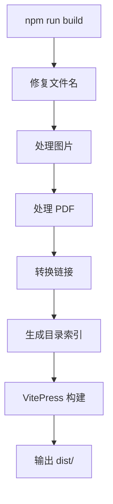
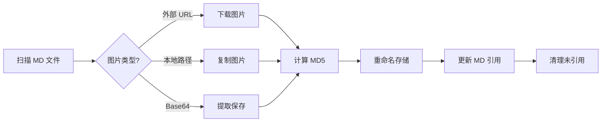
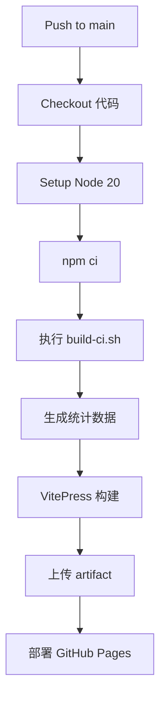

# WTC-Docs 文档系统

## 一站式游戏项目文档管理解决方案

---

## 目录

1. [系统概述](#系统概述)
2. [核心特性](#核心特性)
3. [技术架构](#技术架构)
4. [自动化工作流](#自动化工作流)
5. [搜索系统](#搜索系统)
6. [图片处理系统](#图片处理系统)
7. [统计与可视化](#统计与可视化)
8. [部署架构](#部署架构)
9. [快速开始](#快速开始)

---

## 系统概述

### 项目背景

WorldTourCasino 是一个多风格赌场游戏项目，包含 Classic Vegas、Double Hit、Vegas Star、Double X 四个游戏风格。随着项目规模扩大，文档管理面临以下挑战：

- 文档分散在飞书、本地文件、聊天记录中
- 缺乏统一的搜索入口
- 图片资源管理混乱
- 无法追踪文档更新历史

### 解决方案

WTC-Docs 基于 VitePress 构建，提供：

| 功能 | 描述 |
|-----|------|
| 统一文档中心 | 所有文档集中管理，分类清晰 |
| 智能中文搜索 | 支持分词、模糊匹配 |
| 自动化图片处理 | 外部图片自动下载、去重 |
| 版本追踪 | 基于 Git 的完整历史记录 |
| 一键部署 | GitHub Pages 自动发布 |

### 访问地址

- **线上地址**: https://zhaoheng666.github.io/WTC-Docs/
- **本地开发**: `http://localhost:5173/WTC-Docs/`

---

## 核心特性

### 🔍 智能搜索

- **中文分词**: 使用 `Intl.Segmenter` 原生 API
- **权重配置**: 标题 > 正文 > 其他
- **模糊匹配**: 20% 容错率，支持前缀匹配

### 📸 图片自动化

- **自动下载**: 外部 URL 图片自动本地化
- **智能去重**: 基于内容哈希的去重机制
- **自动清理**: 未引用图片定期清理

### 📊 数据统计

- **文档总数统计**
- **贡献者排行榜**
- **最近更新时间线**
- **分类分布图表**

### 🚀 自动化部署

- **Git 推送触发**: 推送到 main 分支自动构建
- **GitHub Actions**: 全自动 CI/CD 流程
- **零配置发布**: 无需手动干预

---

## 技术架构

### 技术栈

```
┌─────────────────────────────────────────────────────┐
│                    WTC-Docs                         │
├─────────────────────────────────────────────────────┤
│  前端框架     │  VitePress 1.6.4                    │
│  图表支持     │  Mermaid 11.12.1                    │
│  构建工具     │  Vite + Rollup                      │
│  脚本语言     │  Node.js + Shell                    │
│  部署平台     │  GitHub Pages                       │
│  版本控制     │  Git                                │
└─────────────────────────────────────────────────────┘
```

### 目录结构

```
docs/
├── .vitepress/
│   ├── config.mjs          # VitePress 主配置
│   ├── sidebar.mjs         # 侧边栏自动生成
│   ├── theme/              # 自定义主题
│   │   ├── index.js
│   │   └── style.css
│   ├── components/         # Vue 组件
│   │   ├── Dashboard.vue   # 最近更新
│   │   ├── StatsPage.vue   # 统计页面
│   │   └── AnimatedNumber.vue
│   └── scripts/            # 自动化脚本
│       ├── build.sh        # 构建入口
│       ├── lib/            # 核心处理器
│       └── tools/          # 手动工具
├── assets/                 # 图片资源（444个文件）
├── public/                 # 静态资源
│   └── stats.json          # 统计数据
├── 活动/                   # 活动文档
├── 关卡/                   # 关卡文档
├── 工程-工具/              # 工程文档
├── 故障排查/               # 问题解决
├── native/                 # 原生开发
├── 服务器/                 # 服务器文档
└── 成员/                   # 个人笔记
```

### 脚本分层架构

```
┌─────────────────────────────────────────────────────┐
│           第一层：NPM 入口脚本                       │
│  init.sh | dev.sh | build.sh | sync.sh | status.sh │
└───────────────────────┬─────────────────────────────┘
                        │ 调用
┌───────────────────────▼─────────────────────────────┐
│           第二层：核心处理器 (lib/)                  │
│  fix-filenames.js | image-processor.js              │
│  link-processor.js | generate-stats.js              │
│  pdf-processor.js | generate-directory-index.js     │
└───────────────────────┬─────────────────────────────┘
                        │ 依赖
┌───────────────────────▼─────────────────────────────┐
│           第三层：辅助工具 (utils/)                  │
│                    notify.sh                        │
└───────────────────────┬─────────────────────────────┘
                        │ 独立
┌───────────────────────▼─────────────────────────────┐
│           第四层：手动工具 (tools/)                  │
│  image-duplicate-checker.js | rename-images.js      │
│  force-process-images.js | comment-missing.sh       │
└─────────────────────────────────────────────────────┘
```

---

## 自动化工作流

### 构建流程



### 各阶段处理内容

| 阶段 | 脚本 | 处理内容 |
|-----|------|---------|
| 1. 修复文件名 | fix-problematic-filenames.js | 移除非法字符、处理长文件名 |
| 2. 处理图片 | image-processor.js | 下载外部图片、去重、清理 |
| 3. 处理 PDF | pdf-processor.js | 收集 PDF 资源 |
| 4. 转换链接 | link-processor.js | 相对路径转绝对路径 |
| 5. 生成索引 | generate-directory-index.js | 目录自动索引 |
| 6. VitePress | vitepress build | 最终构建 |

---

## 搜索系统

### 搜索架构

```
用户输入
    │
    ▼
┌─────────────────┐
│   中文分词器     │  Intl.Segmenter('zh-CN')
└────────┬────────┘
         │
         ▼
┌─────────────────┐
│   MiniSearch    │  本地搜索引擎
│   索引数据库     │
└────────┬────────┘
         │
         ▼
┌─────────────────┐
│   权重排序       │  title:4 > text:2 > titles:1
└────────┬────────┘
         │
         ▼
    搜索结果
```

### 分词示例

```
输入: "活动配置文件"
分词: ["活动", "配置", "文件", "活动配置", "配置文件"]
```

### 搜索配置

```javascript
{
  boost: { title: 4, text: 2, titles: 1 },
  fuzzy: 0.2,           // 20% 模糊度
  prefix: true,         // 前缀匹配
  combineWith: 'OR'     // 提高召回率
}
```

---

## 图片处理系统

### 处理流程



### 命名规则

```
原始: https://example.com/image.png
处理: assets/a1b2c3d4e5f6.png  (MD5 哈希)
```

### 统计示例

```
图片处理完成:
  - 文件修改: 15
  - 下载图片: 8
  - 处理图片: 23
  - 提取内嵌: 2
  - 清理未用: 5
```

---

## 统计与可视化

### 统计数据结构

```json
{
  "totalDocs": 156,
  "contributors": 5,
  "contributorsList": [
    { "name": "张三", "commits": 120, "lastCommit": "2025-01-15" },
    { "name": "李四", "commits": 80, "lastCommit": "2025-01-14" }
  ],
  "recentUpdates": [
    { "date": "01-15", "file": "活动配置", "message": "更新活动配置" }
  ],
  "categories": {
    "活动": 45,
    "关卡": 32,
    "工程-工具": 28
  }
}
```

### 可视化组件

| 组件 | 功能 | 位置 |
|-----|------|------|
| Dashboard.vue | 最近更新时间线 | 首页 |
| StatsPage.vue | 完整统计页面 | /stats |
| AnimatedNumber.vue | 数字动画效果 | 统计卡片 |

---

## 部署架构

### GitHub Actions 工作流



### 部署配置

```yaml
# .github/workflows/deploy.yml
permissions:
  contents: read
  pages: write
  id-token: write

concurrency:
  group: "pages"
  cancel-in-progress: false
```

### 部署命令

```bash
# 本地一键同步（包含构建+部署）
npm run sync
```

---

## 快速开始

### 环境要求

- Node.js >= 18
- Git
- macOS / Linux / Windows

### 安装步骤

```bash
# 1. 进入 docs 目录
cd /path/to/WorldTourCasino/docs

# 2. 安装依赖
npm install

# 3. 启动开发服务器
npm run dev

# 4. 访问浏览器
# 打开 http://localhost:5173/WTC-Docs/
```

### 常用命令

| 命令 | 用途 |
|-----|------|
| `npm run dev` | 启动开发服务器 |
| `npm run build` | 本地构建 |
| `npm run sync` | 构建并部署到 GitHub Pages |
| `npm run status` | 查看 Git 状态 |
| `npm run convert-docx` | DOCX 转 Markdown |

### 添加新文档

1. 在对应目录创建 `.md` 文件
2. 侧边栏自动生成
3. 提交推送自动部署

---

## 技术亮点总结

| 特性 | 实现方案 | 效果 |
|-----|---------|------|
| 中文搜索 | Intl.Segmenter + MiniSearch | 精准分词，模糊匹配 |
| 图片管理 | MD5 哈希 + 自动清理 | 零重复，零冗余 |
| 侧边栏 | 递归扫描 + 配置排序 | 自动生成，灵活配置 |
| 部署 | GitHub Actions | 推送即发布 |
| 统计 | Git 记录分析 | 实时更新，数据准确 |
| 文件名修复 | 正则检测 + 自动修复 | 跨平台兼容 |

---

## 联系方式

- **项目仓库**: https://github.com/zhaoheng666/WTC-Docs
- **文档地址**: https://zhaoheng666.github.io/WTC-Docs/

---

*本文档由 WTC-Docs 系统生成*
