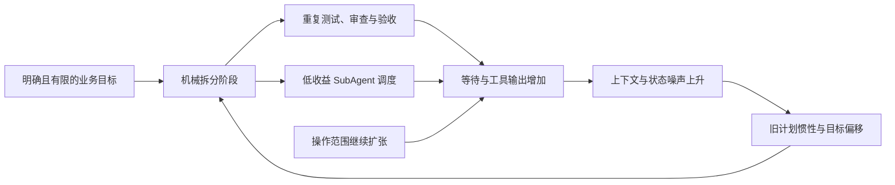
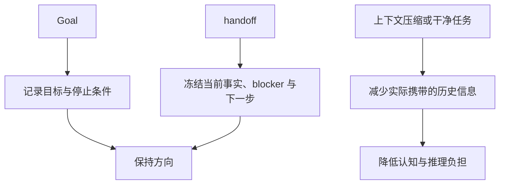
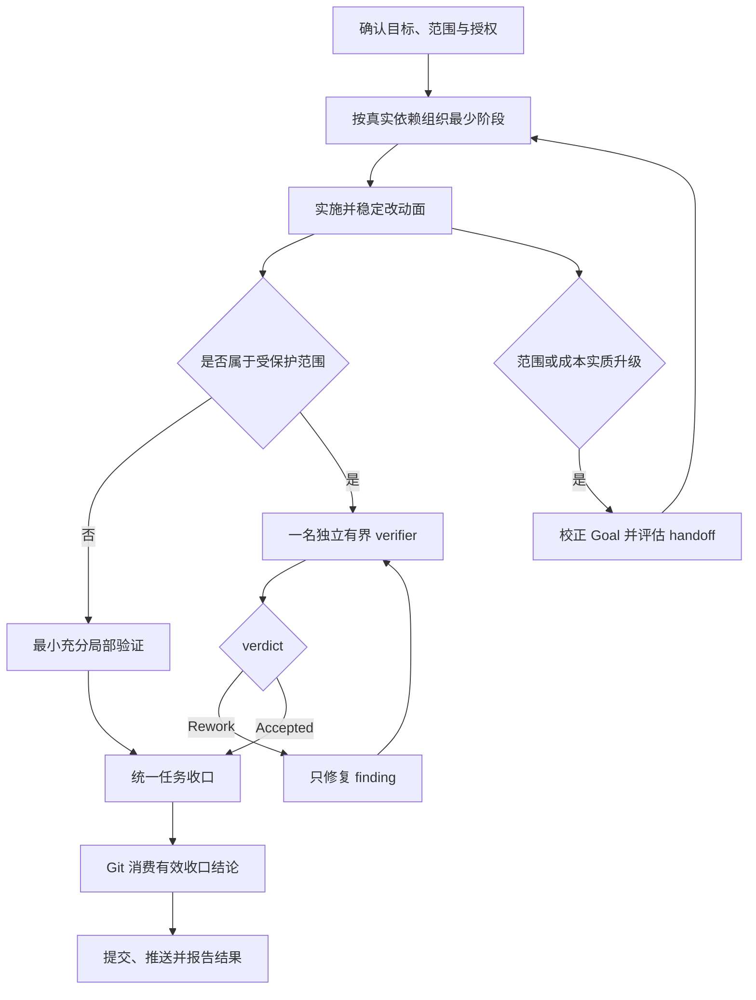

# Agent 综合治理复盘与实践准则

> 核心结论：本次暴露出的首要问题是任务编排和 SubAgent 调度。工具调用与输出控制会放大执行成本，上下文膨胀又会继续放大目标偏移，但上下文不是唯一根因。

## 文档定位

本文记录一次真实任务如何从明确目标演变为长链路执行，并说明项目最终形成的综合治理方法。它用于解释背景、设计取舍和实践方式，不替代以下权威入口：

- `AGENTS.md`：跨任务硬约束、工作流路由与硬门禁。
- `openspec/specs/agent-execution-governance/spec.md`：Agent 执行治理的正式契约。
- DH Resource Program 工件：DH 资源重组的领域状态、阶段边界和验收事实。

上下文架构、按需加载和 Git 确定性流程的专项治理见 [AI 上下文膨胀问题](./AI%20上下文膨胀问题.md)。本文讨论的范围更广，且将上下文治理放回它应处的辅助位置。

## 真实触发场景

问题发生在 DH 浏览器渐进式资源重组工作中。原始目标并不复杂：把 WS-04 已经验证过的局部生成能力沉淀为全局生成器，并继续以 WS-04 已确认的 startup、lobby bundles 为测试单元；WS-05、WS-06 尚未真正启动，不应被提前纳入实施范围。

实际执行却逐渐偏离主线：

1. 对仓库中的本机路径进行了多轮替换，表达方式先后在绝对路径、文件相对路径和项目根名路径之间反复调整。
2. 用户明确要求只做文本替换后，Agent 仍追加了扫描、验证和无关文件处理，甚至把 `.DS_Store` 纳入讨论。
3. 已经完成的检查在提交、推送和归档阶段被重新执行；Git 操作又重复请求授权。
4. SubAgent 被拆分到收益有限的局部工作，主 Agent 需要等待、查询并重新整合结果。
5. 治理规则落地后的第一个小任务，仍被展开为提案、应用、同步、归档和重复验证的长链路，说明“写下规则”不等于“行为已经改变”。

结果是：业务目标没有变复杂，执行系统却持续制造新阶段、新状态和新等待。

## 问题如何相互放大

这条链路中的主次关系很重要：

| 类别 | 本次表现 | 治理定位 |
| --- | --- | --- |
| 任务编排 | 阶段过细、重复验证、提交时重新收口 | 首要问题 |
| SubAgent 调度 | 机械委派、等待成本高、复验不复用 | 首要问题 |
| 工具与输出 | 扫描扩围、巨型输出、过短 yield、重复轮询 | 执行放大器 |
| 上下文 | 历史计划、错误尝试和旧结论持续占据决策空间 | 二次放大器 |

因此，单纯缩短上下文只能缓解症状。真正的治理必须先减少无意义的阶段和协调，再让上下文只携带仍有效的事实。

## 综合治理结论

### 1. 按真实依赖组织任务

阶段不是越细越安全。只有当输入、改动面或责任确实存在依赖时才建立新阶段；同一稳定改动面能够一次完成测试、审查和验收时，不再拆成多轮。

验证采用“最小充分”原则：能用局部测试证明的改动先做局部测试，只有影响证据、失败信号或权威流程表明范围扩大时才扩围。领域硬门禁和确有必要的全量回归仍然保留；当全量回归本身耗时较长时，可以继续等待，但应在开始前明确提示其必要性和成本。

最后一次实质修改后统一完成必要测试、审查、验收和阻断修复。Git 阶段只消费仍有效的收口结论，不再把提交变成第二次任务执行。

### 2. 用收益而不是模板决定 SubAgent

SubAgent 不以“任务看起来可以拆”为充分条件。只有边界清晰，且独立复核、真实并行、专门能力或上下文隔离的收益明显高于协调成本时才委派；委派不得扩大原任务。

共享 Runtime、资源身份、破坏性资源操作、生成契约、Program checker 或 schema、发布切换等受保护范围，必须由一名未参与实施的 verifier 做有界独立复核。它应拿到最小而明确的材料，并返回可判定的 `Accepted` 或 `Rework` 结论。

发生 Rework 时，优先复用同一 verifier，主 Agent 只修复 finding，并在复验前保持被审表面稳定。这样既保留独立性，也避免重新建立完整审查上下文。

### 3. 区分 Goal、handoff 与上下文压缩

三者解决的问题不同：

- Goal 负责“要做到什么、在哪里停止”。
- handoff 负责“现在进行到哪里、哪些结果仍有效、下一步是什么”。
- 宿主压缩或携带 handoff 的干净任务，才会真正减少上下文负担。

当任务从 `S/M` 自然升级到 `L/XL`、连续返工或目标开始漂移时，应在推进下一步前校正目标，并评估是否使用会话内 handoff。是否切换到干净任务由实际收益决定，不设置机械阈值。

### 4. 让工具服从任务范围

工具治理不需要固定唯一的输出上限、轮询次数或等待时长，而需要明确的决策原则：

- 用户限定“只做文本替换”时，停止可选重构、扫描和测试扩张；安全、权限和权威硬门禁除外。
- 巨型文件、单行 HTML 和生成产物优先使用有界搜索、结构化解析、统计摘要或局部 diff，不把完整内容灌入上下文。
- 主任务依赖长命令结果时直接等待或采用事件驱动通知，不用短 yield 制造反复调用。
- 若缺少的工具可以通过一次投入解决一整类重复问题，可以先完善工具环境，但应说明收益和成本。
- 明确的提交或推送请求就是对当前已收口、范围明确工作的授权，不再二次确认；完成后输出实际提交大纲。

### 5. 在目标或权限变化前停止

“立即停止”不是遇到困难就停止，而是识别执行是否已经越过原授权。以下情况进入下一步前必须停下来校正：

- 新动作实质改变了原目标或写入范围。
- 从局部编辑自然膨胀为无依据的全仓扫描、重构或全量回归。
- 即将改变额外外部状态，或需要新的权限与用户裁决。
- 收口缺失、提交范围含糊、硬门禁失败或语义冲突。

继续完成原目标所必需的工作不属于范围膨胀；相关但非必需的改进应记录并延后。

## 推荐执行闭环

这不是固定流水线。低风险任务可以直接从实施进入局部验证和收口；只有受保护范围才强制引入独立 verifier。

## 如何作用于 DH 资源重组

本次治理采用“通用规则 + Program 前向吸收”的双层落地方式。

通用层进入项目 Agent 治理和正式规范，供所有后续任务使用。DH Program 层则修正当前仍具权威性的 Program 要求、编排说明和未来 Workstream 模板，使后续工作自动继承以下做法：

- 复用共享的全局生成器，不要求每个 Workstream 机械创建局部生成器。
- 以 WS-04 已接受的 startup、lobby bundles 作为代表性测试与 walkthrough 单元，不虚构 WS-05、WS-06 已启动。
- 保留资源身份、contract lock、独立验证和发布门禁等领域硬约束。
- 不为了治理额外发明 Program 状态、checker、schema 或 gate。
- 不改写归档提案、历史证据与 verdict，也不追溯修改已经批准的在途契约。

这种方式避免了大面积推翻 Program，又让后续新任务能够得到治理收益。

## 第一次落地为什么仍然很慢

治理落地后的第一个小改动仍执行了较长时间。原因不是规则缺失，而是当时的执行仍受旧上下文和旧动作链影响：Agent 把多个 Skill 当作必须逐个经过的独立阶段，重复读取状态、重复验证，并把一个局部规则修订包装成完整长链路。

这暴露出一个关键事实：文档、规范和 checker 只能证明规则存在，不能单独证明 Agent 已按预期执行。治理是否有效，还必须通过新的、普通规模任务进行端到端观察。必要时使用干净任务，让新 Agent 从最新入口和 handoff 开始，能比在膨胀会话中继续纠偏更快摆脱旧计划惯性。

后续的上下文专项治理进一步统一了 `AGENTS.md` 入口、OpenSpec 有界检索、Skill 按需加载和确定性 Git 批次，但这些措施服务于综合治理，不应取代任务编排与 SubAgent 调度本身。

## 如何判断治理真正生效

不以“新增了多少规则”作为成功标准，而观察以下行为：

1. 同一稳定改动面不再重复测试、审查和验收。
2. 非受保护任务不会被机械拆成多个 SubAgent；受保护任务只引入必要的独立 verifier。
3. Rework 后聚焦 finding，并复用原 verifier，而不是重开完整审查。
4. 用户限定的操作范围得到直接执行，可选工作不会自然膨胀。
5. Git 提交不重新启动任务收口，也不重复询问已经给出的授权。
6. handoff 能冻结有效事实；需要实际减负时，宿主压缩或干净任务能够承接它。
7. DH Program 的领域硬门禁保持不变，未来 Workstream 能直接复用共享能力和治理约束。

## 执行前的六个问题

面对新任务，主 Agent 只需先回答六个问题：

1. 用户真正要求的结果和停止条件是什么？
2. 哪些阶段由真实依赖产生，哪些只是流程惯性？
3. 什么是能够证明正确性的最小充分验证？
4. 是否命中必须独立复核的受保护范围？
5. SubAgent 的净收益是否高于协调成本？
6. 当前动作是否仍在原目标、范围和授权之内？

如果这六个问题始终有清晰答案，治理就不会变成新的官僚流程。

## 相关文档

- [Agent 综合治理经验分享（PPT）](./Agent%20综合治理经验分享.pptx)
- [AI 上下文膨胀问题](./AI%20上下文膨胀问题.md)
- [从上下文膨胀到可治理：项目 Agent 工程实践](./从上下文膨胀到可治理的%20Agent%20工程实践.md)
- `AGENTS.md`
- `openspec/specs/agent-execution-governance/spec.md`
