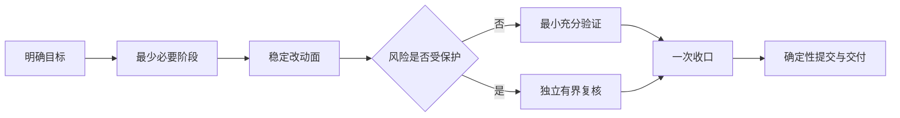

# Agent 综合治理经验分享演讲稿

> 建议时长：5 分钟。核心观点：不要把一次综合执行失控，误诊成单纯的上下文过长。

## 可投屏总览图

## 演讲正文

大家好，今天分享的不是一套为了“管住 AI”而堆出来的新流程，而是一次真实任务失控后的治理复盘。

触发场景是 DH 浏览器资源重组。我们原本只需要把 WS-04 已经验证过的局部生成能力沉淀成全局生成器，并继续用 WS-04 已确认的 bundles 做测试。WS-05、WS-06 并没有启动，任务边界其实很清楚。

但执行很快偏离了主线。一个路径文本替换，先后经历绝对路径、相对链接和项目根名表达的反复调整；用户已经说“只做文本替换”，Agent 仍继续扫描、验证，甚至讨论无关的 `.DS_Store`。到了提交和推送阶段，已经完成的检查又被重做，授权也被重复询问。SubAgent 参与了若干收益不高的局部工作，主 Agent 则不断等待、查询、整合。最后，一个简单操作被拉成了一条很长的执行链。

我们最初怀疑是上下文太大。复盘后发现，上下文确实会放大问题，但不是首因。占比最大的两个问题是任务编排和 SubAgent 调度：阶段被机械拆细，同一改动面被重复测试、审查和验收；SubAgent 因为“可以拆”就被派发，却没有比较独立收益与协调成本。工具输出和短轮询增加了噪声，膨胀的上下文再让旧计划持续影响后续决策，于是形成循环。

治理的第一条，是只保留真实依赖产生的阶段。同一稳定改动面能一次完成测试、审查和验收，就不要拆成三轮。验证追求最小充分：局部测试能够证明，就不扩大到全量；确有必要做全量回归时保留它，并提前说明成本。最后一次实质修改后统一收口，Git 只消费收口结论，不在提交时重新启动任务。

第二条，是 SubAgent 不再机械拆分。普通任务只有在独立复核、真实并行、专门能力或上下文隔离的净收益更高时才委派。共享 Runtime、生成契约、Program checker、发布切换等受保护范围，仍然必须有一名独立 verifier。它只审明确边界，给出 `Accepted` 或 `Rework`；返工后复用同一 verifier，主 Agent 则负责保持被审表面稳定。

第三条，是把 Goal、handoff 和上下文压缩分开。Goal 记录目标和停止条件；handoff 冻结当前事实、blocker 和下一步；真正减少历史负担，要靠宿主压缩或携带 handoff 的干净任务。我们不设机械阈值，只在成本明显升级、连续返工或目标开始漂移时，在下一步前评估是否 handoff。

第四条，是让工具服从用户范围。用户说只做文本替换，就停止可选扫描和重构；巨型文件和生成产物使用结构化摘要与局部 diff；长命令如果是主任务依赖，就直接等待，而不是用短 yield 反复轮询。明确的提交、推送请求本身就是授权，完成后报告提交大纲，不再二次确认。

这些治理也前向作用到了 DH Program：后续 Workstream 复用全局生成器和治理模板，以 WS-04 的已接受 bundles 作为代表性验证单元，同时不改写归档提案、历史 verdict 或已经批准的在途契约。这样既保留领域硬门禁，也不为治理再发明新状态和新流程。

还有一个很重要的教训：规则落地后的第一个小任务仍然很慢。因为 Agent 还沿用旧上下文中的长动作链，把多个 Skill 当成必须逐个走完的阶段。这说明“规范已经写入”和“行为已经改变”不是一回事。治理必须用新的普通任务做端到端验证；必要时重开一个携带 handoff 的干净任务，往往比在旧会话里持续纠偏更有效。

最后用一句话总结：高质量 Agent 执行，不是做最多的检查，而是用最少但充分的阶段、证据和协作完成正确交付。上下文治理很重要，但它应服务于这个目标，而不是成为新的主流程。
