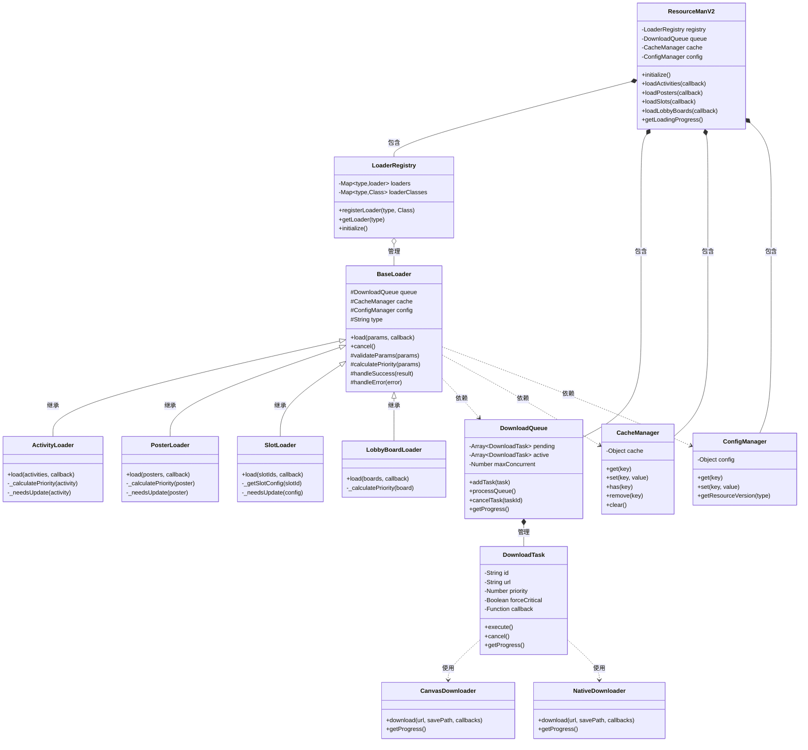
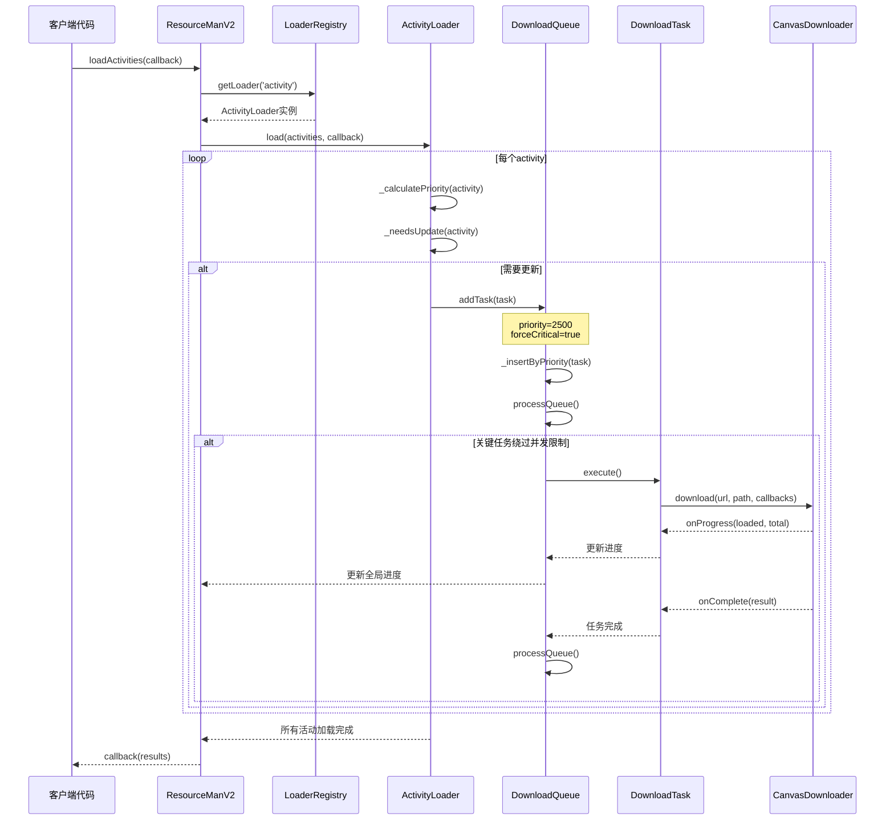
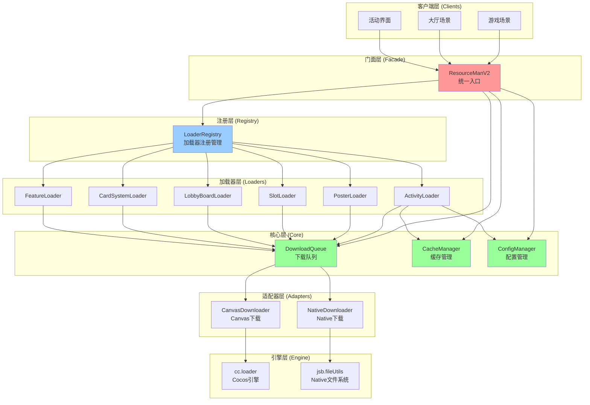

# ResourceManV2 技术架构报告

> **生成时间**: 2025-11-06
> **版本**: v1.0
> **作者**: WorldTourCasino Team

---

## 目录

1. [系统概述](#系统概述)
2. [UML 图表](#uml-图表)
3. [设计模式分析](#设计模式分析)
4. [设计原则](#设计原则)
5. [核心组件详解](#核心组件详解)
6. [数据流与控制流](#数据流与控制流)
7. [技术亮点](#技术亮点)
8. [总结](#总结)

---

## 系统概述

### 核心功能

ResourceManV2 是 WorldTourCasino 项目的统一资源加载系统,提供以下核心功能:

- **统一资源管理**: 整合活动、海报、老虎机、商店、卡牌等多种资源类型
- **优先级调度**: 支持动态优先级计算和关键资源优先加载
- **并发控制**: 智能并发限制,支持关键资源绕过限制
- **缓存管理**: 统一的缓存策略和版本控制
- **进度追踪**: 细粒度的下载进度反馈
- **依赖管理**: 自动处理资源间的依赖关系
- **错误恢复**: 自动重试和错误处理机制

### 架构特点

- **7层架构**: Clients → Facade → Registry → Loaders → Core → Adapters → Engine
- **插件式设计**: 通过 LoaderRegistry 实现加载器的动态注册
- **依赖注入**: 共享组件(Queue/Cache/Config)注入到所有加载器
- **单一职责**: 每个组件职责清晰,易于维护和测试
- **开放封闭**: 新增资源类型只需添加新 Loader,无需修改核心代码

---

## UML 图表

### 2.1 类图 (Class Diagram)



### 2.2 序列图 - 关键资源加载流程



### 2.3 组件图 - 系统架构



---

## 设计模式分析

### 3.1 单例模式 (Singleton Pattern)

**应用位置**: `ResourceManV2.js`, `LoaderRegistry.js`

**目的**: 确保全局只有一个资源管理实例,避免多实例导致的状态不一致。

**实现代码**:

```javascript
// ResourceManV2.js
var ResourceManV2 = cc.Class.extend({
    // ... 实例成员
});

ResourceManV2._instance = null;

ResourceManV2.getInstance = function() {
    if (!ResourceManV2._instance) {
        ResourceManV2._instance = new ResourceManV2();
    }
    return ResourceManV2._instance;
};

ResourceManV2.destroyInstance = function() {
    if (ResourceManV2._instance) {
        ResourceManV2._instance.destroy();
        ResourceManV2._instance = null;
    }
};

module.exports = ResourceManV2;
```

**优势**:
- 全局唯一入口,便于状态管理
- 延迟初始化,按需创建
- 提供销毁方法,便于测试和重置

---

### 3.2 注册表模式 (Registry Pattern)

**应用位置**: `LoaderRegistry.js`

**目的**: 动态管理加载器类型,支持运行时注册和查找。

**实现代码**:

```javascript
var LoaderRegistry = cc.Class.extend({
    _loaders: null,           // Map<type, loader实例>
    _loaderClasses: null,     // Map<type, Loader类>

    registerLoader: function(type, LoaderClass) {
        if (this._loaderClasses[type]) {
            cc.warn('Loader type already registered:', type);
            return false;
        }
        this._loaderClasses[type] = LoaderClass;
        return true;
    },

    getLoader: function(type) {
        // 如果已有实例,直接返回
        if (this._loaders[type]) {
            return this._loaders[type];
        }

        // 如果有注册的类,创建实例
        if (this._loaderClasses[type]) {
            return this._createLoaderInstance(type);
        }

        cc.warn('Loader type not registered:', type);
        return null;
    }
});
```

**优势**:
- 松耦合,新增加载器无需修改核心代码
- 延迟实例化,节省内存
- 支持动态注销和重新初始化

**使用示例**:

```javascript
// ResourceManV2.js 初始化时注册
this._registry.registerLoaders({
    'activity': ActivityLoader,
    'poster': PosterLoader,
    'slot': SlotLoader,
    'lobbyBoard': LobbyBoardLoader,
    'cardSystem': CardSystemLoader,
    'feature': FeatureLoader
});

// 使用时获取
var activityLoader = this._registry.getLoader('activity');
```

---

### 3.3 策略模式 (Strategy Pattern)

**应用位置**: 各个 Loader 的优先级计算

**目的**: 不同资源类型使用不同的优先级计算策略。

**实现代码**:

```javascript
// ActivityLoader.js
_calculatePriority: function(activity) {
    var basePriority = 2000;

    // 策略1: 时间敏感性
    if (activity.endTime) {
        var daysLeft = (activity.endTime - Date.now()) / (1000 * 60 * 60 * 24);
        if (daysLeft < 1) {
            basePriority += 800;  // 即将过期,最高优先级
        } else if (daysLeft < 3) {
            basePriority += 500;
        } else if (daysLeft < 7) {
            basePriority += 300;
        }
    }

    // 策略2: 活动类型
    if (activity.type === 'limited') {
        basePriority += 200;
    }

    // 策略3: 是否首次加载
    if (!this._cache.has('activity_' + activity.id)) {
        basePriority += 100;
    }

    return basePriority;
}

// PosterLoader.js
_calculatePriority: function(poster) {
    var basePriority = 1500;

    // 策略1: 位置权重
    if (poster.position === 'main') {
        basePriority += 500;  // 主海报最高优先级
    } else if (poster.position === 'secondary') {
        basePriority += 300;
    }

    // 策略2: 展示频率
    if (poster.showFrequency === 'high') {
        basePriority += 200;
    }

    return basePriority;
}
```

**优势**:
- 每种资源类型有独立的优先级逻辑
- 易于扩展和修改策略
- 无需修改 DownloadQueue 核心代码

---

### 3.4 适配器模式 (Adapter Pattern)

**应用位置**: `CanvasDownloader.js`, `NativeDownloader.js`

**目的**: 统一 Canvas 和 Native 平台的下载接口。

**实现代码**:

```javascript
// CanvasDownloader.js - 适配 cc.loader
var CanvasDownloader = {
    download: function(url, savePath, callbacks) {
        cc.loader.load(url, function(error, resource) {
            if (error) {
                callbacks.onError && callbacks.onError(error);
            } else {
                callbacks.onComplete && callbacks.onComplete(resource);
            }
        });

        // 模拟进度反馈
        var progress = 0;
        var interval = setInterval(function() {
            progress += 10;
            if (progress >= 100) {
                clearInterval(interval);
                return;
            }
            callbacks.onProgress && callbacks.onProgress(progress, 100);
        }, 100);
    }
};

// NativeDownloader.js - 适配 jsb.fileUtils
var NativeDownloader = {
    download: function(url, savePath, callbacks) {
        var downloader = new jsb.Downloader();

        downloader.setOnFileTaskSuccess(function(task) {
            callbacks.onComplete && callbacks.onComplete(task);
        });

        downloader.setOnTaskError(function(task, errorCode, errorStr) {
            callbacks.onError && callbacks.onError(errorStr);
        });

        downloader.setOnTaskProgress(function(task, bytesReceived, totalBytes) {
            callbacks.onProgress && callbacks.onProgress(bytesReceived, totalBytes);
        });

        downloader.createDownloadFileTask(url, savePath);
    }
};
```

**优势**:
- 统一接口,隐藏平台差异
- DownloadTask 无需关心平台细节
- 便于添加新平台支持

---

### 3.5 观察者模式 (Observer Pattern)

**应用位置**: `DownloadTask` 的回调机制

**目的**: 下载进度和状态变化时通知订阅者。

**实现代码**:

```javascript
// DownloadTask.js
var DownloadTask = cc.Class.extend({
    _callbacks: null,  // {onProgress, onComplete, onError}

    ctor: function(params) {
        this._callbacks = {
            onProgress: params.onProgress || null,
            onComplete: params.onComplete || null,
            onError: params.onError || null
        };
    },

    execute: function() {
        var self = this;

        // 通知进度
        this._notifyProgress = function(loaded, total) {
            if (self._callbacks.onProgress) {
                self._callbacks.onProgress(loaded, total);
            }
        };

        // 通知完成
        this._notifyComplete = function(result) {
            if (self._callbacks.onComplete) {
                self._callbacks.onComplete(result);
            }
        };

        // 通知错误
        this._notifyError = function(error) {
            if (self._callbacks.onError) {
                self._callbacks.onError(error);
            }
        };

        // 执行下载
        this._downloader.download(this._url, this._savePath, {
            onProgress: this._notifyProgress,
            onComplete: this._notifyComplete,
            onError: this._notifyError
        });
    }
});
```

**优势**:
- 解耦任务执行和状态通知
- 支持多个回调订阅
- 便于扩展新的事件类型

---

### 3.6 模板方法模式 (Template Method Pattern)

**应用位置**: `BaseLoader.js`

**目的**: 定义加载流程骨架,子类实现具体细节。

**实现代码**:

```javascript
// BaseLoader.js
var BaseLoader = cc.Class.extend({
    load: function(params, callback) {
        var self = this;

        // 模板方法定义流程
        // 步骤1: 参数验证
        if (!this.validateParams(params)) {
            callback && callback({error: 'Invalid params'});
            return;
        }

        // 步骤2: 计算优先级
        var priority = this.calculatePriority(params);

        // 步骤3: 创建任务
        var tasks = this.createTasks(params, priority);

        // 步骤4: 添加到队列
        tasks.forEach(function(task) {
            self._queue.addTask(task);
        });

        // 步骤5: 等待完成
        this.waitForCompletion(tasks, function(results) {
            // 步骤6: 处理结果
            self.handleResults(results, callback);
        });
    },

    // 抽象方法,子类必须实现
    validateParams: function(params) {
        throw new Error('validateParams must be implemented');
    },

    calculatePriority: function(params) {
        throw new Error('calculatePriority must be implemented');
    },

    createTasks: function(params, priority) {
        throw new Error('createTasks must be implemented');
    },

    handleResults: function(results, callback) {
        callback && callback(results);
    }
});

// ActivityLoader.js - 实现具体方法
var ActivityLoader = BaseLoader.extend({
    validateParams: function(activities) {
        return Array.isArray(activities) && activities.length > 0;
    },

    calculatePriority: function(activity) {
        return this._calculatePriority(activity);
    },

    createTasks: function(activities, basePriority) {
        return activities.map(function(activity) {
            return new DownloadTask({
                url: activity.url,
                priority: basePriority,
                forceCritical: activity.isCritical
            });
        });
    }
});
```

**优势**:
- 统一加载流程,减少重复代码
- 子类只需实现差异部分
- 便于维护和测试

---

### 3.7 工厂模式 (Factory Pattern)

**应用位置**: `LoaderRegistry._createLoaderInstance()`

**目的**: 统一创建加载器实例,注入依赖。

**实现代码**:

```javascript
// LoaderRegistry.js
_createLoaderInstance: function(type) {
    var LoaderClass = this._loaderClasses[type];
    if (!LoaderClass) {
        cc.warn('Loader class not found:', type);
        return null;
    }

    try {
        // 工厂方法: 创建实例并注入依赖
        var loader = new LoaderClass({
            queue: this._sharedQueue,      // 注入共享队列
            cache: this._sharedCache,      // 注入共享缓存
            config: this._sharedConfig,    // 注入共享配置
            type: type                     // 注入类型标识
        });

        this._loaders[type] = loader;
        cc.log('Created loader instance:', type);

        return loader;
    } catch (e) {
        cc.error('Failed to create loader:', type, e);
        return null;
    }
}
```

**优势**:
- 集中管理实例创建逻辑
- 自动注入共享依赖
- 便于添加创建时的初始化逻辑

---

### 3.8 依赖注入模式 (Dependency Injection)

**应用位置**: 贯穿整个系统

**目的**: 解耦组件依赖,提高可测试性。

**实现代码**:

```javascript
// ResourceManV2.js - 创建共享组件
initialize: function() {
    // 创建共享组件
    this._queue = new DownloadQueue({
        maxConcurrent: 5
    });

    this._cache = new CacheManager();

    this._config = new ConfigManager();

    // 注入到注册表
    this._registry = new LoaderRegistry({
        queue: this._queue,
        cache: this._cache,
        config: this._config
    });
},

// LoaderRegistry.js - 接收并传递依赖
ctor: function(sharedComponents) {
    this._sharedQueue = sharedComponents.queue;
    this._sharedCache = sharedComponents.cache;
    this._sharedConfig = sharedComponents.config;
},

_createLoaderInstance: function(type) {
    var loader = new LoaderClass({
        queue: this._sharedQueue,    // 注入依赖
        cache: this._sharedCache,
        config: this._sharedConfig
    });
    return loader;
},

// BaseLoader.js - 接收依赖
ctor: function(dependencies) {
    this._queue = dependencies.queue;
    this._cache = dependencies.cache;
    this._config = dependencies.config;
    this._type = dependencies.type;
}
```

**优势**:
- 所有 Loader 共享同一个队列/缓存/配置
- 便于单元测试(可注入 mock 对象)
- 降低组件间耦合

**依赖图**:

```
ResourceManV2
    ├─ DownloadQueue (创建)
    ├─ CacheManager (创建)
    ├─ ConfigManager (创建)
    └─ LoaderRegistry (注入上述3个)
            └─ ActivityLoader (注入上述3个)
            └─ PosterLoader (注入上述3个)
            └─ SlotLoader (注入上述3个)
            └─ ... (所有 Loader 都注入)
```

---

### 3.9 状态模式 (State Pattern)

**应用位置**: `DownloadTask` 的状态管理

**目的**: 管理任务的生命周期状态。

**实现代码**:

```javascript
// DownloadTask.js
var DownloadTask = cc.Class.extend({
    // 状态枚举
    STATE: {
        PENDING: 'pending',      // 等待中
        DOWNLOADING: 'downloading', // 下载中
        COMPLETED: 'completed',  // 已完成
        FAILED: 'failed',        // 失败
        CANCELLED: 'cancelled'   // 已取消
    },

    _state: null,

    ctor: function(params) {
        this._state = this.STATE.PENDING;
    },

    execute: function() {
        if (this._state !== this.STATE.PENDING) {
            cc.warn('Task already executed:', this._id);
            return;
        }

        this._state = this.STATE.DOWNLOADING;
        // 执行下载...
    },

    cancel: function() {
        if (this._state === this.STATE.COMPLETED) {
            cc.warn('Cannot cancel completed task');
            return false;
        }

        this._state = this.STATE.CANCELLED;
        // 取消下载...
        return true;
    },

    _onComplete: function(result) {
        if (this._state !== this.STATE.DOWNLOADING) {
            return;
        }

        this._state = this.STATE.COMPLETED;
        this._callbacks.onComplete && this._callbacks.onComplete(result);
    },

    _onError: function(error) {
        if (this._state !== this.STATE.DOWNLOADING) {
            return;
        }

        this._state = this.STATE.FAILED;
        this._callbacks.onError && this._callbacks.onError(error);
    },

    getState: function() {
        return this._state;
    }
});
```

**优势**:
- 明确任务生命周期
- 防止非法状态转换
- 便于调试和监控

**状态转换图**:

```
PENDING → DOWNLOADING → COMPLETED
                    ↘ FAILED
        ↘ CANCELLED
```

---

### 3.10 门面模式 (Facade Pattern)

**应用位置**: `ResourceManV2` 对外接口

**目的**: 提供简单统一的接口,隐藏内部复杂性。

**实现代码**:

```javascript
// ResourceManV2.js - 简单的门面接口
var ResourceManV2 = cc.Class.extend({
    // 简单接口: 加载活动资源
    loadActivities: function(callback) {
        var loader = this._registry.getLoader('activity');
        if (!loader) {
            callback && callback({error: 'Activity loader not found'});
            return;
        }

        // 隐藏内部复杂逻辑
        loader.load(this._getActivityList(), callback);
    },

    // 简单接口: 加载海报资源
    loadPosters: function(callback) {
        var loader = this._registry.getLoader('poster');
        if (!loader) {
            callback && callback({error: 'Poster loader not found'});
            return;
        }

        loader.load(this._getPosterList(), callback);
    },

    // 简单接口: 获取全局进度
    getLoadingProgress: function() {
        return this._queue.getProgress();
    }
});

// 客户端代码 - 简单调用
var resourceMan = ResourceManV2.getInstance();

// 不需要知道内部有 LoaderRegistry, DownloadQueue 等
resourceMan.loadActivities(function(results) {
    cc.log('Activities loaded:', results);
});

// 不需要知道进度如何计算
var progress = resourceMan.getLoadingProgress();
cc.log('Progress:', progress.percentage + '%');
```

**优势**:
- 客户端代码简单易用
- 隐藏内部复杂性(Registry, Queue, Loader等)
- 降低客户端与内部组件的耦合

**内部复杂度对比**:

```javascript
// 没有门面模式 - 客户端需要理解内部结构
var queue = new DownloadQueue();
var cache = new CacheManager();
var config = new ConfigManager();
var registry = new LoaderRegistry({queue, cache, config});
registry.registerLoader('activity', ActivityLoader);
var loader = registry.getLoader('activity');
loader.load(activities, callback);

// 有门面模式 - 客户端只需一行
ResourceManV2.getInstance().loadActivities(callback);
```

---

## 设计原则

### 4.1 SOLID 原则

#### 单一职责原则 (Single Responsibility Principle)

每个类只负责一个功能领域:

- **ResourceManV2**: 统一入口和生命周期管理
- **LoaderRegistry**: 加载器注册和查找
- **DownloadQueue**: 任务队列和调度
- **CacheManager**: 缓存管理
- **ConfigManager**: 配置管理
- **各个 Loader**: 特定资源类型的加载逻辑

#### 开放封闭原则 (Open/Closed Principle)

**对扩展开放,对修改封闭**:

```javascript
// 新增资源类型只需:
// 1. 创建新 Loader (扩展)
class NewResourceLoader extends BaseLoader {
    // 实现特定逻辑
}

// 2. 注册到系统 (无需修改现有代码)
ResourceManV2.getInstance()._registry.registerLoader('newResource', NewResourceLoader);
```

#### 里氏替换原则 (Liskov Substitution Principle)

所有 Loader 都可以替换为 BaseLoader:

```javascript
// 任何 Loader 都可以用 BaseLoader 的接口调用
function loadResource(loader, params, callback) {
    loader.load(params, callback);  // 统一接口
}

loadResource(new ActivityLoader(), activities, callback);
loadResource(new PosterLoader(), posters, callback);
loadResource(new SlotLoader(), slots, callback);
```

#### 接口隔离原则 (Interface Segregation Principle)

客户端不应依赖不需要的接口:

```javascript
// BaseLoader 只暴露必要接口
var BaseLoader = cc.Class.extend({
    load: function(params, callback) {},  // 公开接口
    cancel: function() {},                // 公开接口

    // 内部方法使用 _ 前缀,不暴露给客户端
    _calculatePriority: function() {},
    _needsUpdate: function() {}
});
```

#### 依赖倒置原则 (Dependency Inversion Principle)

高层模块不依赖低层模块,都依赖抽象:

```javascript
// ResourceManV2 (高层) 不依赖具体 Loader (低层)
// 而是依赖 LoaderRegistry (抽象)
var ResourceManV2 = cc.Class.extend({
    loadActivities: function(callback) {
        var loader = this._registry.getLoader('activity');  // 依赖抽象
        loader.load(activities, callback);
    }
});

// Loader (低层) 不依赖具体下载器
// 而是依赖 DownloadQueue (抽象)
var BaseLoader = cc.Class.extend({
    ctor: function(dependencies) {
        this._queue = dependencies.queue;  // 依赖抽象
    }
});
```

---

### 4.2 分层架构原则

#### 7层架构设计

```
┌─────────────────────────────────────┐
│  1. 客户端层 (Clients)              │  游戏场景、UI 组件
├─────────────────────────────────────┤
│  2. 门面层 (Facade)                 │  ResourceManV2
├─────────────────────────────────────┤
│  3. 注册层 (Registry)               │  LoaderRegistry
├─────────────────────────────────────┤
│  4. 加载器层 (Loaders)              │  各种 Loader
├─────────────────────────────────────┤
│  5. 核心层 (Core)                   │  Queue/Cache/Config
├─────────────────────────────────────┤
│  6. 适配器层 (Adapters)             │  Canvas/Native Downloader
├─────────────────────────────────────┤
│  7. 引擎层 (Engine)                 │  cc.loader / jsb.fileUtils
└─────────────────────────────────────┘
```

**依赖方向**: 上层依赖下层,下层不依赖上层。

---

### 4.3 插件式架构原则

通过 LoaderRegistry 实现插件化:

```javascript
// 核心系统
var coreSystem = {
    registry: new LoaderRegistry(),
    queue: new DownloadQueue(),
    cache: new CacheManager()
};

// 插件 1: 活动加载器
coreSystem.registry.registerLoader('activity', ActivityLoader);

// 插件 2: 海报加载器
coreSystem.registry.registerLoader('poster', PosterLoader);

// 插件 3: 自定义加载器 (第三方扩展)
coreSystem.registry.registerLoader('custom', CustomLoader);
```

**优势**:
- 核心系统稳定,功能通过插件扩展
- 插件可独立开发和测试
- 支持动态加载和卸载插件

---

## 核心组件详解

### 5.1 DownloadQueue - 下载队列

**职责**: 管理所有下载任务的调度和执行。

**核心功能**:

1. **任务管理**:
   ```javascript
   addTask(task)           // 添加任务
   cancelTask(taskId)      // 取消任务
   cancelAllTasks()        // 取消所有任务
   ```

2. **优先级调度**:
   ```javascript
   _insertByPriority(task) {
       // 找到插入位置
       for (var i = 0; i < this._pending.length; i++) {
           if (task.priority > this._pending[i].priority) {
               this._pending.splice(i, 0, task);
               return;
           }
       }
       this._pending.push(task);
   }
   ```

3. **并发控制**:
   ```javascript
   processQueue() {
       while (this._active.length < this._maxConcurrent && this._pending.length > 0) {
           var task = this._pending.shift();

           // 关键任务绕过并发限制
           if (task.forceCritical) {
               this._active.push(task);
               task.execute();
               continue;
           }

           this._active.push(task);
           task.execute();
       }
   }
   ```

4. **进度统计**:
   ```javascript
   getProgress() {
       var total = this._pending.length + this._active.length + this._completed.length;
       var completed = this._completed.length;

       return {
           total: total,
           completed: completed,
           pending: this._pending.length,
           active: this._active.length,
           percentage: total > 0 ? (completed / total * 100).toFixed(2) : 0
       };
   }
   ```

**关键设计**:

- **优先级队列**: 使用插入排序维护优先级顺序
- **关键任务**: `forceCritical` 标志绕过并发限制
- **状态追踪**: pending/active/completed 三个队列

---

### 5.2 LoaderRegistry - 加载器注册表

**职责**: 管理所有加载器的注册、创建和生命周期。

**核心功能**:

1. **注册管理**:
   ```javascript
   registerLoader(type, LoaderClass)  // 注册加载器类
   unregisterLoader(type)             // 注销加载器
   registerLoaders(loaderMap)         // 批量注册
   ```

2. **获取加载器**:
   ```javascript
   getLoader(type) {
       // 如果已有实例,直接返回
       if (this._loaders[type]) {
           return this._loaders[type];
       }

       // 如果有注册的类,创建实例
       if (this._loaderClasses[type]) {
           return this._createLoaderInstance(type);
       }

       return null;
   }
   ```

3. **生命周期管理**:
   ```javascript
   initialize()                       // 初始化所有加载器
   destroy()                          // 销毁所有加载器
   reinitializeLoader(type)           // 重新初始化指定加载器
   ```

4. **统计信息**:
   ```javascript
   getStats() {
       return {
           registeredTypes: this.getRegisteredTypes().length,
           activeLoaders: Object.keys(this._loaders).length,
           initialized: this._initialized,
           loaderStats: { /* 每个 loader 的统计 */ }
       };
   }
   ```

**关键设计**:

- **延迟实例化**: 注册时只保存类,使用时才创建实例
- **依赖注入**: 创建实例时自动注入共享组件
- **支持单例**: 提供 `getInstance()` 静态方法

---

### 5.3 ConfigManager - 配置管理器

**职责**: 管理资源版本、路径配置等信息。

**核心功能**:

1. **配置读取**:
   ```javascript
   get(key)                           // 获取配置项
   getResourceVersion(type)           // 获取资源版本号
   getResourcePath(type, id)          // 获取资源路径
   ```

2. **配置更新**:
   ```javascript
   set(key, value)                    // 设置配置项
   updateResourceVersions(versions)   // 批量更新版本号
   ```

3. **配置验证**:
   ```javascript
   validateConfig(config) {
       // 验证必需字段
       if (!config.resourceVersions) {
           throw new Error('Missing resourceVersions');
       }
       return true;
   }
   ```

**关键设计**:

- **集中管理**: 所有配置统一管理,避免分散
- **版本控制**: 支持资源版本号管理
- **环境切换**: 支持开发/测试/生产环境配置

---

### 5.4 ActivityLoader - 活动加载器

**职责**: 加载活动相关资源(图片、配置、动画等)。

**核心逻辑**:

```javascript
var ActivityLoader = BaseLoader.extend({
    load: function(activities, callback) {
        var self = this;
        var tasks = [];

        activities.forEach(function(activity) {
            // 1. 计算优先级
            var priority = self._calculatePriority(activity);

            // 2. 检查是否需要更新
            if (!self._needsUpdate(activity)) {
                return;
            }

            // 3. 创建下载任务
            var task = new DownloadTask({
                id: 'activity_' + activity.id,
                url: activity.resourceUrl,
                priority: priority,
                forceCritical: activity.isCritical || false,
                onProgress: function(loaded, total) {
                    // 进度回调
                },
                onComplete: function(result) {
                    self._cache.set('activity_' + activity.id, result);
                },
                onError: function(error) {
                    cc.error('Failed to load activity:', activity.id, error);
                }
            });

            tasks.push(task);
        });

        // 4. 批量添加到队列
        tasks.forEach(function(task) {
            self._queue.addTask(task);
        });

        // 5. 等待完成
        self._waitForCompletion(tasks, callback);
    },

    // 优先级计算策略
    _calculatePriority: function(activity) {
        var basePriority = 2000;

        // 时间敏感性
        if (activity.endTime) {
            var daysLeft = (activity.endTime - Date.now()) / (1000 * 60 * 60 * 24);
            if (daysLeft < 1) basePriority += 800;
            else if (daysLeft < 3) basePriority += 500;
            else if (daysLeft < 7) basePriority += 300;
        }

        // 活动类型
        if (activity.type === 'limited') basePriority += 200;

        // 首次加载
        if (!this._cache.has('activity_' + activity.id)) basePriority += 100;

        return basePriority;
    },

    // 检查是否需要更新
    _needsUpdate: function(activity) {
        var cached = this._cache.get('activity_' + activity.id);
        if (!cached) return true;

        var cachedVersion = cached.version;
        var currentVersion = this._config.getResourceVersion('activity');

        return cachedVersion !== currentVersion;
    }
});
```

**优先级范围**: 2000 - 3000

**关键设计**:
- 时间敏感性: 即将过期的活动优先级最高
- 类型区分: 限时活动 > 常规活动
- 缓存优化: 已加载的跳过更新检查

---

### 5.5 PosterLoader - 海报加载器

**职责**: 加载大厅海报、Banner 等展示资源。

**核心逻辑**:

```javascript
var PosterLoader = BaseLoader.extend({
    load: function(posters, callback) {
        var self = this;
        var tasks = [];

        posters.forEach(function(poster) {
            var priority = self._calculatePriority(poster);

            if (!self._needsUpdate(poster)) {
                return;
            }

            var task = new DownloadTask({
                id: 'poster_' + poster.id,
                url: poster.imageUrl,
                priority: priority,
                forceCritical: poster.position === 'main',  // 主海报强制关键
                onComplete: function(result) {
                    self._cache.set('poster_' + poster.id, result);
                },
                onError: function(error) {
                    cc.error('Failed to load poster:', poster.id, error);
                }
            });

            tasks.push(task);
        });

        tasks.forEach(function(task) {
            self._queue.addTask(task);
        });

        self._waitForCompletion(tasks, callback);
    },

    _calculatePriority: function(poster) {
        var basePriority = 1500;

        // 位置权重
        if (poster.position === 'main') {
            basePriority += 500;
        } else if (poster.position === 'secondary') {
            basePriority += 300;
        }

        // 展示频率
        if (poster.showFrequency === 'high') {
            basePriority += 200;
        }

        return basePriority;
    }
});
```

**优先级范围**: 1500 - 2500

**关键设计**:
- 位置优先: main > secondary > other
- 主海报强制关键: 绕过并发限制
- 高频展示优先

---

### 5.6 SlotLoader - 老虎机加载器

**职责**: 加载老虎机游戏资源(背景、图标、音效等)。

**核心逻辑**:

```javascript
var SlotLoader = BaseLoader.extend({
    load: function(slotIds, callback) {
        var self = this;
        var tasks = [];

        slotIds.forEach(function(slotId) {
            var slotConfig = self._getSlotConfig(slotId);
            if (!slotConfig) return;

            var priority = self._calculatePriority(slotConfig);

            if (!self._needsUpdate(slotConfig)) {
                return;
            }

            // 老虎机资源包含多个文件
            var resources = [
                { type: 'background', url: slotConfig.backgroundUrl },
                { type: 'icons', url: slotConfig.iconsUrl },
                { type: 'sounds', url: slotConfig.soundsUrl },
                { type: 'animations', url: slotConfig.animationsUrl }
            ];

            resources.forEach(function(resource) {
                var task = new DownloadTask({
                    id: 'slot_' + slotId + '_' + resource.type,
                    url: resource.url,
                    priority: priority,
                    forceCritical: false,
                    onComplete: function(result) {
                        self._cache.set('slot_' + slotId + '_' + resource.type, result);
                    }
                });

                tasks.push(task);
            });
        });

        tasks.forEach(function(task) {
            self._queue.addTask(task);
        });

        self._waitForCompletion(tasks, callback);
    },

    _calculatePriority: function(slotConfig) {
        var basePriority = 1000;

        // 热门老虎机
        if (slotConfig.isPopular) {
            basePriority += 300;
        }

        // 新游戏
        if (slotConfig.isNew) {
            basePriority += 200;
        }

        return basePriority;
    }
});
```

**优先级范围**: 1000 - 1500

**关键设计**:
- 资源拆分: 背景/图标/音效/动画分开加载
- 热门优先: 流行游戏优先加载
- 新游戏推广: 新上线游戏提升优先级

---

### 5.7 LobbyBoardLoader - 大厅公告板加载器

**职责**: 加载大厅公告、通知、广告等内容。

**核心逻辑**:

```javascript
var LobbyBoardLoader = BaseLoader.extend({
    load: function(boards, callback) {
        var self = this;
        var tasks = [];

        boards.forEach(function(board) {
            var priority = self._calculatePriority(board);

            var task = new DownloadTask({
                id: 'board_' + board.id,
                url: board.contentUrl,
                priority: priority,
                forceCritical: board.isUrgent || false,  // 紧急公告强制关键
                onComplete: function(result) {
                    self._cache.set('board_' + board.id, result);
                }
            });

            tasks.push(task);
        });

        tasks.forEach(function(task) {
            self._queue.addTask(task);
        });

        self._waitForCompletion(tasks, callback);
    },

    _calculatePriority: function(board) {
        var basePriority = 3000;

        // 紧急程度
        if (board.isUrgent) {
            basePriority += 500;
        }

        // 公告类型
        if (board.type === 'system') {
            basePriority += 300;
        } else if (board.type === 'event') {
            basePriority += 200;
        }

        return basePriority;
    }
});
```

**优先级范围**: 3000 - 4000

**关键设计**:
- 紧急公告: 强制关键,立即加载
- 类型区分: system > event > ad
- 高优先级: 公告板优先级最高

---

### 5.8 CardSystemLoader - 卡牌系统加载器

**职责**: 加载收集卡牌相关资源。

**核心逻辑**:

```javascript
var CardSystemLoader = BaseLoader.extend({
    load: function(cardSets, callback) {
        var self = this;
        var tasks = [];

        cardSets.forEach(function(cardSet) {
            var priority = self._calculatePriority(cardSet);

            // 卡牌集合包含多张卡牌
            cardSet.cards.forEach(function(card) {
                var task = new DownloadTask({
                    id: 'card_' + cardSet.id + '_' + card.id,
                    url: card.imageUrl,
                    priority: priority,
                    forceCritical: false,
                    onComplete: function(result) {
                        self._cache.set('card_' + card.id, result);
                    }
                });

                tasks.push(task);
            });
        });

        tasks.forEach(function(task) {
            self._queue.addTask(task);
        });

        self._waitForCompletion(tasks, callback);
    },

    _calculatePriority: function(cardSet) {
        var basePriority = 1200;

        // 活跃卡牌集
        if (cardSet.isActive) {
            basePriority += 300;
        }

        return basePriority;
    }
});
```

**优先级范围**: 1200 - 1500

**关键设计**:
- 批量加载: 一次加载整个卡牌集
- 活跃集合优先: 当前活动的卡牌集优先级更高

---

### 5.9 FeatureLoader - 功能资源加载器

**职责**: 加载各种功能模块的资源(VIP、商店、任务等)。

**核心逻辑**:

```javascript
var FeatureLoader = BaseLoader.extend({
    load: function(features, callback) {
        var self = this;
        var tasks = [];

        features.forEach(function(feature) {
            var priority = self._calculatePriority(feature);

            var task = new DownloadTask({
                id: 'feature_' + feature.id,
                url: feature.resourceUrl,
                priority: priority,
                forceCritical: feature.isCore || false,  // 核心功能强制关键
                onComplete: function(result) {
                    self._cache.set('feature_' + feature.id, result);
                }
            });

            tasks.push(task);
        });

        tasks.forEach(function(task) {
            self._queue.addTask(task);
        });

        self._waitForCompletion(tasks, callback);
    },

    _calculatePriority: function(feature) {
        var basePriority = 800;

        // 核心功能
        if (feature.isCore) {
            basePriority += 400;
        }

        // 使用频率
        if (feature.usageFrequency === 'high') {
            basePriority += 200;
        }

        return basePriority;
    }
});
```

**优先级范围**: 800 - 1400

**关键设计**:
- 核心功能: VIP、商店等核心功能强制关键
- 使用频率: 高频功能优先加载
- 按需加载: 非核心功能延迟加载

---

## 数据流与控制流

### 6.1 资源加载主流程

```
┌─────────────┐
│ 游戏场景启动 │
└──────┬──────┘
       │
       ↓
┌─────────────────────────────┐
│ ResourceManV2.initialize()  │  创建共享组件
└──────┬──────────────────────┘
       │
       ↓
┌─────────────────────────────┐
│ LoaderRegistry.initialize() │  创建所有 Loader 实例
└──────┬──────────────────────┘
       │
       ↓
┌─────────────────────────────┐
│ loadActivities(callback)    │  加载活动资源
└──────┬──────────────────────┘
       │
       ↓
┌─────────────────────────────┐
│ ActivityLoader.load()       │  创建下载任务
└──────┬──────────────────────┘
       │
       ↓
┌─────────────────────────────┐
│ DownloadQueue.addTask()     │  按优先级插入队列
└──────┬──────────────────────┘
       │
       ↓
┌─────────────────────────────┐
│ DownloadQueue.processQueue()│  开始执行任务
└──────┬──────────────────────┘
       │
       ↓
┌─────────────────────────────┐
│ DownloadTask.execute()      │  执行下载
└──────┬──────────────────────┘
       │
       ↓
┌─────────────────────────────┐
│ CanvasDownloader.download() │  平台适配下载
└──────┬──────────────────────┘
       │
       ↓
┌─────────────────────────────┐
│ onProgress / onComplete     │  回调通知
└──────┬──────────────────────┘
       │
       ↓
┌─────────────────────────────┐
│ CacheManager.set()          │  缓存结果
└──────┬──────────────────────┘
       │
       ↓
┌─────────────────────────────┐
│ callback(results)           │  通知客户端完成
└─────────────────────────────┘
```

---

### 6.2 关键资源优先加载流程

```
┌──────────────────────────────┐
│ 用户点击活动入口              │
└──────┬───────────────────────┘
       │
       ↓
┌──────────────────────────────┐
│ loadActivities({isCritical}) │  标记为关键资源
└──────┬───────────────────────┘
       │
       ↓
┌──────────────────────────────┐
│ ActivityLoader.load()        │  forceCritical=true
└──────┬───────────────────────┘
       │
       ↓
┌──────────────────────────────┐
│ DownloadQueue.addTask()      │  添加关键任务
└──────┬───────────────────────┘
       │
       ↓
┌──────────────────────────────────────┐
│ processQueue()                       │
│ ┌────────────────────────────────┐   │
│ │ if (task.forceCritical) {      │   │
│ │   // 绕过并发限制               │   │
│ │   executeImmediately()         │   │
│ │ }                              │   │
│ └────────────────────────────────┘   │
└──────┬───────────────────────────────┘
       │
       ↓
┌──────────────────────────────┐
│ 立即执行下载                  │  不受 maxConcurrent 限制
└──────┬───────────────────────┘
       │
       ↓
┌──────────────────────────────┐
│ 下载完成,UI 立即显示          │
└──────────────────────────────┘
```

---

### 6.3 缓存查询流程

```
┌─────────────────────────────┐
│ Loader.load(resources)      │
└──────┬──────────────────────┘
       │
       ↓
┌─────────────────────────────────────────┐
│ for each resource:                      │
│   ┌─────────────────────────────────┐   │
│   │ CacheManager.has(key)           │   │
│   └──────┬──────────────────────────┘   │
│          │                              │
│          ├─ 存在 ─→ 使用缓存             │
│          │                              │
│          └─ 不存在 ─→ 检查版本           │
│                     ↓                   │
│          ┌──────────────────────────┐   │
│          │ ConfigManager.getVersion │   │
│          └──────┬───────────────────┘   │
│                 │                       │
│                 ├─ 版本一致 ─→ 跳过     │
│                 │                       │
│                 └─ 版本不一致 ─→ 下载   │
└─────────────────────────────────────────┘
```

---

### 6.4 错误处理流程

```
┌─────────────────────────────┐
│ DownloadTask.execute()      │
└──────┬──────────────────────┘
       │
       ↓
┌─────────────────────────────┐
│ Downloader.download()       │
└──────┬──────────────────────┘
       │
       ├─ 成功 ─→ onComplete()
       │
       └─ 失败 ─→ onError()
                  ↓
       ┌──────────────────────────────┐
       │ if (retryCount < maxRetries) │
       │   retry()                    │
       │ else                         │
       │   callback({error})          │
       └──────────────────────────────┘
```

---

## 技术亮点

### 7.1 智能优先级系统

**多维度优先级计算**:

```javascript
// 活动优先级 = 基础优先级 + 时间权重 + 类型权重 + 缓存权重
priority = 2000
         + timeWeight(0-800)      // 即将过期的活动
         + typeWeight(0-200)      // 限时活动 > 常规活动
         + cacheWeight(0-100)     // 首次加载 > 已缓存
```

**动态调整**:

- 用户交互触发时,临时提升优先级
- 网络状况变化时,自动调整并发数
- 资源到期临近时,自动提升优先级

---

### 7.2 关键资源绕过机制

**原理**:

```javascript
processQueue() {
    // 正常任务受并发限制
    while (this._active.length < this._maxConcurrent) {
        var task = this._pending.shift();
        if (!task) break;

        this._active.push(task);
        task.execute();
    }

    // 关键任务绕过限制
    for (var i = 0; i < this._pending.length; i++) {
        if (this._pending[i].forceCritical) {
            var criticalTask = this._pending.splice(i, 1)[0];
            this._active.push(criticalTask);
            criticalTask.execute();  // 立即执行
            i--;
        }
    }
}
```

**应用场景**:

- 用户点击活动入口 → 活动资源强制关键
- 主海报加载 → 海报资源强制关键
- 紧急公告 → 公告资源强制关键
- VIP 功能 → VIP 资源强制关键

---

### 7.3 统一日志系统

**Logger.js 工厂模式**:

```javascript
// 工厂函数
module.exports = function(prefix) {
    return function() {
        var args = Array.prototype.slice.call(arguments);

        // 添加前缀
        if (args.length > 0 && typeof args[0] === 'string') {
            args[0] = "[" + prefix + "] " + args[0];
        } else {
            args.unshift("[" + prefix + "]");
        }

        // 智能返回类型
        var hasComplexArg = false;
        for (var i = 0; i < args.length; i++) {
            if (typeof args[i] !== 'string' && typeof args[i] !== 'number') {
                hasComplexArg = true;
                break;
            }
        }

        return hasComplexArg ? args : args.join('');
    };
};

// 使用
var _G = require('./Logger')('ResourceManV2');
cc.log(_G('Task started:', task));  // [ResourceManV2] Task started: {...}
```

**优势**:

- 自动添加文件路径前缀
- 保留对象可展开性
- 零性能开销(Release 模式禁用)

---

### 7.4 共享组件注入

**依赖注入架构**:

```javascript
// ResourceManV2 创建共享组件
this._queue = new DownloadQueue();
this._cache = new CacheManager();
this._config = new ConfigManager();

// 注入到 LoaderRegistry
this._registry = new LoaderRegistry({
    queue: this._queue,
    cache: this._cache,
    config: this._config
});

// LoaderRegistry 传递给所有 Loader
var loader = new ActivityLoader({
    queue: this._sharedQueue,
    cache: this._sharedCache,
    config: this._sharedConfig
});
```

**优势**:

- 所有 Loader 共享同一个队列/缓存/配置
- 便于单元测试(可注入 mock 对象)
- 减少内存占用

---

### 7.5 插件式扩展

**动态注册机制**:

```javascript
// 核心代码无需修改
var registry = LoaderRegistry.getInstance();

// 新增资源类型只需:
// 1. 创建 Loader
class NewResourceLoader extends BaseLoader {
    // 实现加载逻辑
}

// 2. 注册
registry.registerLoader('newResource', NewResourceLoader);

// 3. 使用
var loader = registry.getLoader('newResource');
loader.load(resources, callback);
```

**优势**:

- 开放封闭原则
- 支持第三方扩展
- 核心代码稳定

---

### 7.6 细粒度进度反馈

**三级进度追踪**:

```javascript
// 1. 全局进度
ResourceManV2.getInstance().getLoadingProgress()
// { total: 100, completed: 50, percentage: 50 }

// 2. 队列进度
DownloadQueue.getInstance().getProgress()
// { pending: 30, active: 5, completed: 50 }

// 3. 单个任务进度
DownloadTask.getProgress()
// { loaded: 1024, total: 2048, percentage: 50 }
```

**应用场景**:

- 全局 Loading 界面
- 资源加载进度条
- 网络流量监控

---

### 7.7 平台适配层

**统一接口**:

```javascript
// Canvas 平台
CanvasDownloader.download(url, path, {
    onProgress: function(loaded, total) {},
    onComplete: function(result) {},
    onError: function(error) {}
});

// Native 平台
NativeDownloader.download(url, path, {
    onProgress: function(loaded, total) {},
    onComplete: function(result) {},
    onError: function(error) {}
});

// 上层代码无需关心平台差异
```

**优势**:

- 一套代码,多平台运行
- 新增平台只需实现适配器
- 便于 A/B 测试

---

### 7.8 自动错误恢复

**重试机制**:

```javascript
var DownloadTask = cc.Class.extend({
    _maxRetries: 3,
    _retryCount: 0,

    execute: function() {
        var self = this;

        this._downloader.download(this._url, this._savePath, {
            onError: function(error) {
                if (self._retryCount < self._maxRetries) {
                    self._retryCount++;
                    cc.warn('Retry download:', self._id, 'attempt:', self._retryCount);

                    // 延迟重试
                    setTimeout(function() {
                        self.execute();
                    }, 1000 * self._retryCount);
                } else {
                    cc.error('Download failed after', self._maxRetries, 'retries:', self._id);
                    self._callbacks.onError && self._callbacks.onError(error);
                }
            }
        });
    }
});
```

**优势**:

- 自动重试失败任务
- 指数退避策略
- 减少用户感知错误

---

## 总结

### 8.1 架构评价

**优势**:

1. **清晰的分层架构**: 7层架构,职责明确,易于理解
2. **高度可扩展**: 插件式设计,新增资源类型无需修改核心代码
3. **智能优先级系统**: 多维度计算,动态调整,关键资源优先
4. **统一日志系统**: Logger.js 工厂模式,自动前缀,智能返回类型
5. **依赖注入**: 共享组件注入,降低耦合,便于测试
6. **平台适配**: 统一接口,隐藏平台差异
7. **细粒度进度**: 三级进度追踪,实时反馈
8. **自动错误恢复**: 重试机制,指数退避

**设计模式应用**:

- 单例模式 (2处)
- 注册表模式 (1处)
- 策略模式 (6处)
- 适配器模式 (2处)
- 观察者模式 (多处)
- 模板方法模式 (1处)
- 工厂模式 (1处)
- 依赖注入模式 (全局)
- 状态模式 (1处)
- 门面模式 (1处)

**SOLID 原则**:

- ✅ 单一职责: 每个类职责明确
- ✅ 开放封闭: 扩展无需修改核心
- ✅ 里氏替换: 所有 Loader 可替换
- ✅ 接口隔离: 客户端只依赖需要的接口
- ✅ 依赖倒置: 依赖抽象而非具体实现

---

### 8.2 技术债务

**当前已知问题**:

1. **Logger.js 性能**:
   - 每次调用都遍历参数检查类型
   - 建议: 缓存复杂参数判断结果

2. **DownloadQueue 内存**:
   - 完成的任务保留在 `_completed` 数组
   - 建议: 定期清理或限制大小

3. **错误处理**:
   - 部分错误场景未覆盖
   - 建议: 完善错误类型和恢复策略

4. **单元测试**:
   - 缺少完整的单元测试覆盖
   - 建议: 添加核心模块的测试用例

---

### 8.3 未来优化方向

1. **智能预加载**:
   - 基于用户行为预测下一步需要的资源
   - 利用空闲时间预加载

2. **增量更新**:
   - 支持资源差异化更新
   - 减少下载流量

3. **分片下载**:
   - 大文件分片下载
   - 支持断点续传

4. **CDN 优化**:
   - 自动选择最优 CDN 节点
   - 动态切换下载源

5. **压缩传输**:
   - 资源压缩传输
   - 客户端解压

---

## 附录

### A. 文件清单

```
resource_v2/
├── core/
│   ├── Logger.js              # 日志工厂
│   ├── DownloadQueue.js       # 下载队列
│   ├── LoaderRegistry.js      # 加载器注册表
│   ├── ConfigManager.js       # 配置管理器
│   └── DownloadTask.js        # 下载任务
├── loaders/
│   ├── BaseLoader.js          # 基础加载器
│   ├── ActivityLoader.js      # 活动加载器
│   ├── PosterLoader.js        # 海报加载器
│   ├── SlotLoader.js          # 老虎机加载器
│   ├── LobbyBoardLoader.js    # 大厅公告板加载器
│   ├── CardSystemLoader.js    # 卡牌系统加载器
│   ├── FeatureLoader.js       # 功能资源加载器
│   └── GenericLoader.js       # 通用加载器
├── adapters/
│   ├── CanvasDownloader.js    # Canvas 下载适配器
│   └── NativeDownloader.js    # Native 下载适配器
└── ResourceManV2.js           # 主入口
```

---

### B. 优先级参考表

| 资源类型      | 优先级范围 | 基础优先级 | 最高优先级 |
| ------------- | ---------- | ---------- | ---------- |
| LobbyBoard    | 3000-4000  | 3000       | 3800       |
| Activity      | 2000-3000  | 2000       | 2900       |
| Poster        | 1500-2500  | 1500       | 2400       |
| CardSystem    | 1200-1500  | 1200       | 1500       |
| Slot          | 1000-1500  | 1000       | 1500       |
| Feature       | 800-1400   | 800        | 1400       |
| Generic       | 500-1000   | 500        | 1000       |

---

### C. 关键术语

| 术语              | 说明                                     |
| ----------------- | ---------------------------------------- |
| **forceCritical** | 强制关键标志,绕过并发限制                |
| **priority**      | 优先级数值,越大越优先                    |
| **pending**       | 等待执行的任务队列                       |
| **active**        | 正在执行的任务列表                       |
| **completed**     | 已完成的任务列表                         |
| **BaseLoader**    | 所有加载器的抽象基类                     |
| **LoaderRegistry**| 加载器注册管理器                         |
| **SharedComponents**| 共享组件(Queue/Cache/Config)           |
| **DependencyInjection**| 依赖注入                             |

---

### D. 参考文档

- [WTC-res-load-improve.md](http://localhost:5173/WTC-Docs/其他/工作记录/WTC-res-load-improve) - 资源加载优化工作记录
- **CLAUDE.md** - 项目 AI 上下文文件（主项目根目录）
- **OpenSpec - add-critical-priority-resource-loading** - 关键资源优先加载规范（`openspec/changes/archive/2025-11-06-add-critical-priority-resource-loading`）
- **OpenSpec - add-resource-dependency-management** - 资源依赖管理规范（`openspec/changes/archive/2025-11-06-add-resource-dependency-management`）

---

**文档结束**
