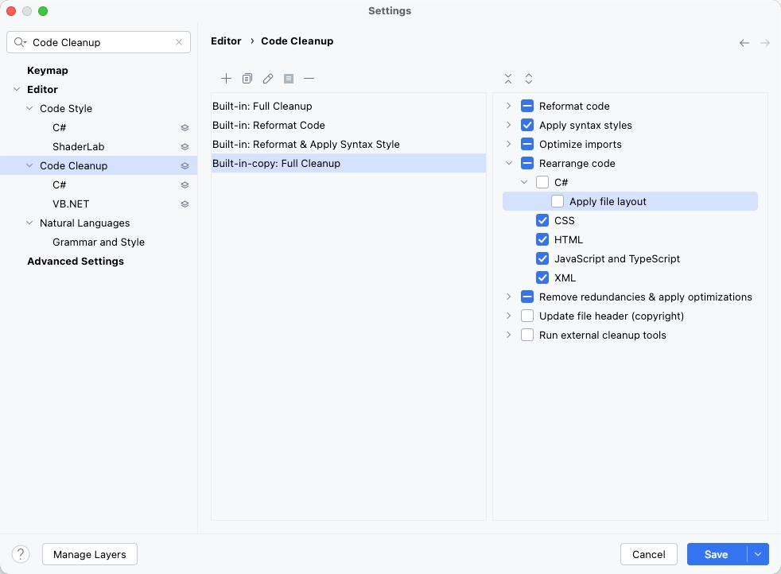
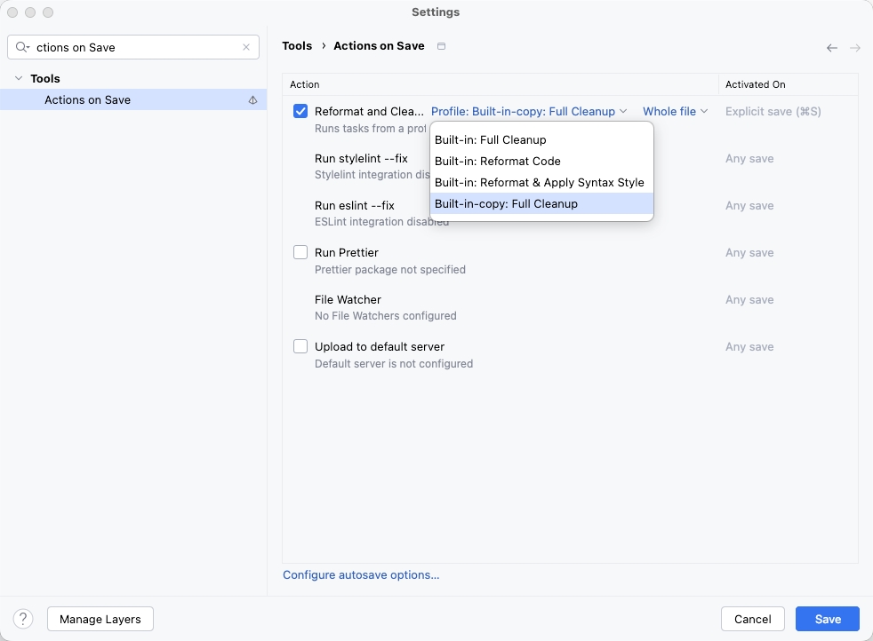
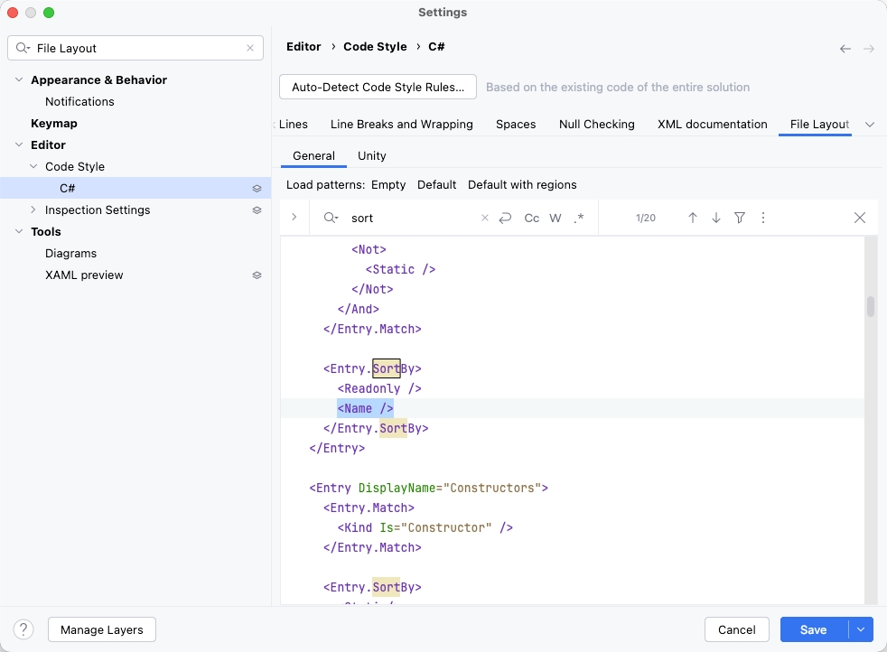

# Rider 配置：解决保存时代码自动重排（Field Reordering）问题

## 1. 问题描述

在 Rider、WebStorm 等 JetBrains 编辑器中，执行保存操作（`Cmd+S` / `Ctrl+S`）时，IDE 自动触发代码整理。原本按逻辑排列的字段被强制按字母顺序（A-Z）重新排列，破坏了代码结构。

## 2. 核心原因分析

该问题由两个层级的配置共同导致：

1. **规则层（Rule Layer）**：Rider 默认的 C# File Layout 规则中包含了 `Sort By: Name`。
2. **执行层（Action Layer）**：Actions on Save 关联了包含"代码重排（Rearrange Code）"功能的清理配置方案（Cleanup Profile）。即使修改了自定义方案，如果执行层引用的是内置的 `Full Cleanup`，修改也不会生效。

## 3. 解决方案

### 第一步：修改/创建自定义清理方案

取消掉"文件布局重排"这一动作。

1. 进入 **Settings** → **Editor** → **Code Cleanup**。
2. 点击 `+` 号新建一个方案，或选中已有的自定义方案（如：`拷贝：完全清理`）。
3. 在右侧的复选框列表中：
   - **勾选**：`Reformat code`（只负责缩进、空格、对齐）
   - **取消勾选**：`Rearrange code` 下的 **Apply file layout**
   - **建议勾选**：`Apply syntax styles`（自动简化代码语法）
4. 点击 **Save**。

### 第二步：将方案绑定到"保存动作"

这是最关键的一步，确保保存时调用的是刚刚修改过的方案。

1. 进入 **Settings** → **Tools** → **Actions on Save**。
2. 找到 **Reformat and Cleanup Code** 项。
3. **核心配置**：点击该项右侧蓝色的 **Profile: [方案名称]** 链接。
4. 在下拉菜单中，**切换为第一步中修改的方案**（例如：选择 `拷贝：完全清理`，而不是默认的 `Built-in: Full Cleanup`）。
5. 点击 **Save** 应用。

## 4. 进阶：彻底从底层禁用"按名称排序"

如果依然想保留"自动分类"（比如让所有字段永远在属性上面），但仅仅想关掉"按名字 A-Z 排序"，可以修改 File Layout 的 XAML：

1. 进入 **Editor** → **Code Style** → **C#** → **File Layout**。
2. 切换到 **XAML View**。
3. 全局搜索并删除所有的 `<Name />` 标签（这些标签就是 A-Z 排序的根源）。
4. 保存。
