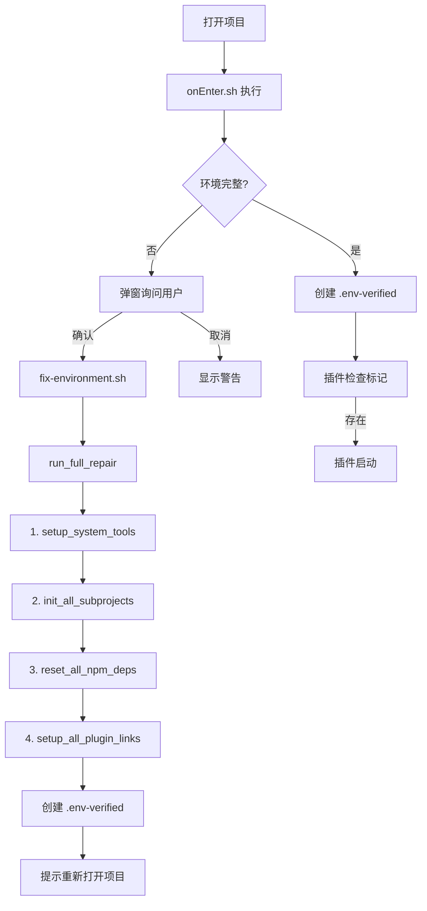

# 环境管理系统重构记录

## 更新时间
2025-01-11

## 背景

原有的环境管理系统存在以下问题：
1. **职责不清**：`onEnter.sh` 既负责检查又负责修复，还包含插件设置逻辑
2. **冗余代码**：插件清理、设置逻辑散落在多个脚本中
3. **启动问题**：插件在环境修复过程中会自动启动，导致服务管理混乱
4. **脚本错误**：`set -e` 模式下 `((count++))` 导致脚本意外退出
5. **模块耦合**：`fix-environment.sh` 包含大量实现细节，难以维护

## 重构目标

### 架构设计原则
1. **单一职责**：每个脚本/模块只做一件事
2. **职责分离**：检查、修复、控制、执行各司其职
3. **模块化**：所有具体实现封装在模块中
4. **可预测**：行为可预测，无意外的副作用

### 目标架构

```
onEnter.sh（检查器）
  ├── 检查环境完整性
  ├── 弹窗询问用户
  └── 创建环境验证标记

fix-environment.sh（流程编排器）
  ├── 参数解析和验证
  ├── 调用高级流程函数
  └── 显示最终结果

env-control.sh（流程控制器）
  ├── 环境验证标记管理
  ├── 通知管理
  └── 高级流程封装

各功能模块（执行器）
  ├── system-tools.sh
  ├── subprojects.sh
  ├── npm-deps.sh
  └── plugin-links.sh
```

## 重构内容

### 1. 新增模块

#### check-environment.sh
**职责**：环境完整性检查

```bash
#!/bin/zsh
# 检查子项目、依赖、全局命令
# 返回: 0=环境完整, 1=需要修复
# 输出: 缺失项列表

check_subprojects()          # 检查子项目
check_main_dependencies()    # 检查主项目依赖
```

**特点**：
- 纯检查功能，不执行任何修复
- 返回详细的缺失项列表
- 可独立运行

#### env-control.sh
**职责**：环境控制和流程管理

```bash
#!/bin/zsh
# 环境验证标记管理
create_env_verified_marker()      # 创建验证标记
remove_env_verified_marker()      # 删除验证标记
is_env_verified()                 # 检查是否已验证

# 通知管理
show_repair_start_notification()  # 显示修复开始通知
show_repair_complete_notification()  # 显示修复完成通知

# 高级流程封装
run_full_repair()                 # 执行完整修复流程
run_clean()                       # 执行清理流程
run_subprojects_repair()          # 执行子项目修复
run_system_tools_setup()          # 执行系统工具安装
run_deps_reset()                  # 执行依赖重置
run_links_reset()                 # 执行插件链接重置
```

**特点**：
- 封装所有高级流程操作
- 统一管理环境验证标记
- 提供一致的通知接口

### 2. 重构现有模块

#### onEnter.sh
**重构前**：277+ 行，包含检查、修复、插件设置逻辑

**重构后**：~90 行，纯检查器
```bash
#!/bin/zsh
# 1. 检查环境（调用 check-environment.sh）
# 2. 环境不完整 → 弹窗询问用户
# 3. 用户确认 → 执行 fix-environment.sh
# 4. 环境完整 → 创建 .env-verified 标记
```

**移除的逻辑**：
- ✂️ 插件清理逻辑 → 移至 `plugin-links.sh`
- ✂️ 插件设置逻辑 → 移至 `plugin-links.sh`
- ✂️ 子项目初始化 → 由 `fix-environment.sh` 调用模块
- ✂️ 所有修复操作 → 移至相应模块

#### fix-environment.sh
**重构前**：217 行，包含大量实现细节

**重构后**：171 行，纯流程编排
```bash
#!/bin/zsh
# 1. 参数解析
# 2. 调用 env-control.sh 中的高级函数
# 3. 显示结果

case $ACTION in
    "all")
        run_full_repair "$QUICK_MODE"
        ;;
    "system")
        run_system_tools_setup
        ;;
    # ...其他选项
esac
```

**移除的逻辑**：
- ✂️ 环境验证标记创建 → `env-control.sh`
- ✂️ 通知显示 → `env-control.sh`
- ✂️ 完成提示 → `env-control.sh`
- ✂️ 具体实现细节 → 各功能模块

#### subprojects.sh
**新增功能**：`init_all_subprojects()`
```bash
# 初始化所有子项目（删除已存在的并重新克隆）
init_all_subprojects() {
    # 删除所有已存在的子项目目录
    # 重新克隆所有子项目
    # 确保环境完全干净
}
```

**修复内容**：
- 修复 `((count++))` 导致的脚本退出问题
- 改为 `count=$((count + 1))` 避免 `set -e` 问题

#### plugin-links.sh
**新增功能**：插件清理能力
```bash
# 清理无效的符号链接
cleanup_invalid_symlinks()    # 清理指向不存在目标的链接

# 清理旧的插件名称
cleanup_old_plugin_names()    # 清理历史遗留的旧插件名称

OLD_PLUGIN_NAMES=(
    "vscode-toolbar-extension"
    "google-drive-uploader"
)
```

**整合流程**：
```bash
setup_all_plugin_links() {
    # 1. 清理无效链接
    # 2. 清理旧插件名称
    # 3. 验证扩展项目
    # 4. 创建新的插件链接
}
```

#### npm-deps.sh & system-tools.sh
**修复内容**：
- 所有 `((count++))` 改为 `count=$((count + 1))`
- 确保在 `set -e` 模式下正常工作

### 3. 插件启动控制

#### wtc-local-server
```typescript
// 新增环境验证检查
function isEnvironmentVerified(): boolean {
    const verifiedMarker = path.join(
        workspaceFolder.uri.fsPath,
        '.vscode',
        '.env-verified'
    );
    return fs.existsSync(verifiedMarker);
}

// 只在环境验证后才自动启动
if (config.get<boolean>('autoStart') &&
    isWTCMainProject() &&
    isEnvironmentVerified() &&
    !manuallyStopped) {
    startServer();
}
```

#### wtc-docs-server
```typescript
// 检查环境验证标记
const isEnvironmentVerified = verifiedMarker && fs.existsSync(verifiedMarker);

// 只在环境验证后才自动启动
if (config.autoStart && isEnvironmentVerified) {
    const success = await this.terminalManager.startServer();
    if (success) {
        this.statusBarManager.updateStatusBar(true);
    }
} else if (config.autoStart && !isEnvironmentVerified) {
    console.log('Environment not verified, skipping auto-start');
}
```

### 4. 模块加载顺序优化

**问题**：`env-control.sh` 依赖其他模块的函数，需要在它们之后加载

**解决**：
```bash
# fix-environment.sh 中的加载顺序
source "$ENV_TOOLS_DIR/system-tools.sh"
source "$ENV_TOOLS_DIR/subprojects.sh"
source "$ENV_TOOLS_DIR/npm-deps.sh"
source "$ENV_TOOLS_DIR/plugin-links.sh"
source "$ENV_TOOLS_DIR/env-control.sh"  # 最后加载
```

### 5. .gitignore 更新

```gitignore
# 环境验证和临时文件
.vscode/.env-verified
.vscode/.onenter.lock
.stashed_subprojects
.fix-environment-patches/
```

## 技术细节

### set -e 模式下的算术运算问题

**问题描述**：
```bash
set -e
count=0
((count++))  # ❌ count=0 时返回 0，被解释为失败，脚本退出
```

**原因分析**：
- `((count++))` 返回 count 的旧值（0）
- 在 `set -e` 模式下，表达式返回 0 被解释为失败
- 导致脚本意外退出

**解决方案**：
```bash
set -e
count=0
count=$((count + 1))  # ✅ 返回 1，总是成功
```

**修复范围**：
- `subprojects.sh` - 2 处
- `plugin-links.sh` - 3 处
- `npm-deps.sh` - 1 处

### 环境验证机制

**标记文件**：`.vscode/.env-verified`

**工作流程**：
1. `check-environment.sh` 检查环境
2. 环境完整 → `onEnter.sh` 创建标记
3. 环境不完整 → 执行修复后创建标记
4. 插件启动时检查标记存在性

**优势**：
- 简单可靠，只需检查文件是否存在
- 跨进程共享状态
- 易于调试和手动控制

## 执行流程

### 完整修复流程



### 子项目初始化流程

```bash
init_all_subprojects() {
    for subproject in $(get_all_subprojects); do
        # 1. 删除已存在的目录（无论是否是 git 仓库）
        if [[ -d "$subproject_dir" ]]; then
            chmod -R u+w "$subproject_dir"
            rm -rf "$subproject_dir"
        fi

        # 2. 重新克隆
        git clone "$git_url" "$subproject_dir"
    done
}
```

**设计决策**：
- 删除所有已存在的子项目（不跳过）
- 确保环境修复时子项目处于完全干净的状态
- 避免旧文件残留导致的问题

## 改进效果

### 代码质量
- `onEnter.sh`: 277+ 行 → ~90 行（减少 68%）
- `fix-environment.sh`: 217 行 → 171 行（减少 21%）
- 总体：+455 行/-340 行（净增115行，但职责更清晰）

### 职责分离
| 脚本/模块 | 重构前 | 重构后 |
|-----------|--------|--------|
| `onEnter.sh` | 检查+修复+设置 | 纯检查 |
| `fix-environment.sh` | 编排+实现 | 纯编排 |
| `env-control.sh` | 不存在 | 流程控制 |
| `plugin-links.sh` | 基础功能 | 完整清理+设置 |

### 可维护性
- ✅ 每个模块职责单一
- ✅ 功能封装在对应模块
- ✅ 易于测试和调试
- ✅ 扩展不影响现有逻辑

### 可靠性
- ✅ 修复 `set -e` 模式问题
- ✅ 插件启动时机可控
- ✅ 环境验证机制可靠
- ✅ 行为可预测

## 使用指南

### 环境检查
```bash
# 检查环境是否完整
./.vscode/scripts/check-environment.sh

# 输出示例
• 主项目缺少依赖 (node_modules)
• 子项目 extensions 缺少依赖 (node_modules)
```

### 环境修复
```bash
# 完整修复（删除子项目并重新克隆）
./.vscode/scripts/fix-environment.sh

# 快速修复（只更新子项目，不删除）
./.vscode/scripts/fix-environment.sh --quick

# 仅修复特定部分
./.vscode/scripts/fix-environment.sh --system      # 只安装系统工具
./.vscode/scripts/fix-environment.sh --subprojects # 只处理子项目
./.vscode/scripts/fix-environment.sh --deps        # 只安装依赖
./.vscode/scripts/fix-environment.sh --links       # 只设置插件链接
```

### 清理环境
```bash
# 清理 node_modules 和插件链接
./.vscode/scripts/fix-environment.sh --clean
```

### 手动控制插件启动
```bash
# 创建环境验证标记（允许插件启动）
touch .vscode/.env-verified

# 删除环境验证标记（阻止插件启动）
rm .vscode/.env-verified
```

## 相关提交

### 主项目
- [`7c1108abbd7`](https://github.com/LuckyZen/WorldTourCasino/commit/7c1108abbd7) - chore: 重构环境管理系统，优化模块职责分离
- [`d88f9d106ea`](https://github.com/LuckyZen/WorldTourCasino/commit/d88f9d106ea) - fix: init_all_subprojects 应删除已存在的子项目并重新克隆

### Extensions 子项目
- [`fdb7f71`](https://github.com/zhaoheng666/WTC-extensions/commit/fdb7f71) - feat: 添加环境验证检查，插件只在环境完整后启动

## 后续优化

### 可能的改进方向
1. **版本追踪**：记录子项目的版本，检测版本更新
2. **增量修复**：支持更精细的增量修复策略
3. **并行处理**：并行安装依赖和初始化子项目
4. **恢复机制**：自动保存和恢复子项目的本地修改

### 已知限制
1. **手动重载**：环境修复完成后需要手动重新打开项目
2. **全局命令检查**：暂时注释了 browserify 和 uglifyjs 的检查（需要时可启用）
3. **子项目修改丢失**：init_all_subprojects 会删除本地修改（建议手动提交）

## 总结

本次重构通过引入清晰的架构设计和模块化的实现方式，显著提升了环境管理系统的可维护性和可靠性：

1. **职责分离**：检查、修复、控制、执行各司其职
2. **模块化**：所有实现细节封装在对应模块中
3. **可预测**：插件启动时机可控，行为可预测
4. **可靠性**：修复了关键的脚本退出问题
5. **易维护**：代码精简，逻辑清晰，易于扩展

这为后续的功能扩展和优化打下了坚实的基础。
