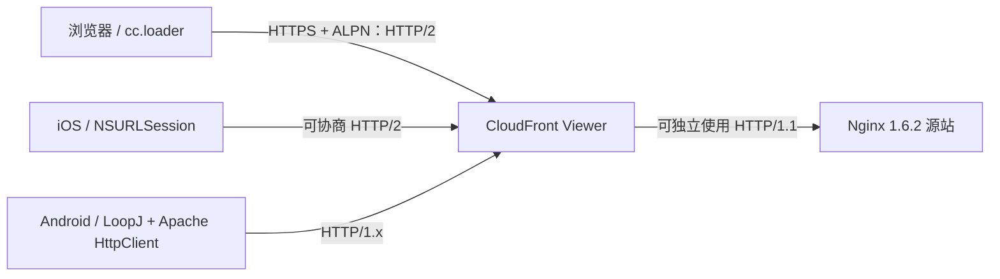

# HTTP/2 升级调研与实施记录

> 创建时间：2025-12-03
>
> 最后更新：2026-08-21
>
> 状态：Web/CloudFront 已完成，Native 待确认或改造
>
> 负责人：赵恒

## 1. 结论

| 范围 | 当前结论 | 状态 |
| --- | --- | --- |
| Web `cc.loader` | 资源由 `XMLHttpRequest`、`img`、`script` 等浏览器能力发起，HTTP 版本由浏览器通过 TLS ALPN 自动协商 | 已支持 |
| 生产 CloudFront Viewer 链路 | `slotssaga-v401-cdn.me2zengame.com` 已由 HTTP/1.1 切换为 HTTP/2 | 已完成 |
| 正式 Web 入口 | `classicvegas.ghoststudio.net/wtc_webapp/...` 的游戏资源已实测为 HTTP/2 | 已完成 |
| 测试服 Web 链路 | `ali-slots-res.me2zengame.com:8445` 实测为 HTTP/2 | 已支持 |
| Native iOS/macOS 资源下载 | Cocos `Downloader` 使用 `NSURLSession`，系统网络栈具备 HTTP/2 协商能力 | 代码具备能力，待真机抓包确认 |
| Native Android 资源下载 | 使用 LoopJ `android-async-http 1.4.9` 和 Apache HttpClient `4.4.1.1`，当前实现不具备 HTTP/2 能力 | 仍为 HTTP/1.x，待评估改造 |

HTTP/2 已经解决 Web 端的协议协商问题，但不能单独解释或解决完整 Loading 慢的问题。正式入口此前的主要异常是 CloudFront 边缘缓存持续未命中，详见 [CV Web CloudFront 缓存未命中排查记录](/故障排查/CV-Web-CloudFront缓存未命中问题)。

## 2. 链路与协议边界



CloudFront 的两段连接相互独立：

- Viewer 链路：浏览器或 Native 客户端到 CloudFront。
- Origin 链路：CloudFront 到 Nginx 源站。

因此，即使旧版 Nginx 没有启用 HTTP/2，只要 CloudFront Viewer Protocol 已启用 HTTP/2，浏览器仍可通过 ALPN 自动协商为 HTTP/2。源站继续使用 HTTP/1.1 不会迫使浏览器回退到 HTTP/1.1。

Android 当前网络栈不支持 HTTP/2，也不会影响 Web 浏览器。CloudFront 会按客户端能力分别协商：浏览器使用 HTTP/2，Android 当前实现继续使用 HTTP/1.x。

## 3. `cc.loader` 是否明确支持 HTTP/2

`cc.loader` 没有“开启 HTTP/2”的配置项，也不直接实现 HTTP 协议栈。

Web 端的关键实现位于：

- `frameworks/cocos2d-html5/CCBoot.js`：`getXMLHttpRequest()` 创建浏览器原生 `XMLHttpRequest`。
- `frameworks/cocos2d-html5/CCBoot.js`：JS、图片等资源通过浏览器的 `script`、`img` 和 XHR 加载。
- `frameworks/cocos2d-html5/cocos2d/core/platform/CCLoaders.js`：各资源类型最终委托给上述浏览器能力。

实际协议由以下条件共同决定：

1. URL 使用 HTTPS。
2. 客户端网络栈支持 HTTP/2。
3. TLS 握手时服务端通过 ALPN 提供并选择 `h2`。
4. 中间代理没有终止或降级 Viewer 链路。

所以更准确的表述是：**`cc.loader` 对 HTTP/2 透明；浏览器与 CDN 协商成功后，`cc.loader` 发出的请求自动使用 HTTP/2。**

## 4. Native 端代码核查

### 4.1 Cocos Downloader 平台选择

`frameworks/cocos2d-x/cocos/network/CCDownloader.cpp` 按平台选择实现：

| 平台 | 实现 |
| --- | --- |
| iOS/macOS | `DownloaderApple` |
| Android | `DownloaderAndroid` |
| 其他或显式指定 curl | `DownloaderCURL` |

### 4.2 iOS/macOS

`frameworks/cocos2d-x/cocos/network/CCDownloader-apple.mm` 使用默认 `NSURLSessionConfiguration` 创建 `NSURLSession`，并通过 `dataTaskWithRequest`、`downloadTaskWithRequest` 下载资源。

`NSURLSession` 会根据操作系统能力和服务端 ALPN 自动协商 HTTP/2，无需在游戏代码中指定版本。这里的结论是代码能力核查结果，仍需在正式包真机上通过抓包或 `NSURLSessionTaskMetrics.networkProtocolName` 确认实际协议。

### 4.3 Android

Android 下载链路的证据：

- `frameworks/cocos2d-x/cocos/network/CCDownloader-android.cpp` 桥接 `Cocos2dxDownloader`。
- `frameworks/cocos2d-x/cocos/platform/android/java/src/org/cocos2dx/lib/Cocos2dxDownloader.java` 使用 LoopJ `AsyncHttpClient`。
- `frameworks/cocos2d-x/cocos/platform/android/java/libs/android-async-http-1.4.9.jar`。
- `frameworks/cocos2d-x/cocos/platform/android/java/libs/httpclient-4.4.1.1.jar`。

该组合基于 Apache HttpClient 4.x，不提供 HTTP/2 多路复用。若 Native Android 需要 HTTP/2，应优先评估将资源下载器替换为 OkHttp，而不是仅修改 CloudFront。

### 4.4 Cocos HttpClient 与 Downloader 不应混淆

`frameworks/cocos2d-x/cocos/network/HttpClient.cpp` 是另一条基于 libcurl 的请求链路，主要用于普通接口请求；资源热更新使用的是上述平台 `Downloader`。libcurl 是否能使用 HTTP/2，取决于编译时是否链接 nghttp2 等能力，不能据此推断 Android `Downloader` 已支持 HTTP/2。

## 5. 升级前实测

测试时间：2026-08-20。测试环境为当前办公网络，生产 CloudFront 落到洛杉矶边缘节点，测试服通过内网代理访问。

| 指标 | 生产 CloudFront | 测试服 |
| --- | --- | --- |
| 实际节点 | `LAX53-P5 / 52.84.16.152` | 内网 `10.10.31.14` |
| 协议 | HTTP/1.1 | HTTP/2 |
| 入口总耗时 | 599 ms | 32 ms |
| 游戏资源抽样 | 129/129 为 HTTP/1.1 | 134/134 为 HTTP/2 |
| 浏览器连接 | 约 6 条，每条串行 20-22 个请求 | 132 个响应复用一条 HTTP/2 连接 |
| 请求发送前排队中位数 | 131.2 ms | 12.5 ms |
| 发送至响应中位数 | 159.9 ms | 34.2 ms |
| 单资源总耗时中位数 | 305 ms | 96 ms |
| 约 130 个响应完成窗口 | 3.743 秒 | 0.193 秒 |

这组数据证明当时两条链路的协议和排队行为存在明显差异，但不能把全部耗时差直接归因于 HTTP/2，因为两者同时存在公网/内网、CDN/代理、边缘节点、源站和缓存状态差异。

## 6. CloudFront 调整后实测

### 6.1 生产资源 CDN

CloudFront 开启 HTTP/2 后：

- TLS ALPN 协商结果为 `h2`。
- `slotssaga-v401-cdn.me2zengame.com` 返回 `HTTP/2 200`。
- HTTP/1.1 客户端仍可正常回退访问。

### 6.2 正式 Web 入口

通过 `https://classicvegas.ghoststudio.net/` 选择 Guest 登录后：

- 游戏在 iframe 中加载 `/wtc_webapp/...`。
- 抽样的 150 个游戏资源请求全部使用 HTTP/2。
- 2026-08-21 对当前 `v968` 资源复测，正式入口和独立资源 CDN 均返回 HTTP/2。

这确认了游戏内 `cc.loader` 发起的资源请求已经实际走 HTTP/2，而不只是入口 HTML 使用 HTTP/2。

## 7. 对 Loading 性能的判断

HTTP/2 对大量小资源有价值，主要减少每域名连接数限制和 HTTP/1.1 请求排队。但本项目进入大厅前约有 7,954 个资源请求，完整耗时还受以下因素影响：

- CloudFront 是否命中边缘缓存。
- 未命中时 CloudFront 到源站的回源延迟。
- 资源调度批次和依赖关系。
- 图片解码、脚本执行和主线程工作。
- 当前版本资源是否刚发布或刚执行 CDN Invalidation。

实际观察到正式入口的资源已全部使用 HTTP/2，但在 CloudFront 持续 `Miss` 时，到 89% 弹出 Account Login 仍然很慢。这说明协议升级有效，但它不是完整 Loading 的唯一瓶颈，也不是当时的主要异常。

不要仅因为启用了 HTTP/2 就直接提高下载并发。应在 CDN 命中正常后，使用同版本、同网络、相同浏览器冷缓存条件重新测量，再根据浏览器排队、CPU 和主线程数据调整并发。

## 8. 验收方法

### 8.1 Web

1. 清理浏览器本地缓存或使用无痕窗口。
2. 打开 DevTools Network，启用 Protocol 列。
3. Guest 登录，统计到 89% 弹出 Account Login。
4. 验证游戏资源 Protocol 为 `h2`。
5. 同时记录 `X-Cache`，避免把 HTTP/2 和 CloudFront 命中率混为一个变量。

命令行单资源验证：

```bash
curl -sS -o /dev/null -D - \
  'https://slotssaga-v401-cdn.me2zengame.com/wtc_fb/v968/res_oldvegas_webp/casino/card_system/wild_card/effects/wild_card_bg_gold_light2.plist'
```

预期响应状态行是 `HTTP/2 200`。

### 8.2 Native

| 平台 | 验收方式 | 预期 |
| --- | --- | --- |
| iOS/macOS | 真机抓包或记录 `NSURLSessionTaskMetrics.networkProtocolName` | 服务端支持时为 `h2` |
| Android 当前实现 | 真机抓包 | HTTP/1.1 |
| Android 改造后 | OkHttp EventListener、抓包或服务端日志 | 服务端支持时为 `h2` |

## 9. 后续事项

- [x] CloudFront Viewer 链路开启 HTTP/2。
- [x] 验证生产资源 CDN 为 HTTP/2。
- [x] 验证正式游戏资源抽样为 HTTP/2。
- [ ] iOS 正式包真机确认资源下载实际协议。
- [ ] 评估 Android Downloader 是否需要迁移到 OkHttp。
- [ ] CDN 命中稳定后，重新执行“浏览器冷缓存、CDN 热缓存”到 Account Login 的完整基准测试。

## 10. 参考资料

- [CloudFront 支持的 HTTP 版本](https://docs.aws.amazon.com/AmazonCloudFront/latest/DeveloperGuide/distribution-web-values-specify.html)
- [CloudFront 工作原理](https://docs.aws.amazon.com/AmazonCloudFront/latest/DeveloperGuide/HowCloudFrontWorks.html)
