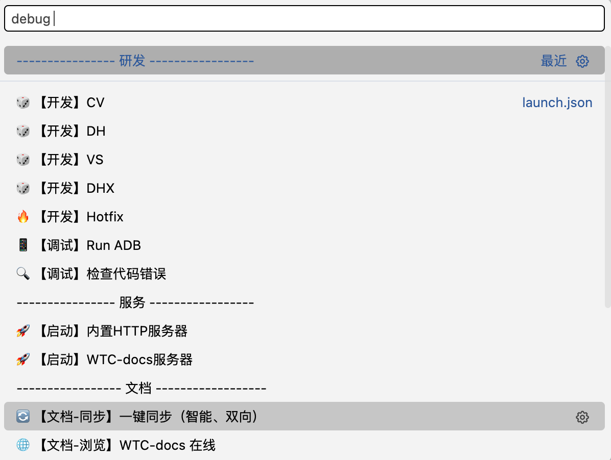

# 🚀 快速开始

VScode 打开 WorldTourCasino 项目时自动部署、初始化 WTC-docs 系统，你唯一需要关心的事情：运行-一键智能同步

## 方式一、使用 VScode 系列编辑器

- #### 自动初始化

  - 自动检出、部署到 WorldTourCasino/docs
  - 首次打开 WorldTourCasino 项目时触发
- #### 自启动

  - 自动启动，dev 模式
  - 打开 WorldTourCasino 项目时触发
- #### 一键同步

## 方式二、手动部署、控制

### 第一步：初始化环境

```bash
npm run init
```

此命令会自动：

- ✅ 安装所有依赖
- ✅ 配置 Git 和 GitHub CLI
- ✅ 设置必要的权限

### 第二步：启动开发服务器

```bash
npm run dev
```

本地预览：[http://localhost:5173](http://localhost:5173)

### 第三步：编写 markdown 文档

- docs 目录结构即为文档组织结构；
- 按需添加分类目录、MD 文档；

### 第四步：提交更新

```bash
npm run sync
```

此命令会自动：

- ✅ 处理所有图片
- ✅ 构建测试
- ✅ 提交并推送
- ✅ 部署到线上

---

💡 **就这么简单！** 更多详细功能请查看[开发指南](./README)
