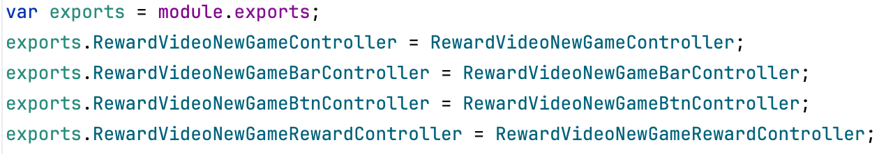

# Q2`25-Slots-HotFix插件代码更新无效说明-程序

## 关键技术说明：

1. 热更支持组件：`ModuleDebugMan.js`​

2. 基于 nodejs、commonJs 标准的 `module.exports` 和 `require` 机制：

    1. 通过 cc.loadTxt 加载新的 js 文件；
    2. 按照 commonJs 模块标准、包装成 function(require,module,export){};
    3. 用 eval 读取新 module；
    4. 替换全局 module lib，替换 module 原型链；
3. 只做了 module 替换，未做 require 缓存清理，`module.exports` 单导出和多导出的缓存存在差异；

    存在多导出文件更新不生效的问题；
4. 无法获取 require.cache 做主动清理：

    `delete require.cache[require.resolve(path)];`​

## 多导出文件的更新问题：

	

1. 情形一：未触发该文件的 require

    1. eg：未触发该文件相关功能
    2. 未经 require 缓存，更新后可直接生效；
2. 情形二：已触发过该文件 require

    1. 多到处实际上导出的是一个对象值
    2. 已被 require 缓存时，将缓存该导出对象，后续 require 仍直接返回缓存对象；
    3. 更新方法：

        1. 更新目标文件;
        2. 更新 require 目标文件的文件；
3. 案例：

    1. ​`RewardVideoNewGameRewardController` - 多导出：

        由`RewardVideoNewGameEntranceController`文件 require；

        如果要使`RewardVideoNewGameRewardController`更新生效，需要额外更新`RewardVideoNewGameEntranceController`​
    2. ​`RewardVideoNewGameEntranceController` - 单导出：

        更新`RewardVideoNewGameEntranceController`可直接生效；

## CCClass 的继承链更新问题：

1. 同样存在多导出问题，同上；
2. CCClass 内部对 module 对象和原型链做了二次加工，以 CCClass.extend 做继承；

    1. ​`ModuleDebugMan` 增加了针对 extend 的原型链修正；
    2. 只针对 module 对象自身的 function 成员做原型链修正；
3. 更新方法：

    1. 检查继承关系，补充 extend 关联；
    2. 更新目标文件；
    3. 如果目标文件存在派生模块，更新派生模块；
4. 案例：

    1. ​`SlotMachineScene` - 多导出 - CCClass.extend

        如果要使 `SlotMachineScene` 更新生效，需要额外更新 `SlotMachineScene2022`、或具体的关卡代码文件；
    2. ​`SlotMachineScene` - 单导出 - CCClass.extend

        更新 `SlotMachineScene2022` 可直接生效；

‍
