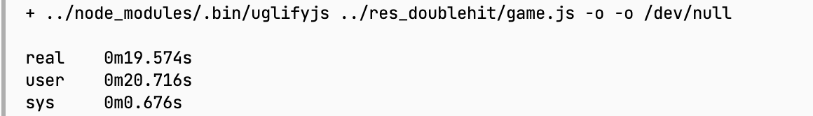
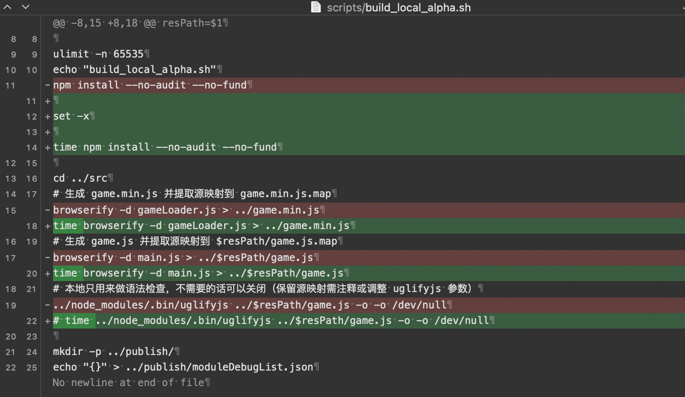
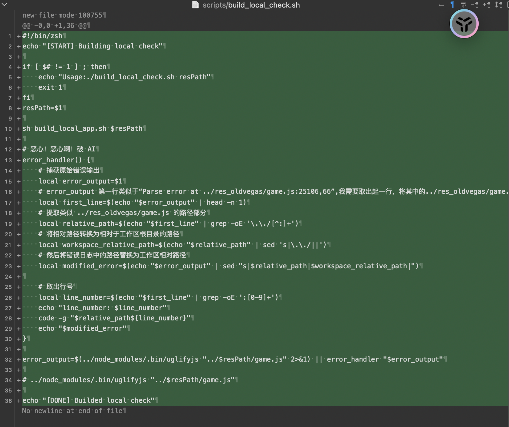
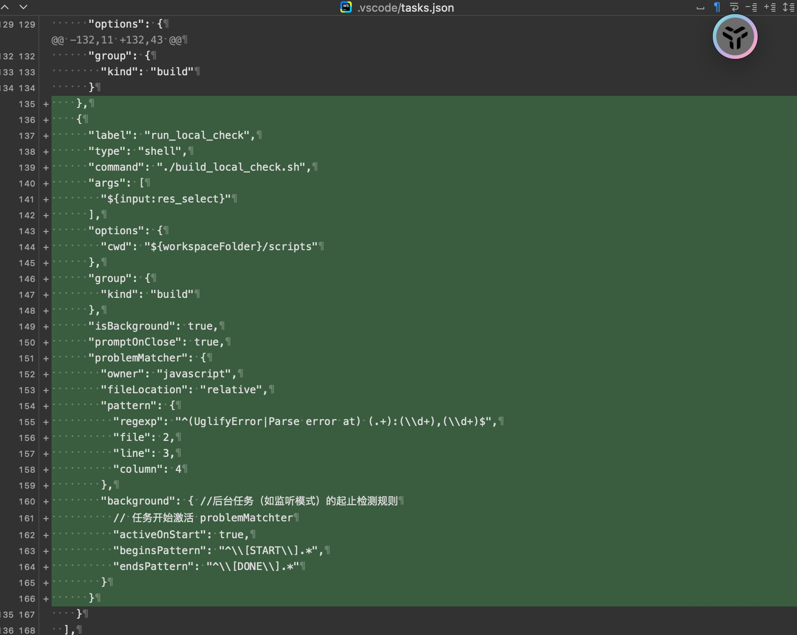
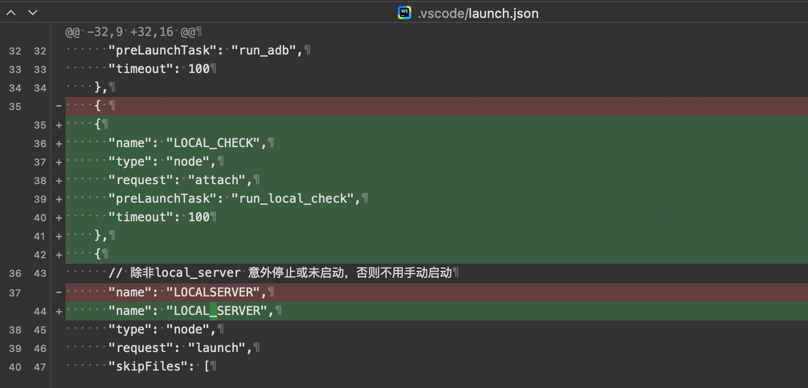
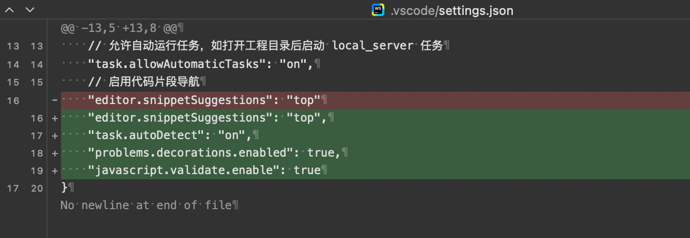
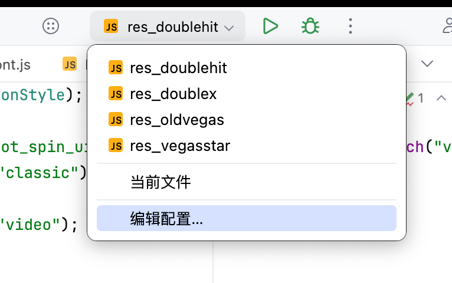
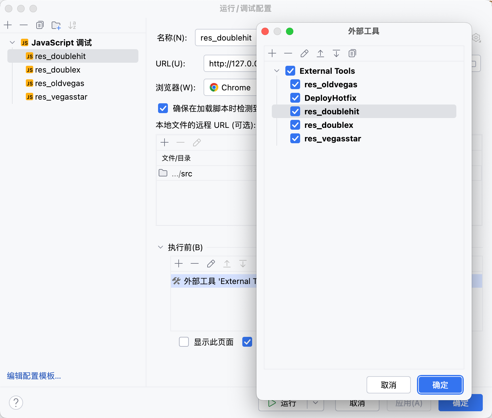
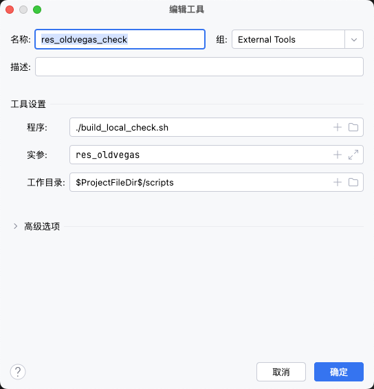

# Q3`25-Slots-优化本地工程启动速度-程序

### 一、解决的问题：

- build_local_app.sh 脚本中 uglifyjs 命令执行时间过长，拖慢程序本地工程单次启动的速度，影响开发节奏：

  

- uglifyjs 用于检查代码语法错误，之前尝试屏蔽该命令，导致了一些语法错误带到了打包机，付出了额外的错误查询成本；

### 二、优化效果：

- 本地启动耗时缩短 19.5m：（缩减比例：2/3）

### 三、解决方案：

- 1、修改 build_local_app.sh 脚本、新增 build_lcoal_check.sh 脚本：

  日常开发中启动时不做语法检查，如果出现语法错误，单独启动该脚本定位；

  

  

- 2、新增 vs-code:task:

  本次优化针对 vs-code:task 做了自动定位报错行的功能：

  受限于 vscode eslint 未配置完成，不能直接使用 vscode 的问题面板，暂时采用了通过自动打开game.js 文件，自动定位到报错行的方式；

  

- 3、新增 vs-code:luanch:

  

- 4、开启 vscode:task 自动检查：

  

- 5、webstorm 自行创建外部工具调用将脚本：

  可以通过新建 JavaScript 调试器调用外部工具；

  或将该外部工具添加到工具栏，类似于 hotfix；

  ​

​

​

​
