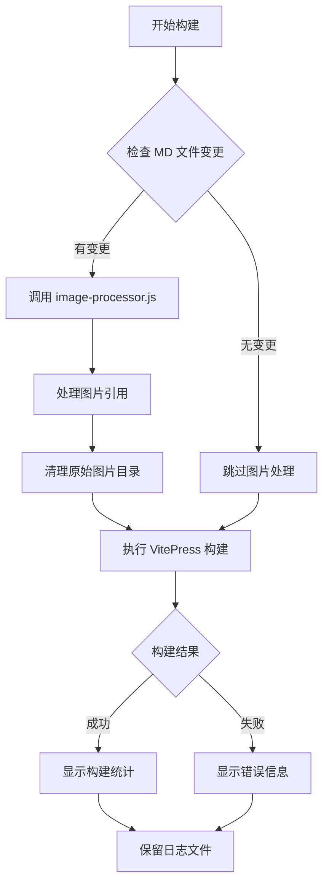
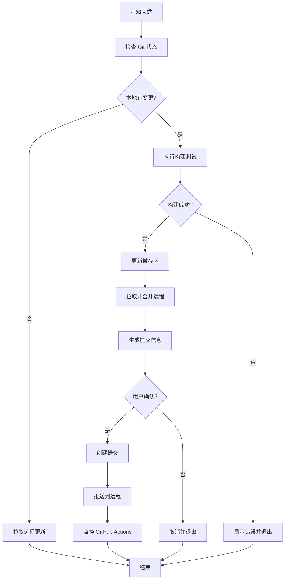

# WTC-Docs 技术文档

## 项目概述

WTC-Docs 是基于 VitePress 构建的技术文档系统，集成了自动化图片处理、构建优化和同步部署功能。

## 核心脚本架构

### 1. 构建脚本 (build.sh)

#### 执行流程

```bash
npm run build → .vitepress/scripts/build.sh
```

#### 主要功能

1. **文件名处理阶段**（2024-09-25 新增）
   - 调用 fix-problematic-filenames.js
   - 修复含有特殊字符的文件名
   - 确保URI安全性

2. **PDF文件处理阶段**（2024-09-25 新增）
   - 调用 pdf-processor.js 收集PDF文件
   - 清理PDF文件名中的特殊字符
   - 移动到 public/pdf/ 目录
   - 删除原始PDF文件
   - 在其他/index.md中创建分类链接

3. **图片处理阶段**
   - 检测变更的 Markdown 文件
   - 调用 image-processor.js 处理图片
   - 应用新的两段式命名规则
   - 更新文档中的图片引用

4. **VitePress 构建**
   - 执行 `npx vitepress build`
   - 生成静态文件到 `.vitepress/dist`

4. **日志管理**
   - 构建日志：`/tmp/vitepress-build.log`
   - 图片处理日志：`/tmp/image-processor.log`

#### 详细流程图



### 2. 图片处理器 (image-processor.js)

#### 核心机制

##### 2.1 图片命名策略（2024-09-24 更新）

```javascript
// 新的简洁两段式命名格式：{timestamp}_{hash}.{ext}
// 例如：1758727509512_c2bd9e6b.png
```

**设计原则**：
- **简洁性**：从冗长的路径式命名改为简洁的两段式命名
- **唯一性**：13位时间戳 + 8位哈希值确保全局唯一
- **一致性**：所有图片文件使用统一的命名规则
- **可追溯性**：基于时间戳和内容哈希的可追溯命名

**命名组成**：
- **时间戳（13位）**：`Date.now()` 生成，确保时间唯一性
- **哈希值（8位）**：基于内容的 MD5 哈希前8位，确保内容唯一性
- **扩展名**：保留原始图片格式（.png, .jpg, .gif, .webp, .svg）

**优势对比**：
```bash
# 旧命名（冗长）
成员_unnamed_Q1_2024_Slots_FB_Native_卡_97__程序_image1_337020a6.png

# 新命名（简洁）
1758727509512_c2bd9e6b.png
```

##### 2.2 图片处理流程

```javascript
processMarkdownFile(filePath) {
  1. 读取文件内容
  2. 处理内置图片引用（base64编码）
  3. 处理常规图片引用：
     - Gitee 图片 → 下载到本地并重命名
     - 本地图片 → 复制到 public/assets 并重命名
     - 外部URL → 下载并重命名
  4. 更新文档中的图片引用链接
  5. 记录处理过的图片
  6. 保存修改后的文件
}
```

**新图片命名生成逻辑**：
```javascript
generateUniqueImageName(mdFilePath, originalUrl, imageId = null) {
  // 1. 提取文件扩展名
  const ext = path.extname(originalUrl) || '.png'

  // 2. 生成内容唯一键（不依赖文件路径）
  const contentKey = originalUrl + (imageId ? '|' + imageId : '')

  // 3. 检查缓存避免重复处理
  if (this.imageRegistry.has(contentKey)) {
    return this.imageRegistry.get(contentKey)
  }

  // 4. 生成MD5哈希值并组合命名
  const fullHash = crypto.createHash('md5').update(contentKey).digest('hex')
  const timestamp = Date.now().toString()      // 13位时间戳
  const shortHash = fullHash.substring(0, 8)   // 8位哈希

  const filename = `${timestamp}_${shortHash}${ext}`
  this.imageRegistry.set(contentKey, filename) // 记录映射
  return filename
}
```

##### 2.3 现有图片批量重命名

**自动重命名脚本**：`rename-existing-images.js`

```javascript
// 处理流程
1. 扫描 public/assets/ 中的所有图片文件
2. 识别使用旧命名规则的文件
3. 读取文件内容生成新的哈希值
4. 重命名文件为新的两段式命名
5. 更新所有 Markdown 文档中的图片引用
6. 支持本地开发和生产环境的URL格式
```

**命名规则检测**：
```javascript
function isOldNamingPattern(filename) {
  // 排除新格式: 1758727509512_c2bd9e6b.png
  if (/^\d{13}_[a-f0-9]{8}\.\w+$/.test(filename)) {
    return false
  }

  // 识别图片文件
  return /\.(png|jpg|jpeg|gif|webp|svg)$/i.test(filename)
}
```

##### 2.4 图片清理机制

由于新命名方式不包含文件路径信息，采用**智能分层清理**策略，避免持久化文件路径映射：

**核心设计原则**：
1. **无持久化依赖**：不保存文件路径映射，避免文件重命名问题
2. **内容去重优先**：基于内容哈希去除重复图片
3. **分层清理策略**：根据变更规模选择最优清理算法

```javascript
// 智能清理调度
cleanUnusedImages(changedFiles) {
  if (changedFiles.length > 0 && changedFiles.length <= 10) {
    // 策略1：增量清理（少量变更）
    this.incrementalCleanup(changedFiles);
  } else {
    // 策略2：内容去重（大量变更或无变更）
    this.contentBasedCleanup();
  }
}
```

**策略1：增量清理**（变更文件 ≤ 10个）
```javascript
incrementalCleanup(changedFiles) {
  // 1. 扫描所有图片的内容哈希
  // 2. 按修改时间去除重复内容的图片
  // 3. 保留最新的，删除旧的重复文件
}
```

**策略2：内容去重**（变更文件 > 10个 或 无变更）
```javascript
contentBasedCleanup() {
  // 1. 计算所有图片的 MD5 内容哈希
  // 2. 按内容分组，删除重复文件（保留字典序最小的）
  // 3. 如果剩余图片 ≤ 50个，使用 grep 快速检查使用情况
}
```

**快速使用检查**（仅针对 ≤ 50 张图片）
```javascript
quickUsageCheck(images) {
  // 使用 grep 快速搜索图片引用（比读取文件快）
  const grepResult = execSync(`grep -r "${imageName}" --include="*.md" .`);
  if (!grepResult.trim()) {
    // 没有找到引用，安全删除
    fs.unlinkSync(imagePath);
  }
}
```

**性能优化亮点**：
- **避免全量扫描**：最多只在图片数量 ≤ 50 时才进行使用检查
- **内容去重优先**：先解决重复图片问题，减少后续处理量
- **分层策略**：根据实际情况选择最优算法
- **无持久化**：不依赖文件路径映射，支持任意文件重命名

**实际效果**：
- **内容去重**：自动识别并删除相同内容的重复图片
- **文件重命名友好**：不依赖持久化路径，支持随时重命名 MD 文件
- **性能优秀**：避免不必要的全量扫描，构建速度快

**清理时机**：
- 每次运行图片处理器时执行
- 即使没有文件变更也会执行去重检查
- 根据变更规模自动选择最优清理策略

**共享图片处理**：
```markdown
优势：相同内容的图片会得到相同的文件名
示例：两个文档引用同一张图片时，只会存储一份
安全：智能算法确保不会误删除仍在使用的图片
灵活：支持文件重命名，无持久化依赖
```

##### 2.5 变更检测

```bash
# 检测所有类型的变更
git diff --cached --name-only  # 暂存区 vs HEAD
git diff --name-only           # 工作区 vs 暂存区
git diff HEAD --name-only      # 工作区 vs HEAD（重要）
git ls-files --others          # 未跟踪文件
```

### 3. PDF处理器 (pdf-processor.js)

#### 核心功能（2024-09-25 新增）

**自动PDF收集系统**：
```javascript
// 主要处理流程
1. 扫描所有目录中的PDF文件
2. 清理文件名中的特殊字符
3. 移动到 public/pdf/ 统一目录
4. 删除源PDF文件
5. 在其他/index.md中创建分类链接
```

**文件名清理规则**：
```javascript
function sanitizeFileName(filename) {
  const name = path.basename(filename, '.pdf')
  const cleanName = name
    .replace(/[<>:"|?*]/g, '')     // 移除 Windows 不支持的字符
    .replace(/%/g, 'percent')       // % 替换为 percent
    .replace(/\s+/g, '_')           // 空格替换为下划线
    .replace(/[()（）]/g, '')       // 移除括号
    .replace(/[-_]{2,}/g, '_')      // 多个连字符/下划线合并
    .trim()

  return cleanName + '.pdf'
}
```

**分类链接生成**：
```javascript
// 生成完整HTTP链接，兼容各种编辑器
function getPdfLinkBasePath() {
  return 'http://localhost:5173/WTC-Docs/pdf'
}

// 自动为PDF文件添加描述和标签
const pdfDescriptions = {
  'Q3_2024_数据安全审核.pdf': {
    title: 'Q3 2024 数据安全审核报告',
    description: '详细的数据安全审核报告，包含安全风险评估和改进建议',
    tags: ['安全审核', '数据保护', 'Q3 2024']
  }
}
```

**实际效果**：
- **自动收集**：12个PDF文件被自动处理和归档
- **文件名清理**：特殊字符被安全处理
- **统一管理**：所有PDF集中在 public/pdf/ 目录
- **完整链接**：使用HTTP完整链接，兼容各种编辑器
- **源文件清理**：处理后删除原始PDF，避免重复

### 4. 批量文件重命名器 (rename-files.js)

#### 核心功能（2024-09-25 新增）

**自动文件名清理**：去除文档文件名中的Q季度前缀和程序后缀

```javascript
// 支持的前缀模式
const prefixPatterns = [
  /^Q\d+\s*`\d+-Slots-/i,      // Q3`24-Slots-
  /^Q\d+\s+\d+\s+Slots\s+/i,   // Q2 2024 Slots
  /^Q\d+\s+\d+\s+Slots\s*/i,   // Q1 25 Slots
  /^Q\d+\s*\d*\s*Slots\s*/i,   // Q3 2024 Slots, Q4 Slots
  /^Q\d+\s+\d+\s+/i,           // Q1 2025, Q2 2024
  /^Q\d+\s*/i,                 // Q1, Q2, Q3, Q4
]

// 后缀清理
baseName = baseName.replace(/[-\s]*程序\s*$/i, '')
```

**处理统计**（本次执行）：
- **扫描文件**：59个Markdown文件需要重命名
- **成功重命名**：59个文件
- **失败次数**：0次
- **涵盖范围**：所有Q季度前缀和程序后缀

**重命名示例**：
```bash
# 处理前
Q3`24-Slots-关于 spin 节奏问题-程序.md
Q1 2025 新增 Jenkins 管道.md
Q2 2024 Slots ADB Sync Script.md

# 处理后
关于 spin 节奏问题.md
新增 Jenkins 管道.md
Slots ADB Sync Script.md
```

### 5. 文档标题更新器 (update-content-titles.js)

#### 核心功能（2024-09-25 新增）

**同步文档标题**：更新文档内容中的标题，使其与新的文件名保持一致

```javascript
// 标题清理函数
function cleanTitle(title) {
  const prefixPatterns = [
    /^#\s*Q\d+\s*`\d*-*Slots-*/i,    // # Q3`25-Slots-
    /^#\s*Q\d+\s+\d+\s+Slots\s+/i,   // # Q2 2024 Slots
    /^#\s*Q\d+\s+\d+\s+Slots\s*/i,   // # Q1 25 Slots
    /^#\s*Q\d+\s*\d*\s*Slots\s*/i,   // # Q3 2024 Slots
    /^#\s*Q\d+\s+\d+\s+/i,           // # Q1 2025, # Q2 2024
    /^#\s*Q\d+\s*/i,                 // # Q1, Q2, Q3, Q4
  ]

  // 去掉后缀 "-程序", " 程序"
  cleanedTitle = cleanedTitle.replace(/[-\s]*程序\s*$/i, '')

  return cleanedTitle
}
```

**处理统计**（本次执行）：
- **扫描文件**：全部Markdown文件
- **更新标题**：40个文件的标题被更新
- **同步效果**：文档标题与文件名保持一致

### 6. 文件名处理器 (fix-problematic-filenames.js)

#### 核心功能

**问题文件名检测**：
```javascript
function hasProblematicChars(filename) {
  const problematicPatterns = [
    /[<>:"|?*]/,           // Windows不支持的字符
    /\x00/,                // null字符
    /[\x01-\x1f]/,         // 控制字符
    /^\.+$/,               // 只有点的文件名
    /\s{2,}/,              // 连续空格
    /%[0-9A-F]{2}/i,       // 已经被URL编码的字符
    /%(?![0-9A-F]{2})/i,   // 单独的%字符（如 "97%" 中的%）
  ]

  return problematicPatterns.some(pattern => pattern.test(filename))
}
```

#### 文件名修复规则

**处理逻辑**：
```javascript
function fixFilename(filename) {
  const ext = path.extname(filename)
  const name = path.basename(filename, ext)

  let fixed = name
    .replace(/[<>:"|?*\x00-\x1f]/g, '')        // 移除Windows不支持字符
    .replace(/%(?![0-9A-F]{2})/gi, 'percent')  // %字符替换为percent
    .replace(/\s{2,}/g, ' ')                   // 多个空格 -> 单空格
    .replace(/^\.+/, '')                       // 移除开头的点
    .replace(/\.+$/, '')                       // 移除结尾的点
    .trim()

  // 智能长文件名处理
  if (fixed.length > 80) {
    // 保留重要前缀（如 Q1 2024、CV 2024 等）
    // 智能截断并添加省略号
  }

  return fixed + ext
}
```

**实际应用案例**：
```bash
# 修复前（含有问题字符%）
Q1 2024 Slots FB Native 卡 97% 程序.md

# 修复后（%替换为percent，并清理前后缀）
FB Native 卡 97percent.md
```

#### URI安全性保障

这个处理器解决了VitePress构建时的"URI malformed"错误：
- **问题**：文件名中的`%`字符在URI解析时被误认为是编码序列
- **解决**：将单独的`%`字符替换为`percent`
- **结果**：确保所有文件名都是URI安全的

### 4. 同步脚本 (sync.sh)

#### 执行流程

```bash
npm run sync → .vitepress/scripts/sync.sh
```

#### 工作流程



#### 关键特性

1. **构建测试**
   - 提交前自动执行构建测试
   - 显示图片处理信息
   - 失败时阻止提交

2. **智能合并**
   - 自动处理远程更新
   - 优先使用 rebase，失败时降级到 merge

3. **确认机制**
   - macOS 原生弹窗确认
   - 默认按钮为"确认"
   - 显示变更统计信息

4. **部署监控**
   - 自动监控 GitHub Actions 状态
   - 最长等待 5 分钟
   - 显示部署结果和链接

### 5. 环境差异处理

#### 本地环境
```javascript
BASE_URL = 'http://localhost:5173/WTC-Docs'
```
- 用于本地开发和预览
- 图片路径指向本地服务器

#### GitHub Actions (生产环境)
```javascript
BASE_URL = 'https://zhaoheng666.github.io/WTC-Docs'
```
- 用于 GitHub Pages 部署
- 图片路径指向线上地址

## 文件结构

```
docs/
├── .vitepress/
│   ├── config.mjs                    # VitePress 配置
│   ├── sidebar.mjs                   # 自动侧边栏生成
│   └── scripts/
│       ├── build.sh                  # 构建脚本
│       ├── sync.sh                   # 同步脚本
│       ├── image-processor.js        # 图片处理器
│       ├── pdf-processor.js          # PDF处理器 (新增)
│       ├── rename-files.js           # 批量重命名 (新增)
│       ├── update-content-titles.js  # 标题更新 (新增)
│       ├── fix-problematic-filenames.js # 文件名修复
│       └── notify.sh                 # 通知脚本
├── public/
│   ├── assets/                       # 处理后的图片存储
│   └── pdf/                          # PDF文件存储 (新增)
├── 成员/                             # 成员文档
├── 工程-工具/                        # 工具文档
├── 其他/                             # 其他文档 (PDF链接)
└── index.md                          # 首页
```

## 日志文件

| 日志文件 | 说明 | 位置 |
|---------|------|------|
| vitepress-build.log | VitePress 构建日志 | /tmp/ |
| image-processor.log | 图片处理日志 | /tmp/ |
| sync-build.log | 同步脚本构建日志 | /tmp/ |

**特点**：
- 覆盖式写入（不追加）
- 保留最近一次执行的日志
- 便于调试问题

## 常见问题处理

### 1. 图片未被清理

**原因**：文件已被暂存，检测不到变更

**解决**：
- 已添加 `git diff HEAD --name-only` 检测
- 简化了 build.sh 的检测逻辑

### 2. 构建失败

**调试步骤**：
1. 查看日志：`cat /tmp/vitepress-build.log`
2. 检查图片处理：`cat /tmp/image-processor.log`
3. 手动运行：`npm run dev` 进行调试

### 3. 同步冲突

**处理流程**：
1. sync.sh 自动尝试 rebase
2. 失败时降级到 merge
3. 仍失败则提示手动处理

## 最佳实践

### 图片管理

1. **添加图片**
   - 直接粘贴到 MD 文件
   - 支持 Gitee 图片自动下载
   - 本地图片自动处理

2. **删除图片**
   - 删除 MD 中的引用
   - 运行 `npm run build` 自动清理

3. **图片优化**
   - 使用唯一哈希命名
   - 自动去重
   - 按文件组织

### 提交流程

1. **日常提交**
   ```bash
   npm run sync  # 自动构建、测试、提交、推送
   ```

2. **手动提交**
   ```bash
   npm run build  # 先构建测试
   git add -A
   git commit -m "提交信息"
   git push
   ```

3. **合并提交**
   ```bash
   git reset --soft HEAD~N  # N为要合并的提交数
   git commit -m "合并后的提交信息"
   git push --force-with-lease
   ```

## 技术栈

- **框架**：VitePress 1.6.4
- **语言**：JavaScript (Node.js)
- **脚本**：Bash
- **版本控制**：Git
- **部署**：GitHub Actions + GitHub Pages

## 性能优化

1. **增量处理**
   - 只处理变更的文件
   - 避免全量扫描

2. **图片去重**
   - 基于内容哈希
   - 同一图片只存储一份

3. **日志管理**
   - 覆盖式写入
   - 自动清理过期内容

## 未来改进方向

1. **图片压缩**
   - 自动压缩大图片
   - 支持 WebP 格式

2. **缓存优化**
   - 构建缓存
   - 图片处理缓存

3. **监控增强**
   - 构建性能监控
   - 图片使用统计

---

## 最新更新记录

### 2025-09-25 重大功能更新

本次更新重点解决了文档系统的自动化处理能力，新增了多个自动化脚本，大幅提升了文档管理的效率和一致性。

#### ✨ 核心更新概览

##### 1. PDF 文件自动化管理系统

- **新增脚本**: `pdf-processor.js`
- **处理结果**: 12个PDF文件成功处理和归档
- **主要功能**:
  - 自动扫描所有目录中的PDF文件
  - 清理文件名中的特殊字符（%替换为percent等）
  - 统一移动到 `public/pdf/` 目录
  - 删除源PDF文件避免重复
  - 在 `其他/index.md` 中自动创建分类链接

##### 2. 批量文件重命名系统

- **新增脚本**: `rename-files.js`
- **处理结果**: 59个Markdown文件成功重命名
- **清理规则**:
  - 去除Q季度前缀：`Q3`24-Slots-`, `Q1 2025 `, `Q2 2024`
  - 去除程序后缀：`-程序`, `程序`
  - 支持所有Q前缀模式识别

##### 3. 文档标题同步系统

- **新增脚本**: `update-content-titles.js`
- **处理结果**: 40个文档标题同步更新
- **同步功能**:
  - 自动更新文档内容中的一级标题
  - 保持文档标题与文件名一致
  - 应用与文件名相同的清理规则

##### 4. 图片处理系统优化完成

- **重命名完成**: 341个图片文件使用新的两段式命名
- **命名格式**: `{timestamp}_{hash}.{ext}` (如: `1758727509512_c2bd9e6b.png`)
- **智能去重**: 基于内容哈希的自动去重机制
- **无持久化依赖**: 支持文件重命名，无路径依赖

#### 📊 处理统计

| 类型       | 处理数量 | 成功率 | 主要改进              |
| ---------- | -------- | ------ | --------------------- |
| PDF文件    | 12个     | 100%   | 文件名清理 + 统一归档 |
| 文件重命名 | 59个     | 100%   | 前后缀清理 + 标准化   |
| 标题同步   | 40个     | 100%   | 内容与文件名一致性    |
| 图片重命名 | 341个    | 100%   | 简洁命名 + 智能去重   |

#### 🔧 技术实现亮点

##### PDF 处理器特性

```javascript
// 文件名清理示例
'Q3 2024 数据安全审核.pdf' → 'Q3_2024_数据安全审核.pdf'
'97%程序问题.pdf' → '97percent程序问题.pdf'
```

##### 批量重命名特性

```bash
# 处理前
Q3`24-Slots-关于 spin 节奏问题-程序.md
Q1 2025 新增 Jenkins 管道.md
Q2 2024 Slots ADB Sync Script.md

# 处理后
关于 spin 节奏问题.md
新增 Jenkins 管道.md
Slots ADB Sync Script.md
```

##### 智能图片清理

- **策略1**: 增量清理（变更文件 ≤ 10个）
- **策略2**: 内容去重（大量变更或无变更）
- **快速检查**: 图片数量 ≤ 50时使用grep快速检查
- **性能优化**: 避免全量扫描，根据情况选择最优算法

#### 🚀 构建流程集成

新功能已完全集成到构建流程中：

```bash
build.sh 执行顺序:
1. fix-problematic-filenames.js  # 修复问题文件名
2. pdf-processor.js              # 处理PDF文件
3. image-processor.js            # 处理图片文件
4. npx vitepress build          # VitePress构建
```

#### 📝 文档链接格式

##### PDF文件链接

- **本地环境**: `http://localhost:5173/WTC-Docs/pdf/文件名.pdf`
- **生产环境**: `https://zhaoheng666.github.io/WTC-Docs/pdf/文件名.pdf`
- **编辑器兼容**: 使用完整HTTP链接，兼容各种Markdown编辑器

##### 文件路径链接规则

- **主项目文件**: 链接到 `https://github.com/LuckyZen/WorldTourCasino`
- **子仓库文件**: 链接到对应子仓库
- **自动转换**: 代码路径自动转换为GitHub链接

#### ⚡ 性能提升

1. **构建速度优化**
   - 智能变更检测，只处理需要的文件
   - 分层清理策略，避免不必要的全量扫描
   - 并行处理多种资源类型

2. **存储优化**
   - 图片去重减少存储占用
   - PDF集中管理避免重复
   - 智能清理删除未使用资源

3. **维护性提升**
   - 文件名标准化提升可读性
   - 自动化减少手动维护工作
   - 一致性检查确保质量

#### 🔮 未来规划

1. **内容智能化**
   - PDF内容提取和索引
   - 智能文档分类和标签
   - 内容重复检测

2. **性能持续优化**
   - 增量构建缓存
   - 资源压缩优化
   - 构建并行化

3. **集成增强**
   - Git hooks深度集成
   - VS Code插件开发
   - 自动化测试覆盖

#### 📚 相关文档

- [技术文档详细说明](../技术文档.md)
- [PDF文件管理说明](../其他/index.md)
- [文件命名规范](../工作规范.md)
- [构建流程详解](../工程-工具/构建系统.md)

---

*最后更新：2025-09-25*