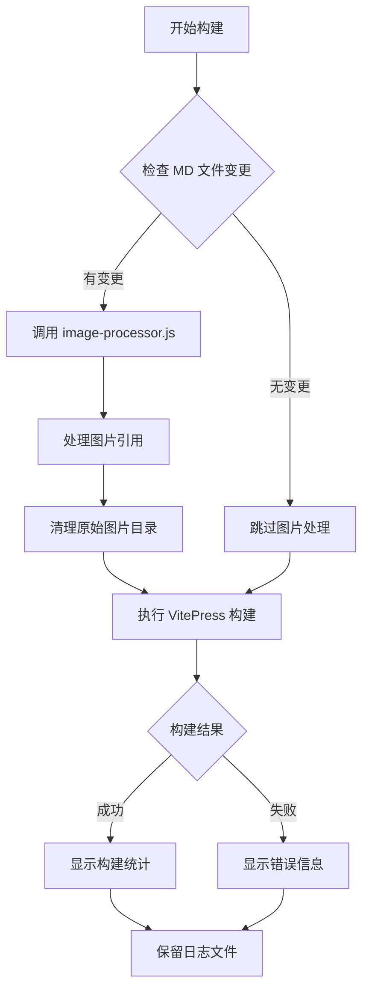
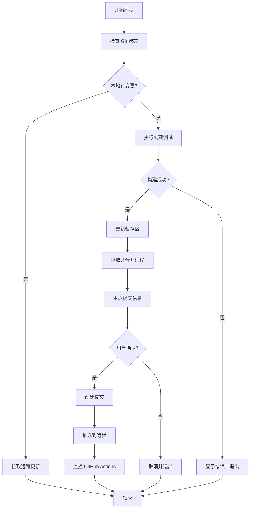

# WTC-Docs 技术文档

## 项目概述

WTC-Docs 是基于 VitePress 构建的技术文档系统，集成了自动化图片处理、构建优化和同步部署功能。

## 核心脚本架构

### 1. 构建脚本 (build.sh)

#### 执行流程

```bash
npm run build → .vitepress/scripts/build.sh
```

#### 主要功能

1. **图片处理阶段**
   - 检测变更的 Markdown 文件
   - 调用 image-processor.js 处理图片
   - 清理原始图片目录

2. **VitePress 构建**
   - 执行 `npx vitepress build`
   - 生成静态文件到 `.vitepress/dist`

3. **日志管理**
   - 生成日志：`/tmp/vitepress-build.log`
   - 图片处理日志：`/tmp/image-processor.log`

#### 详细流程图



### 2. 图片处理器 (image-processor.js)

#### 核心机制

##### 2.1 图片命名策略

```javascript
// 格式：文件路径_哈希.扩展名
// 例如：成员_赵恒_CardSystem加载优化_abc123def456.png
```

- **文件路径前缀**：标识图片属于哪个 MD 文件
- **12位哈希值**：基于原始 URL 生成，确保唯一性
- **扩展名**：保留原始图片格式

##### 2.2 处理流程

```javascript
processMarkdownFile(filePath) {
  1. 读取文件内容
  2. 逐行扫描图片引用
  3. 处理每个图片：
     - Gitee 图片 → 下载到本地
     - 本地图片 → 复制到 public/assets
     - 生成新的 URL 路径
  4. 清理未使用的图片
  5. 保存修改后的文件
}
```

##### 2.3 图片清理机制

```javascript
// 清理逻辑
1. 收集文件中所有仍在使用的图片 → processedInThisFile Set
2. 扫描 public/assets/ 中属于该文件的图片
3. 删除不在 processedInThisFile 中的图片
```

**多图片场景示例**：
```markdown
文件有3个图片：A、B、C
删除图片B的引用后：
- 图片A：保留（仍在使用）
- 图片B：删除（不再引用）
- 图片C：保留（仍在使用）
```

##### 2.4 变更检测

```bash
# 检测所有类型的变更
git diff --cached --name-only  # 暂存区 vs HEAD
git diff --name-only           # 工作区 vs 暂存区
git diff HEAD --name-only      # 工作区 vs HEAD（重要）
git ls-files --others          # 未跟踪文件
```

### 3. 同步脚本 (sync.sh)

#### 执行流程

```bash
npm run sync → .vitepress/scripts/sync.sh
```

#### 工作流程



#### 关键特性

1. **构建测试**
   - 提交前自动执行构建测试
   - 显示图片处理信息
   - 失败时阻止提交

2. **智能合并**
   - 自动处理远程更新
   - 优先使用 rebase，失败时降级到 merge

3. **确认机制**
   - macOS 原生弹窗确认
   - 默认按钮为"确认"
   - 显示变更统计信息

4. **部署监控**
   - 自动监控 GitHub Actions 状态
   - 最长等待 5 分钟
   - 显示部署结果和链接

### 4. 环境差异处理

#### 本地环境
```javascript
BASE_URL = 'http://localhost:5173/WTC-Docs'
```
- 用于本地开发和预览
- 图片路径指向本地服务器

#### GitHub Actions (生产环境)
```javascript
BASE_URL = 'https://zhaoheng666.github.io/WTC-Docs'
```
- 用于 GitHub Pages 部署
- 图片路径指向线上地址

## 文件结构

```
docs/
├── .vitepress/
│   ├── config.js              # VitePress 配置
│   └── scripts/
│       ├── build.sh            # 构建脚本
│       ├── sync.sh             # 同步脚本
│       ├── image-processor.js  # 图片处理器
│       └── notify.sh           # 通知脚本
├── public/
│   └── assets/                 # 处理后的图片存储
├── 成员/                       # 成员文档
├── 工程-工具/                  # 工具文档
└── index.md                    # 首页
```

## 日志文件

| 日志文件 | 说明 | 位置 |
|---------|------|------|
| vitepress-build.log | VitePress 构建日志 | /tmp/ |
| image-processor.log | 图片处理日志 | /tmp/ |
| sync-build.log | 同步脚本构建日志 | /tmp/ |

**特点**：
- 覆盖式写入（不追加）
- 保留最近一次执行的日志
- 便于调试问题

## 常见问题处理

### 1. 图片未被清理

**原因**：文件已被暂存，检测不到变更

**解决**：
- 已添加 `git diff HEAD --name-only` 检测
- 简化了 build.sh 的检测逻辑

### 2. 构建失败

**调试步骤**：
1. 查看日志：`cat /tmp/vitepress-build.log`
2. 检查图片处理：`cat /tmp/image-processor.log`
3. 手动运行：`npm run dev` 进行调试

### 3. 同步冲突

**处理流程**：
1. sync.sh 自动尝试 rebase
2. 失败时降级到 merge
3. 仍失败则提示手动处理

## 最佳实践

### 图片管理

1. **添加图片**
   - 直接粘贴到 MD 文件
   - 支持 Gitee 图片自动下载
   - 本地图片自动处理

2. **删除图片**
   - 删除 MD 中的引用
   - 运行 `npm run build` 自动清理

3. **图片优化**
   - 使用唯一哈希命名
   - 自动去重
   - 按文件组织

### 提交流程

1. **日常提交**
   ```bash
   npm run sync  # 自动构建、测试、提交、推送
   ```

2. **手动提交**
   ```bash
   npm run build  # 先构建测试
   git add -A
   git commit -m "提交信息"
   git push
   ```

3. **合并提交**
   ```bash
   git reset --soft HEAD~N  # N为要合并的提交数
   git commit -m "合并后的提交信息"
   git push --force-with-lease
   ```

## 技术栈

- **框架**：VitePress 1.6.4
- **语言**：JavaScript (Node.js)
- **脚本**：Bash
- **版本控制**：Git
- **部署**：GitHub Actions + GitHub Pages

## 性能优化

1. **增量处理**
   - 只处理变更的文件
   - 避免全量扫描

2. **图片去重**
   - 基于内容哈希
   - 同一图片只存储一份

3. **日志管理**
   - 覆盖式写入
   - 自动清理过期内容

## 未来改进方向

1. **图片压缩**
   - 自动压缩大图片
   - 支持 WebP 格式

2. **缓存优化**
   - 构建缓存
   - 图片处理缓存

3. **监控增强**
   - 构建性能监控
   - 图片使用统计

---

*最后更新：2025-09-22*