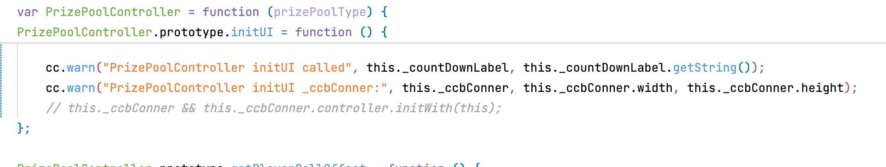
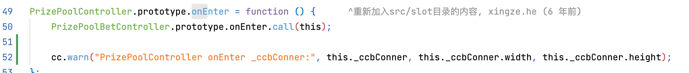
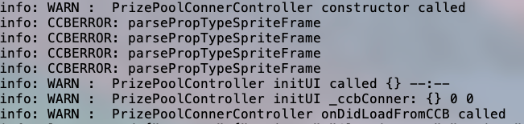
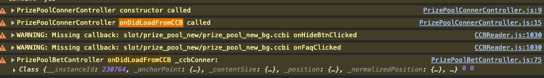

# CCB 加载顺序问题分析报告

## 问题现象

在 `PrizePoolController` 中，`this._ccbConner` 对象在不同生命周期和平台上表现不一致：

### 代码：



### Android 平台

- 在 `onDidLoadFromCCB` 中：`_ccbConner` 存在但其 `controller` 属性为 `undefined`
- 在 `onEnter` 中：`_ccbConner.controller` 正常存在
- 日志输出：`onDidLoadFromCCB` 中对象显示为 `{}` ,`onEnter` 中对象显示为 `{controller:{...}},animationManager:{...}}}

### 浏览器平台（HTML5）

- 在 `onDidLoadFromCCB` 中：`_ccbConner` 及其 `controller` 属性都正常存在
- 日志输出：对象正常打印

## 原因分析：

### 1. Android 日志显示问题

- 原因：`cc.formatStr` 在 Native 平台上将对象转换为字符串 `"{}"`
  - 位置：`/frameworks/cocos2d-x/cocos/scripting/js-bindings/script/jsb_boot.js:764`

```javascript
str = '' + str;  // 将对象转换为字符串表示
```


### 2. CCB 嵌套 Controller 创建、onDidLoadFromCCB 触发时序差异



补充到这里
