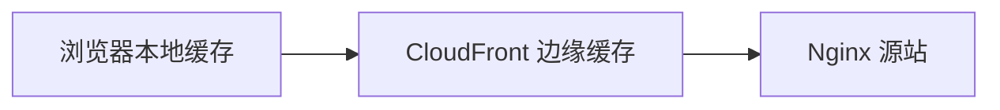

# CV Web CloudFront 缓存未命中排查记录

> 调研时间：2026-08-20
>
> 修复复测：2026-08-21
>
> 状态：单资源连续请求已恢复 `Miss → Hit`
>
> 范围：Web 游戏静态资源的 CloudFront 边缘缓存

## 1. 结论

正式入口 `classicvegas.ghoststudio.net` 和独立资源域名 `slotssaga-v401-cdn.me2zengame.com` 对应两套不同的 CloudFront 分发，缓存策略、缓存键、TTL、边缘缓存内容和 Invalidation 状态彼此独立。

修复前，同一正式入口资源在排除浏览器本地缓存和 DNS 轮询后仍连续返回 `Miss from cloudfront`；独立资源 CDN 的同一内容则能从 `Miss` 转为 `Hit`。证据指向正式入口分发的 Cache Behavior，而不是 HTTP/2 或浏览器缓存。

2026-08-21 复测当前 `v968` 资源，正式入口已经从第一次 `Miss` 转为第二次 `Hit` 并返回 `Age`，说明 CloudFront 边缘缓存已恢复工作。

本次复测只确认了缓存行为修复，尚未重新测量完整约 7,954 个请求到 89% 弹出 Account Login 的总耗时。

HTTP/2 的独立结论见 [HTTP/2 升级调研与实施记录](/待办/HTTP2升级方案)。

## 2. 涉及入口与分发

| 用途 | 访问地址 | CloudFront 分发域名 | 当前环境边缘节点 |
| --- | --- | --- | --- |
| 正式 Web 入口及同源游戏资源 | `classicvegas.ghoststudio.net/wtc_webapp/...` | `d1lp5umrzrmiye.cloudfront.net` | `LAX54-P11` |
| 独立生产资源 CDN | `slotssaga-v401-cdn.me2zengame.com/wtc_fb/...` | `d2q1qb5pfovzme.cloudfront.net` | `LAX53-P5` |

当前网络下，两者都落在洛杉矶 CloudFront 节点，因此不是“一条亚洲链路、一条美国链路”的地理差异。但它们属于不同分发和不同 POP 集群，不能共享缓存。

同一资源在两个域名下具有相同的 `ETag`、`Last-Modified` 和 `server: nginx/1.6.2`，说明源内容一致或来自同一套源站，但 CloudFront Viewer 层的缓存行为不同。

## 3. 浏览器缓存与 CloudFront 缓存



| 操作 | 浏览器缓存 | CloudFront 缓存 | 预期结果 |
| --- | --- | --- | --- |
| 清除浏览器缓存 | 清除 | 不受影响 | 请求到达 CloudFront，仍可能 `Hit` |
| DevTools Disable cache | 本次会话不使用本地缓存 | 不受影响 | 可用于检查 CDN 命中 |
| CloudFront Invalidation | 不受影响 | 指定对象被移除 | 下次请求回源并返回 `Miss` |
| 发布全新版本路径 | 无对应对象 | 新路径通常未预热 | 每个对象首次可能 `Miss` |

CloudFront 官方文档明确说明，Viewer GET 请求中的 `Cache-Control` 或 `Pragma` 不能强制 CloudFront 回源，CloudFront 会忽略这些请求头。因此 DevTools Disable cache 不会天然导致 CloudFront `Miss`。

CloudFront Invalidation 是清除边缘缓存，不是预热。执行 Invalidation 后，每个对象的下一次访问回源是正常现象；如果对象可缓存，后续相同 Cache Key 的请求应变成 `Hit`。

## 4. 故障现象

通过 `https://classicvegas.ghoststudio.net/` 选择 Guest 登录，统计口径截止到 89% 弹出 Account Login：

- 进入大厅前约发起 7,954 个资源请求。
- 浏览器抽样的 150 个游戏资源全部使用 HTTP/2。
- 这 150 个响应同时全部显示 `X-Cache: Miss from cloudfront`，没有 `Age`。
- 单次观察中约 80 秒到 27%，约 137 秒到 38%，Loading 明显偏慢。

这说明 HTTP/2 已生效，但 CloudFront 没有为这批请求提供边缘缓存收益。HTTP/2 只优化浏览器到 CloudFront 的连接；发生 `Miss` 时，CloudFront 仍需逐个向源站取回资源。

## 5. 排除本地缓存与 DNS 轮询

### 5.1 测试方法

使用普通 `curl GET` 请求，不发送用于绕过缓存的请求头：

1. 对两个域名请求内容相同的同一资源。
2. 立即重复完全相同的 URL。
3. 对正式入口使用 `--resolve` 固定到已访问过的边缘 IP，再次重复。
4. 检查 `X-Cache`、`Age`、`X-Amz-Cf-Pop`、协议和总耗时。

修复前样本资源：

```text
v966/res_oldvegas_webp/casino/card_system/wild_card/effects/wild_card_bg_gold_light2.plist
```

### 5.2 修复前结果

| 域名 | 第一次 | 第二次 | 总耗时变化 | 判断 |
| --- | --- | --- | --- | --- |
| `classicvegas.ghoststudio.net` | `Miss`，无 `Age` | `Miss`，无 `Age` | 0.805 秒 → 0.604 秒 | 未缓存或 TTL/Cache Key 异常 |
| `slotssaga-v401-cdn.me2zengame.com` | `Miss` | `Hit`，`Age: 20` | 0.873 秒 → 0.488 秒 | 缓存正常 |

将正式入口分别固定到 `99.84.41.75` 和 `99.84.41.82` 后，结果仍是：

| 固定 IP | POP | 结果 | 总耗时 |
| --- | --- | --- | --- |
| `99.84.41.75` | `LAX54-P11` | `Miss`，无 `Age` | 0.605 秒 |
| `99.84.41.82` | `LAX54-P11` | `Miss`，无 `Age` | 0.798 秒 |

因此，连续 `Miss` 不是浏览器本地缓存测试失真，也不能用 DNS 轮询到不同 IP 解释。

## 6. 原因判断

故障范围可以高置信度定位到 `classicvegas.ghoststudio.net` 对应 CloudFront 分发的 Cache Behavior。由于调研期间未直接读取 AWS 控制台配置，无法从外部响应头确认究竟修改了哪一个字段。

当时源站响应没有 `Cache-Control` 和 `Expires`。此时 CloudFront 使用关联 Cache Policy 的 `Default TTL`。需要重点检查：

1. `/wtc_webapp/*` 是否匹配预期的 Path Pattern。
2. Behavior 优先级是否导致请求落入 Default Behavior。
3. 是否关联了托管策略 `CachingDisabled`。
4. `Min TTL`、`Default TTL`、`Max TTL` 是否全部为 0。
5. Cache Key 是否包含不必要的 Cookie、Header 或 Query String，造成同一对象被拆成大量缓存变体。
6. Origin Request Policy 与 Cache Policy 是否混用，把仅需转发到源站的字段也加入了 Cache Key。

AWS 说明：当 `Min TTL`、`Default TTL` 和 `Max TTL` 全部为 0 时，CloudFront 缓存会被禁用；当源站没有返回 `Cache-Control` 或 `Expires` 时，`Default TTL` 决定对象缓存时间。

## 7. 修复后复测

2026-08-21，入口仍引用 `/wtc_webapp/v561/`，页面 `<base>` 已指向当前实际资源版本 `/wtc_webapp/v968/`。使用当前有效资源重新测试：

```text
v968/res_oldvegas_webp/casino/card_system/wild_card/effects/wild_card_bg_gold_light2.plist
```

| 域名 | 第一次 | 第二次 | 协议 | 总耗时变化 |
| --- | --- | --- | --- | --- |
| `classicvegas.ghoststudio.net` | `Miss` | `Hit`，`Age: 13` | HTTP/2 | 0.983 秒 → 0.594 秒 |
| `slotssaga-v401-cdn.me2zengame.com` | `Miss` | `Hit`，`Age: 13` | HTTP/2 | 1.520 秒 → 0.600 秒 |

正式入口第二次请求虽然 DNS 从 `99.84.41.75` 切换到 `99.84.41.82`，仍在 `LAX54-P11` 返回 `Hit`，说明该分发当前已能复用边缘或区域缓存。

### 当前验收结论

- [x] 正式入口静态资源可以从 `Miss` 转为 `Hit`。
- [x] 响应包含递增依据 `Age`。
- [x] 两个生产分发均使用 HTTP/2。
- [ ] 修复后重新测量完整 Loading 到 Account Login 的总耗时。
- [ ] 统计完整 Loading 的 `Hit/Miss` 数量和 CloudFront 命中率。

## 8. 为什么清理浏览器缓存后首次 Loading 仍可能很慢

清理浏览器缓存后，首次 Loading 是否命中 CloudFront，取决于边缘节点是否已经有对应对象：

- 同一版本已经被其他用户预热：浏览器首次请求也可以是 CloudFront `Hit`。
- 新版本刚发布：新 URL 尚未访问，通常是 `Miss`。
- 刚执行 Invalidation：对象已被边缘节点移除，首次访问是 `Miss`。
- 资源访问频率低：对象可能在 TTL 到期前被 CloudFront 淘汰。
- 两个域名不同：在独立资源 CDN 上预热，不会让正式入口分发命中。

游戏包含约 7,954 个不同资源时，即使缓存策略已经正确，如果刚发布新版本或刚清空 CDN，当前边缘节点的第一个用户仍可能承担大量冷回源。需要用“浏览器冷缓存、CloudFront 热缓存”作为稳定性能基准，并把“CloudFront 冷缓存”单独作为发布首访场景测试。

## 9. 建议配置

### 9.1 带版本号的静态资源

`/wtc_webapp/v*/` 和 `/wtc_fb/v*/` 下不会原路径覆盖的资源建议返回：

```http
Cache-Control: public, max-age=31536000, immutable
```

CloudFront Cache Policy 建议：

- 使用非零 `Default TTL`。
- `Max TTL` 至少覆盖版本资源的预期生命周期。
- Cache Key 不包含与资源内容无关的 Cookie、Header 和 Query String。
- 发布新版本使用新目录，例如 `v968` → `v969`，不要对旧版本资源做全量 Invalidation。

### 9.2 入口与可变配置

HTML、版本指针和需要快速更新的配置应采用短 TTL 或协商缓存，不要与不可变静态资源共用一套长期缓存规则。

### 9.3 发布预热

若必须保证新版本第一个用户的体验，可根据启动资源清单预热关键路径。预热具有地域性，只从一个位置访问不能保证全球所有 POP 都已热缓存，因此仍应监控各区域命中率。

## 10. 验收命令

连续执行两次，第二次应返回 `Hit from cloudfront`，并出现 `Age`：

```bash
asset_url='https://classicvegas.ghoststudio.net/wtc_webapp/v968/res_oldvegas_webp/casino/card_system/wild_card/effects/wild_card_bg_gold_light2.plist'

curl -sS -o /dev/null -D - "${asset_url}"
curl -sS -o /dev/null -D - "${asset_url}"
```

重点响应头：

```text
HTTP/2 200
X-Cache: Hit from cloudfront
Age: <大于等于 1 的秒数>
X-Amz-Cf-Pop: <边缘节点>
```

完整 Loading 回归需要同时记录：

| 指标 | 口径 |
| --- | --- |
| 开始点 | 点击 Guest 或游戏 iframe 开始加载 |
| 结束点 | 89% 弹出 Account Login |
| 浏览器缓存 | 清空或无痕窗口 |
| CloudFront 状态 | 分别测试热缓存与 Invalidation 后冷缓存 |
| 资源数量 | 记录总请求数，当前基线约 7,954 |
| 协议 | 游戏资源应为 `h2` |
| CDN 命中率 | 统计 `Hit`、`Miss`、`RefreshHit` 和 `Error` |
| 时间 | 总耗时、TTFB 中位数/P95、排队中位数/P95 |

## 11. 参考资料

- [CloudFront Invalidation](https://docs.aws.amazon.com/AmazonCloudFront/latest/DeveloperGuide/Invalidation.html)
- [CloudFront 缓存时间与 Viewer 请求头](https://docs.aws.amazon.com/AmazonCloudFront/latest/DeveloperGuide/Expiration.html)
- [CloudFront Cache Policy](https://docs.aws.amazon.com/AmazonCloudFront/latest/DeveloperGuide/cache-key-understand-cache-policy.html)
- [CloudFront Cache Behavior](https://docs.aws.amazon.com/AmazonCloudFront/latest/DeveloperGuide/DownloadDistValuesCacheBehavior.html)
