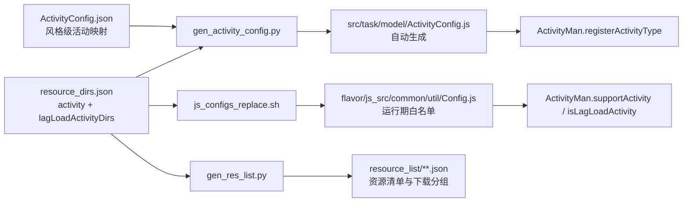
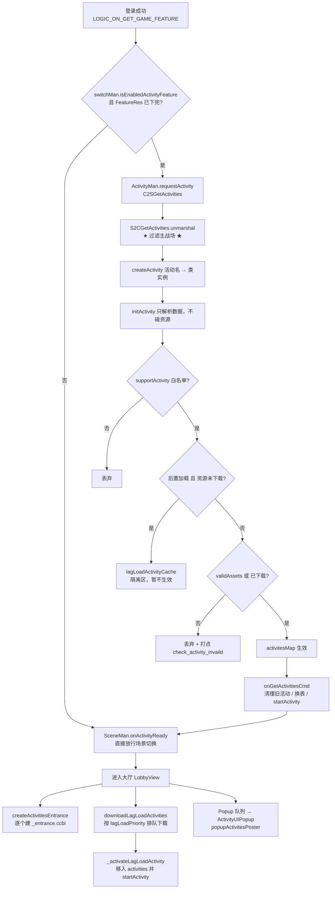
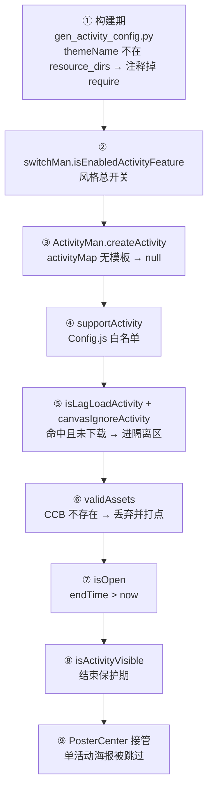
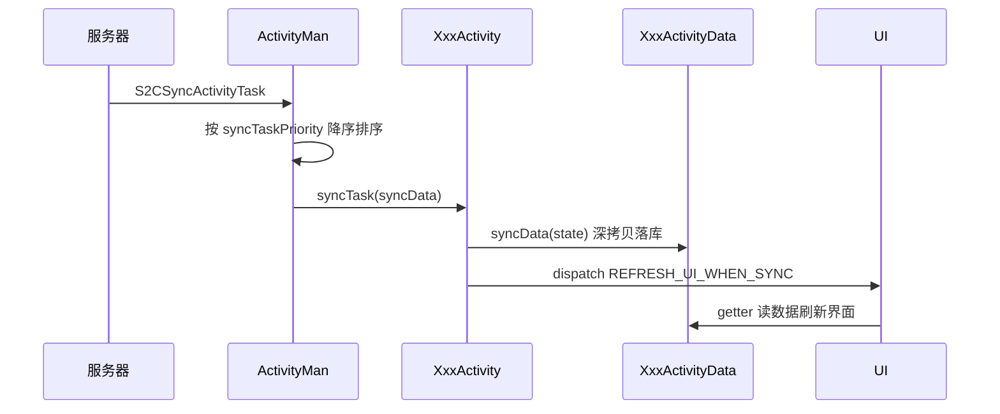
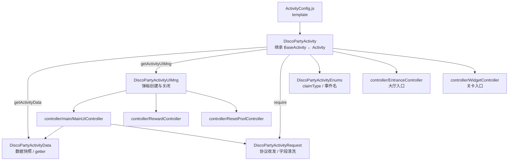

# 活动系统框架总览

> **整理时间**: 2026-08-13
> **代码基准**: `src/task/`、`src/activity/`、`src/resource_v2/`
> **示例活动**: DISCO PARTY（`src/activity/disco_party/`）

本文回答四个问题：**活动怎么跑起来的**、**框架长什么样**、**在哪里配置**、**在哪里被过滤掉**，以及每处设计的原因。

::: tip 与其他文档的分工

- 本文：全链路运转机制、过滤链、设计取舍（**为什么**）
- [新人活动开发流程](/活动/流程/新人活动开发流程)：从零做一个活动的操作步骤（**怎么做**）
- [Activity](/活动/接口/Activity)：`Activity` / `BaseActivity` 类成员与方法清单（**有什么**）
- [ResourceManV2-技术指南](/优化重构/resource-v2/ResourceManV2-技术指南)：活动资源下载调度细节

:::

---

## 一、框架分层

```text
┌─────────────────────────────────────────────────────────────────────┐
│ ① 配置层（构建期）                                                     │
│   res_xxx/flavor/js_src/task/model/ActivityConfig.json  ← 活动名映射   │
│   res_xxx/resource_dirs.json（activity / lagLoadActivityDirs）        │
│                    │ scripts/gen_activity_config.py                   │
│                    ▼                                                  │
│   src/task/model/ActivityConfig.js（自动生成，勿手改）                  │
│   src/task/enum/ActivityTagEnum.js（入口互斥 tag）                     │
└─────────────────────────────────────────────────────────────────────┘
                     │ require
┌────────────────────▼────────────────────────────────────────────────┐
│ ② 管理层  ActivityMan（单例）                                          │
│   · activityMap           活动名 → 活动类（注册表）                     │
│   · taskTypeMap           任务类型 → 任务类（46+ 种）                   │
│   · activities            已生效活动 {activityId: Activity}            │
│   · lagLoadActivityCache  资源未下完的活动（隔离区）                     │
│   · runningActivities     1s tick 调度队列                             │
│   · noticeListenerMap     notice 广播总线                              │
└────────────────────┬────────────────────────────────────────────────┘
        ┌────────────┼─────────────┬──────────────┐
        ▼            ▼             ▼              ▼
┌───────────┐ ┌────────────┐ ┌──────────┐ ┌───────────────┐
│③ 实体层    │ │④ 协议层     │ │⑤ 资源层   │ │⑥ UI 层         │
│Activity    │ │C2S/S2C     │ │ResourceMa│ │Entrance/Widget│
│ └BaseActi..│ │GetActivit..│ │nV2 +     │ │MainUI/Poster/ │
│   └XxxActi.│ │ClaimSpeci..│ │Activity  │ │End（CCB 五件套）│
│  +Data     │ │SyncActivi..│ │Loader    │ │               │
│  +UIMng    │ │            │ │          │ │               │
│  +Request  │ │            │ │          │ │               │
└───────────┘ └────────────┘ └──────────┘ └───────────────┘
```

| 层 | 关键文件 | 职责 |
|---|---|---|
| 配置层 | `res_xxx/flavor/js_src/task/model/ActivityConfig.json`、`res_xxx/resource_dirs.json` | 声明活动名 → 类 → 资源目录的映射，以及本风格上哪些活动 |
| 管理层 | `src/task/model/ActivityMan.js` | 注册表、生命周期调度、广播、批量遍历 |
| 实体层 | `src/task/entity/Activity.js`、`BaseActivity.js`、`src/activity/<theme>/` | 单个活动的数据与业务 |
| 协议层 | `src/task/protocol/` | 收发协议、解析并**过滤**服务器下发的活动 |
| 资源层 | `src/resource_v2/loaders/ActivityLoader.js` | 后置下载、激活活动 |
| UI 层 | `src/task/controller/`、`src/activity/<theme>/controller/` | 五件套 CCB 控制器 |

---

## 二、配置层：三个文件 + 构建生成链

### 2.1 生成链



### 2.2 配置点清单（新增或修改活动只碰这 5 处）

| # | 文件 | 配置内容 | 消费方 |
|---|---|---|---|
| 1 | `res_xxx/flavor/js_src/task/model/ActivityConfig.json` | `templateName`（类名）、`themeName`（资源目录，可为数组做换皮）、`lagLoadPriority`、`isSilentLoad` | 构建期生成 `ActivityConfig.js` |
| 2 | `res_xxx/resource_dirs.json` → `activity[]` | 随包 / 首屏下载的活动资源目录 | 资源清单 + 运行期白名单 |
| 3 | `res_xxx/resource_dirs.json` → `lagLoadActivityDirs[]` | 进大厅后再下载的活动 | `ActivityMan.isLagLoadActivity` |
| 4 | `src/task/enum/ActivityTagEnum.js` | 活动唯一 tag（入口节点互斥、`getChildByTag` 用） | `createActivityEntrance` |
| 5 | 活动类构造函数内的开关位 | `isOpenPurchase`、`isShowPoster`、`posterPopupFrozenTime`、`isOpenEndTimeProtect`、`entranceAttachPointPriority` 等 | `BaseActivity` 各流程 |

DISCO PARTY 的实际配置：

```json
"DiscoParty": {
  "templateName": "DiscoPartyActivity",
  "themeName": "disco_party",
  "lagLoadPriority": 50,
  "isSilentLoad": true
}
```

配套：`resource_dirs.json` 的 `lagLoadActivityDirs` 追加 `"disco_party"`；`ActivityTagEnum.DISCO_PARTY_ACTIVITY = 793`。

### 2.3 生成规则里最关键的一行

`scripts/gen_activity_config.py` 在 `themeName` 不在 `activity + lagLoadActivityDirs` 时，把 `"template"` 替换成 `//"template"`：

```javascript
"AmericaJuly": {
    //"template": require("../entity/AmericaJulyActivity"),
    "themeName": "america_july_pinata"
},
```

`require` 被注释 ⇒ **该活动代码根本不会被 Browserify 打进 `game.js`**。所以 `ActivityConfig.js` 里大量 `//"template"` 条目 = 本风格不上的活动。这是构建期的第一道过滤，也是包体控制的核心手段。

::: warning
`ActivityConfig.js`、`Config.js`、`resource_list/**` 都是构建产物，不要手改、不要提交（见 CLAUDE.md「构建产物」章节）。
:::

---

## 三、主流程：登录到大厅可见



关键落点：

| 步骤 | 代码位置 |
|---|---|
| 入口 | `src/task/model/ActivityMan.js:75` `onGetGameFeatureInfo` |
| 拉活动 | `src/task/model/ActivityMan.js:101` `requestActivity` |
| 解析 + 过滤 | `src/task/protocol/S2CGetActivities.js:23` `unmarshal` |
| 换表 + 启动 | `src/task/model/ActivityMan.js:201` `onGetActivitiesCmd` |
| 场景闸门 | `src/common/model/SceneMan.js:148` `onActivityReady`（清 `ACTIVITY_MASK`） |
| 大厅入口聚合 | `src/task/controller/activity_center/ActivityEntranceGroupController.js` |
| 海报触发 | `src/common/popup/Popup.js` 的 `ActivityUIPopup` |

::: tip 为什么活动请求是场景切换的一道闸门
`SceneMan` 用 `progressMask` 位掩码等待多路数据（服务器 / 资源 / 活动 / bonus）。活动数据没回来就进大厅，会出现入口闪现、海报错序。所以三个分支（关闭、拉取成功、拉取失败）**都必须调用 `onActivityReady`**，否则卡在 loading。
:::

---

## 四、过滤链：九道闸门

活动"不显示"的排查顺序，就是这张图从上往下走一遍。



| # | 闸门 | 位置 | 触发后的现象 |
|---|---|---|---|
| ① | 构建期裁剪 | `scripts/gen_activity_config.py:64` | 活动类不在包里，服务器下发也创建不出来 |
| ② | 风格总开关 | `src/common/model/SwitchMan.js:117` | 整个活动系统不启用（如 VegasGrand） |
| ③ | 注册表缺模板 | `src/task/model/ActivityMan.js:791` | 静默丢弃，日志无痕 |
| ④ | 运行期白名单 | `src/task/model/ActivityMan.js:112` | 与 ① 双保险 |
| ⑤ | 后置加载判定 | `src/task/model/ActivityMan.js:122` | 活动进隔离区，大厅显示占位图标（`isSilentLoad=false` 时） |
| ⑥ | 资源校验 | `src/task/entity/Activity.js:437` | 打点 `check_activity_invaild`，**最常见的坑** |
| ⑦ | 时间判定 | `src/task/entity/Activity.js:84` | 几乎所有遍历接口都带这个判断 |
| ⑧ | 结束保护期 | `src/task/entity/BaseActivity.js:489` | 付费活动专用，未付费玩家提前看不到 |
| ⑨ | 海报中心 | `src/task/model/ActivityMan.js:1050` | 活动实现 `isIgnorePosterCenter` 才能独立弹海报 |

::: danger 排查口诀
活动看不见，90% 是资源没进 `resource_dirs.json` 对应数组。先搜日志 `check_activity_invaild`，再看 `ActivityConfig.js` 里本活动的 `"template"` 有没有被注释掉。
:::

---

## 五、运行期五条链路

### 5.1 心跳（1s tick）

```text
setInterval 1s ─► ActivityMan.onUpdateLoop()                ActivityMan.js:135
    ├─ 每个 runningActivity.update()
    │     ├─ isOpen()  → dispatch ACTIVITY_UPDATE（UI 刷倒计时）
    │     └─ !isOpen() → stopSchedule + ACTIVITY_ON_ACTIVITY_END + endActivity()
    │                     └─ 弹 _end.ccbi / settleBill / 反注册 notice
    └─ 在大厅时累计 60 次 → C2SGetOpenActivities
          └─ 有本地没有的活动 → sendRequestNewServerActivityCmd → 下资源 → 生效
```

::: warning 代码与注释不一致
`ActivityMan.js:144` 注释写"每隔 10 分钟同步"，实际条件是 `syncActivityTimer >= 1 * 60`，即**大厅内每 60 秒**轮询一次新开放活动。以代码为准。
:::

### 5.2 Spin 前后

```text
SlotMan spin
  ├─ ActivityMan.preSpinUpdateActivity(cb)    ActivityMan.js:879
  │     └─ 遍历所有 open 活动并发执行，计数回调全部到齐才放行 spin
  └─ ActivityMan.postSpinUpdateActivity(cb)   ActivityMan.js:905
        └─ 同上 + GameFeatureMan.onNotice(NOTICE_SLOT_SPIN_END)
```

`Activity.callbackStack` 用于防止一次 spin 内 post 回调被多次触发。

### 5.3 数据同步



多活动同时同步时，`syncTaskPriority` 决定谁先处理（`ActivityMan.js:584`）——用于"某活动的动画必须先于另一个播放"的场景。

### 5.4 领奖（新框架统一走通用协议）

```text
UI 点击
 └─ XxxActivityRequest.claimXxx(activity, cb)
      └─ game.aUtil.claimSpecialActivity(activity, {claimType})   ActivityUtil.js:823
           └─ C2SClaimSpecialActivityReward ──► S2C rewardResultMap
                ├─ 剔除瞬态字段（drawIndex / gainScore / claimResultList …）
                ├─ Data.syncData(持久字段)
                └─ callback → UIMng.popupRewardPanel()
```

DISCO PARTY 用 `claimType` 区分抽奖 / 重置转盘 / 领里程碑三种行为，共用一条协议（`src/activity/disco_party/DiscoPartyActivityRequest.js`）。

### 5.5 支付

```text
StoreMan 验单
 └─ ActivityMan.onNotice(NOTICE_VERIFY_PURCHASE)
      └─ BaseActivity.onVerifyPurchaseWithLagLoadCheck()      BaseActivity.js:559
           └─ ensureActivityResources()   ← 资源没下完先下（补单保护）
                └─ onVerifyPurchase() → transactionId 去重
                     └─ onPurchaseResult() → PayResultController 弹奖励
                          └─ NOTICE_CONSUME_PURCHASE → 同步数据 → 刷 UI
```

---

## 六、单活动内部结构（DISCO PARTY 为例）



### 四件套职责边界

| 模块 | 基类（`src/activity/base/`） | 职责 | 禁止 |
|---|---|---|---|
| `XxxActivity` | `BaseActivity` | 生命周期、开关位、对外接口 | 不写 UI 细节、不拼协议 |
| `XxxActivityData` | `ActivityBaseData` | 服务器数据深拷贝 + getter | 不碰 UI、不发协议 |
| `XxxActivityUIMng` | `ActivityBaseUIMng` | 弹板创建 / 关闭、防连点 | 不存业务数据 |
| `XxxActivityRequest` | `ActivityBaseRequest` | 协议收发、落库前清洗 | 不直接操作 UI |

### 生命周期契约（后置加载重构后的硬性约束）

| 方法 | 时机 | 能否使用活动资源 |
|---|---|---|
| `initActivity` | `createActivity` 后立即调用，**资源可能还没下载** | ❌ 否，只能解析数据 |
| `onActivityStart` | 资源就绪、活动正式启用时 | ✅ 是，子类扩展写这里 |
| `startActivity` | 进 tick 队列、注册 notice、挂关卡入口 | ✅ 是 |
| `endActivity` | tick 检测到过期 | ✅ 是（弹结束板） |
| `cleanActivity` | 活动被替换或关闭 | 只做反注册 |

::: danger 常见错误
把资源相关逻辑（读 CCB、建节点）写进 `initActivity`，在后置加载活动上会偶发白板或崩溃。资源相关一律写 `onActivityStart`（见 `BaseActivity.js:163` 注释）。
:::

---

## 七、UI 五件套与挂点

| CCB | 命名约定 | 控制器基类 | 挂点 / 触发 |
|---|---|---|---|
| 大厅入口 | `<theme>_entrance.ccbi` | `ActivityEntranceController` | `ActivityEntranceGroupController` 容器，按优先级排序 |
| 关卡入口 | `<theme>_widget.ccbi` | `ActivityBaseWidgetController` | CV/DH 走 `ActivityCenterWidgetController` 聚合，其余走 slotScene 左侧排列 |
| 主界面 | `<theme>_main.ccbi` | `ActivityMainUIController` | `popupActivityMainUI(triggerType)` |
| 海报 | `<theme>_poster.ccbi` | `ActivityPosterController` | `popupActivitesPoster`，受 PosterCenter 接管 |
| 结束板 | `<theme>_end.ccbi` | `ActivityEndNoticeController` | `endActivity` 自动弹 |

排序仲裁规则（`ActivityMan.rearrangeLeftWidgetsPosition`，`ActivityMan.js:1140`）：

```text
widgetAttachPointPriority → entranceAttachPointPriority → leftWidgetPriority → activityId
（数值越小越靠下；buff 类入口恒在最底）
```

海报排序：`getActivityPosterPriority()` 数值越大越先弹，相同则按 `activityId`。

---

## 八、为什么这样设计

| 设计 | 原因 |
|---|---|
| **配置驱动 + 构建期裁剪 require** | 一套 `src/` 供 CV / DH / VS / DHX 四风格共用，全量 348 个活动打进包会让 `game.js` 无法接受地膨胀。注释掉 `template` 是最省事的"编译期 tree-shaking" |
| **服务器只下发 `activityName` + `activityResource`** | 后端不需要知道客户端类名与资源路径；换皮时 `themeName` 配成数组即可复用同一套代码（`ActivityMan.js:806`） |
| **`activities` 与 `lagLoadActivityCache` 双表隔离** | 后置加载期间"数据已到、资源未到"。若直接进 `activities`，任何 `forEachActivites` 都可能读不存在的 CCB 而崩溃。隔离区语义 = 数据就绪但功能未就绪 |
| **`initActivity` 与 `startActivity` 分离** | 前者纯数据（安全），后者才碰资源。这是资源后置加载方案的前置改造 |
| **`notice` 注册表而非直接调用** | `ActivityMan` 不可能 `require` 200+ 个活动。活动自行 `registerNotice`，管理器只做广播 + 全员回调计数，保证 spin / 补单等流程"所有活动都响应完"才放行 |
| **1s 全局 tick 而非每活动 schedule** | 活动数量多且都只需秒级倒计时，单定时器省调度开销，顺带统一处理"到点自动结束" |
| **`Activity` / `BaseActivity` 两层** | `Activity` 是任务组 + 奖励的纯数据模型；`BaseActivity` 追加海报 / 入口 / 关卡挂件 / 支付 / 音乐等约定。源码注释已明确"不建议直接继承 `Activity`" |
| **新框架拆 Data / UIMng / Request** | 老活动把数据、UI、协议塞进一个 2000+ 行文件，改一处牵全身。拆开后：数据层深拷贝隔离服务器结构变动，协议层统一剔除瞬态字段，UI 层可独立换皮 |
| **满屏的优先级字段** | 同时在线活动可达十几个，抢入口位、抢弹板顺序、抢下载带宽，只能用数值排序做确定性仲裁 |
| **结束保护期 `isOpenEndTimeProtect`** | 付费活动的核心风险是"玩家付完钱活动正好结束"。前端把 `getLeftTime()` 提前 `protectTimeSec`，已付费玩家还能走完抽奖与领奖 |
| **`poppedRewardIDMap` 去重** | 服务器可能重复推送同一 reward，用 `reward.id` 防止弹板弹两次（`ActivityMan.js:1039`） |

---

## 九、新增活动 checklist

```text
1. cd scripts/create_activity_v2 && python create_activity.py
     交互式选功能模块（Pass / Rank / FAQ / Guide / Pay / Widget / Entrance）
     自动写入：ActivityConfig.json、ActivityTagEnum.js、resource_dirs.json
2. 实现 src/activity/<theme>/
     XxxActivity + Data + UIMng + Request + Enums + controller/
3. 资源放 res_xxx/activity/<themeName>/，CCB 命名遵守五件套约定
4. cd scripts && ./build_local_oldvegas.sh
5. 自检：
     · ActivityConfig.js 中本活动的 "template" 未被注释
     · Config.js 的 activity / lagLoadActivityDirs 含本活动 themeName
     · ActivityTagEnum 中 tag 唯一
```

详细步骤见 [新人活动开发流程](/活动/流程/新人活动开发流程)。

---

## 十、故障速查

| 现象 | 优先检查 |
|---|---|
| 大厅完全没有入口 | ⑥ 资源校验（日志 `check_activity_invaild`）→ ① `ActivityConfig.js` 的 `template` 是否被注释 |
| 入口延迟很久才出现 | 活动在 `lagLoadActivityDirs` 中，属正常后置加载；调 `lagLoadPriority` 提前 |
| 入口出现但点击无反应 | `MainUIController` 未配置时会退化为弹海报（`BaseActivity.js:210`） |
| 海报不弹 | ⑨ PosterCenter 接管；或 `posterPopupFrozenTime` 冷却未到 |
| 活动提前消失 | ⑧ `isActivityVisible` 保护期；检查 `protectTimeSec` |
| 补单奖励丢失 | `onVerifyPurchaseWithLagLoadCheck` 的资源确保流程、`transactionId` 去重逻辑 |
| 关卡入口位置错乱 | `rearrangeLeftWidgetsPosition` 的四级排序字段 |

---

**最后更新**: 2026-08-13
**维护者**: WorldTourCasino Team
