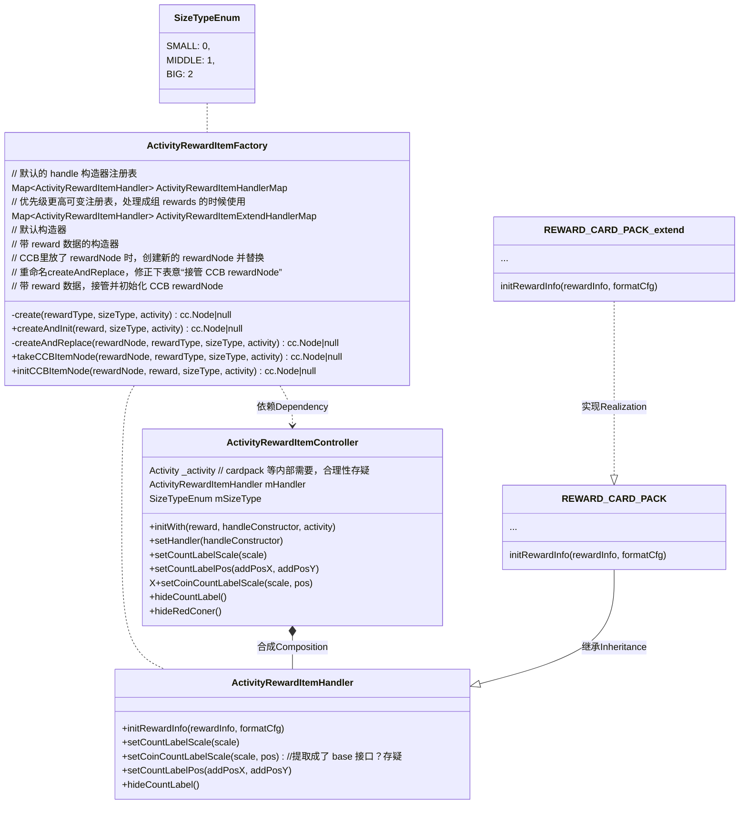

# 通用 activity reward 说明

## 一、程序使用说明：




### 设计说明：

核心是：结构化、逻辑分层、隔离；

#### 1、ActivityRewardItemController层：

所有类型reward使用同一个 controller，提取、规范通用行为、属性，统一调用接口；

#### 2、ActivityRewardItemHandler层：

通过组成（composition）的方式，使ActivityRewardItemController持有差异化对象；

#### 3、差异化ActivityRewardItemHandler层：

通过继承ActivityRewardItemHandler，实现每个类型 reward 的差异化；积累该类型的可复用逻辑；

#### 4、相同类型奖励的差异实例化层：

通过继承重写各自类型的handler实现，将差异化处理下放整合到各 activity 实现层；

以后的活动，内部对通用资源的特殊差异化处理，都通过该层实现，如换图、换字体、调整具体节点显示等，

保证与通用逻辑的隔离；


#### 5、ActivityRewardItemFactory负责创建 、接管、初始化rewardNode；

#### 6、目前提供的 handle 差异化支撑接口：

```javascript 
// 方式一：设置替换 handler
var node = ActivityRewardItemFactory.initCCBItemNode(this._cardPack, rewardData, ActivityRewardItemFactory.SizeTypeEnum.BIG, this._activity);
node.controller.setHandler(Buy1Get1Free_REWARD_CARD_PACK);
// 方式二：通过初始化接口替换 handler
ActivityRewardItemFactory.createAndReplace(this._cardPack, rewardData.rewardType, ActivityRewardItemFactory.SizeTypeEnum.BIG, this._activity);
node.controller.initWith(rewardData, Buy1Get1Free_REWARD_CARD_PACK);

// 方式三：注册更高优先级的 handler 构造器
// 单一、明确类型
ActivityRewardItemFactory.registExtendHandlers(Buy1Get1Free_REWARD_CARD_PACK);
ActivityRewardItemFactory.initCCBItemNode(this._cardPack, rewardData, ActivityRewardItemFactory.SizeTypeEnum.BIG, this._activity);
ActivityRewardItemFactory.unRegistExtendHandler(Buy1Get1Free_REWARD_CARD_PACK);
// 多个、不同类型
ActivityRewardItemFactory.registExtendHandlers([Buy1Get1Free_REWARD_CARD_PACK]);
cc.each(rewardDatas, function (rewardData) {
    ActivityRewardItemFactory.initCCBItemNode(this._cardPack, rewardData, ActivityRewardItemFactory.SizeTypeEnum.BIG, this._activity);
}.bind(this));
ActivityRewardItemFactory.unRegistExtendHandlers();
//为防止漏写 unRegistExtendHandlers，在smartRewardController 的onExit中封装unRegistExtendHandlers
```


## 二、美术使用说明：

### 1、统一使用新的活动奖励CCB ，请避免直接放图、或旧的 Reward 模板；


### 2、结构说明：

#### a、最外层节点：程序识别节点，tag 为奖励类型，与文件名种的数字一致；


#### b、大小缩放：新增的奖励类型直接在CCB 里调整，已经在用不要动；

#### c、时间线：目前只有normal，win，如需新增告知程序统一处理；

#### d、变量节点：标红的节点为变量节点（包含tag），如果需要动层级等属性，找程序确认；

### 3、关于美术想统一修改一遍旧的奖励图片：

#### 结论：老的通用资源不要动，新增图片大小可按金币、宝箱的规格来，最终在 CCB 中统一显示规格就好；

遵照（美术使用说明：1）后，程序只关心最终 CCB 的显示效果，不关心原始图片大小；

#### 原因：

**被引用的通用图集：**（老的通用资源）


引用这些通用图集的地方，按使用场景划分：

**i、旧的通用 CCB：**

老活动大量使用，动了通用图集，这些 CCB 得重新调整缩放，使用到这些通用 CCB 的活动要全部检查、修正、测试一遍；


**ii、新的拆分通用 CCB：**

已经有数个活动在调用，动了通用图集，相关的通用奖励CCB 需重新调整缩放，使用到这些通用奖励 CCB 的活动要全部检查、修正、测试一遍；

**iii、UI 中未使用新、旧通用组件，但直接引用了通用图集：**

有多少地方这么用的？未知；

有没有办法用程序的方法筛出来？可以，需要做工具，性价比不高；

QA 会打死各位吗？会，因为即便都筛出来了，每一处都必须检查、修正、测试一遍；


#### a、解决美术拼 CCB 没有可视化参照问题：（新增一套通用奖励的流程）

新建了一个 design 用的 CCB 工程，路径 WorldTourResource/design/ccbView/designView\.ccbproj

i、将工程里预制的三个 ccb 拷贝一份出来，修正文件名中的数字为新增类型数字，修正最外层节点的 tag 为新增类型数字(新增的奖励类型数字提前跟程序要)；

ii、新的奖励图片替换到各规格的 ccb  去，与 coins 同级，图片节点名修正为改类型的英文、拼音（程序不关心图片节点名，此举仅为大家提供识别方便）；

iii、调整好大小等，删除coins 节点，保存；

iiii、将弄好的新的 ccb 移动到 oldvegas/common/activity\_reward;(或 doublehit)


#### b、解决金币显示样式不统一问题：

方案一：现行的这套通用个奖励资源中的图片直接改掉，已经再使用的多个活动需要重新测试相关显示；（reject）

方案二：程序封装接口换图；（accept）


#### c、解决底色问题：


i、扣出底色、光晕、描边等，作为底图添加到各通用奖励 CCB的bgEffectNode 下；

ii、程序封装接口，控制是否显示bgEffectNode；

iii、程序分装接口，变更底色、光晕、描边等图片颜色（基础色美术定，需要变更的色彩 RGBA 值美术提供）；


